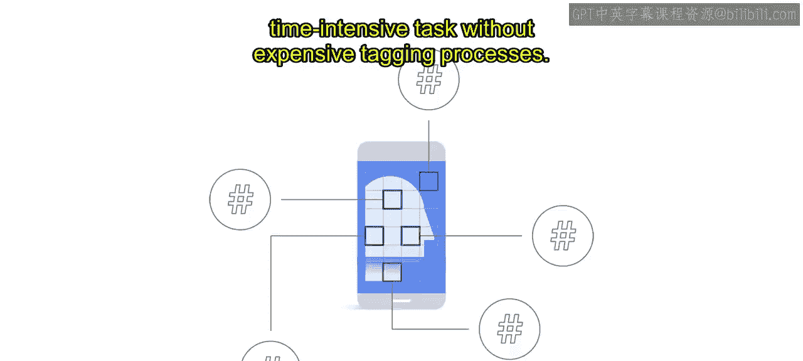
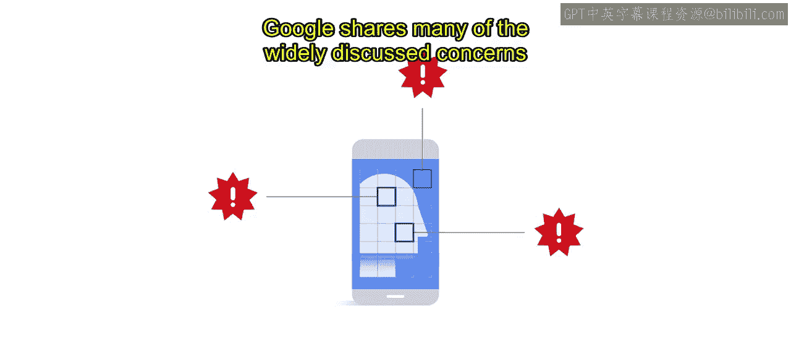

# 016：名人识别案例研究 🎬

在本节课中，我们将通过一个具体的案例研究，了解谷歌云如何在其AI原则和审查流程的指导下，负责任地开发并推出了“名人识别”API。我们将看到从技术限制、伦理考量到最终产品落地的完整过程。

上一节我们介绍了AI伦理的一般性原则，本节中我们来看看这些原则如何在一个真实的产品开发案例中得到应用。

## 概述

以下案例研究概述了我们的AI原则和审查流程如何塑造了谷歌云在人脸识别技术上的方法。

让我们从审查的结果开始。2019年，谷歌云推出了“名人识别”API。这是一个范围严格限定的API，面向媒体和娱乐行业的客户，旨在帮助他们为专业授权的媒体内容中的名人打上标签。

在没有昂贵打标流程的情况下，搜索视频内容一直是一项困难且耗时的工作。这使得创作者难以组织他们的内容并提供个性化体验。

名人识别API是一个预训练的AI模型，这意味着它不可定制。该模型能够基于授权图像识别全球数千名受欢迎的演员和运动员。这是谷歌云首个包含人脸识别的企业产品。😊

## 决策背景与伦理考量

那么，我们是如何走到这一步的？人脸识别技术因其潜在的不公平偏见而被认定为一个关键关切点。

早在2016年，云业务领导层就决定人脸识别不会成为云视觉API产品的一部分，尽管这是客户最迫切的需求之一。为了进一步探讨这个问题，我们让人脸识别技术经历了我们AI原则审查流程的早期迭代。

这些审查为我们提供了一个开放的论坛和时间，让我们能够批判性地思考这项技术的研究、社会背景和挑战。

我们已经看到，一系列与人脸相关的技术对个人和整个社会有多么有用。它们可以使产品更安全、更可靠，例如使用人脸认证来控制对敏感信息的访问。有些用途具有巨大的社会效益，例如非营利组织利用人脸识别技术打击人口贩卖。

但重要的是，这些技术的开发必须经过深思熟虑并负起责任。谷歌对滥用人脸识别技术的许多广泛讨论的担忧表示认同，即：

*   **它必须是公平的**，因此不会强化或放大现有的偏见，尤其是在这可能影响代表性不足群体的情况下。

*   **它不应被用于违反国际公认准则的监控**。
*   **它需要保护人们的隐私**，提供适当程度的透明度和控制。

为了减少滥用的可能性，并使该技术能够用于符合我们AI原则的企业用例，谷歌决定开发一个范围严格限定的人脸识别应用——名人识别。

## 外部评估与保障措施

为了让名人识别API做好发布准备，除了我们内部的审查流程，我们还寻求了外部专家和民权领袖的帮助。

我们认识到，我们的生活经验不一定与受影响人群的生活经验一致，我们需要帮助将这些经验和关切纳入我们的审查。

考虑到产品的预期用途，社会中黑人和少数族裔演员的系统性代表不足是我们评估的一个关键因素。为了更深入地关注潜在影响，我们聘请了一家名为“企业社会责任”（BSR）的外部人权咨询公司，进行深入的人权影响评估。

与BSR的合作在塑造API的功能和政策方面发挥了至关重要的作用，将人权考量整合到产品开发生命周期的全过程。它还揭示了解决方案在哪些方面需要额外的监督，并验证了我们之前不提供通用人脸识别API的决定。他们的完整报告是公开的，可以在本课程的资源部分找到。

基于BSR的建议，谷歌实施了一系列保障措施，以下是关键措施：

*   **允许名单访问**：名人识别API仅对列入允许名单的合格客户开放。
*   **预定义数据库**：名人数据库经过精确定义，并限制在一个预定义的名单内。
*   **退出政策**：实施退出政策，允许名人将自己从名单中移除。
*   **扩展服务条款**：适用于该API的扩展服务条款。

这些措施旨在避免和减轻潜在危害，并为谷歌提供了一个坚实的基础来降低人权风险。

## 公平性分析与技术改进

谷歌审查名人识别API的另一个关键步骤是一系列公平性分析。从根本上说，这些公平性测试旨在评估API在**召回率**和**精确率**方面的性能。

换句话说，我们不仅评估了API针对不同肤色和性别群体的性能，还评估了这些群体组合的性能，例如肤色较深的女性或肤色较浅的男性。

在三次独立的公平性测试中，我们发现我们的训练数据集与一个基于肤色的基准数据集之间存在误差。这些误差让我们暂停下来，并决定更深入地探究根本原因。

我们检查的第一件事是我们数据集中肤色标签的准确性。结果发现，对于中等和深色皮肤的人，这些标签并不完全准确。我们根据Fitzpatrick皮肤类型量表重新标注了肤色，该量表在Joy Buolamwini和Timnit Gebru的开创性研究“性别阴影”中被使用。😊

这项研究评估了自动面部分析算法和数据集中存在的与肤色和性别相关的偏见。重新标注肤色降低了错误率，但我们发现了进一步的差异。

一小部分演员在评估数据集中占据了总识别错误（missed IDs）的很大比例，尤其是对于深色皮肤的男性。了解到大多数错误率只影响少数特定的演员后，我们查看了错误最多的演员，发现他们几乎有100%的误拒率。

由于名人识别API的范围有限，我们能够逐一检查测试集和图库，以确定问题所在。😊

我们发现，对于三位黑人演员，我们的名人图库中是他们成年后的照片，而训练集中则是他们年轻得多时的演员照片。我们的模型无法将成年演员识别为他们多年前扮演的年轻角色。

在这种情况下，我们通过扩展训练数据集来解决这个问题，纳入了名人职业生涯中不同时期和不同年龄段的图像。这消除了错误率之间的差异。

## 总结与后续发展

这次经历让我们深刻认识到，花时间审视解决方案的整体背景（即媒体中的代表性问题）的重要性。只有理解了这一背景，严格限定了解决方案的范围，并经过严格的公平性测试和改进API后，我们才有信心发布该API。😊

这个例子说明了为什么负责任地开发AI能带来AI的成功整合。

2020年年中，鉴于对该技术更广泛的担忧，我们欢迎其他科技公司限制或退出其人脸识别业务的消息。最终，我们的AI治理流程使我们能够研究并确定一个符合我们AI原则的产品范围。

今天，谷歌发布了Monk皮肤色调（MST）量表。这是一个更精细的肤色量表，将帮助我们更好地理解图像中的代表性。

本节课中，我们一起学习了谷歌云“名人识别”API从伦理审查、外部评估、公平性测试到最终发布的完整历程。这个案例清晰地展示了将负责任的AI原则融入产品开发生命周期的具体实践，包括如何通过限定范围、引入外部评估、进行细致的公平性分析以及实施保障措施，来应对人脸识别技术带来的挑战，最终实现技术创新与社会责任的平衡。