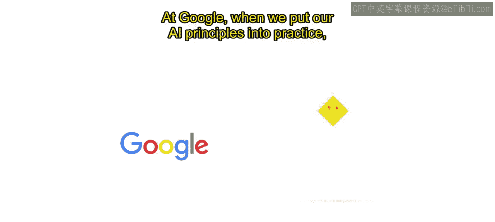
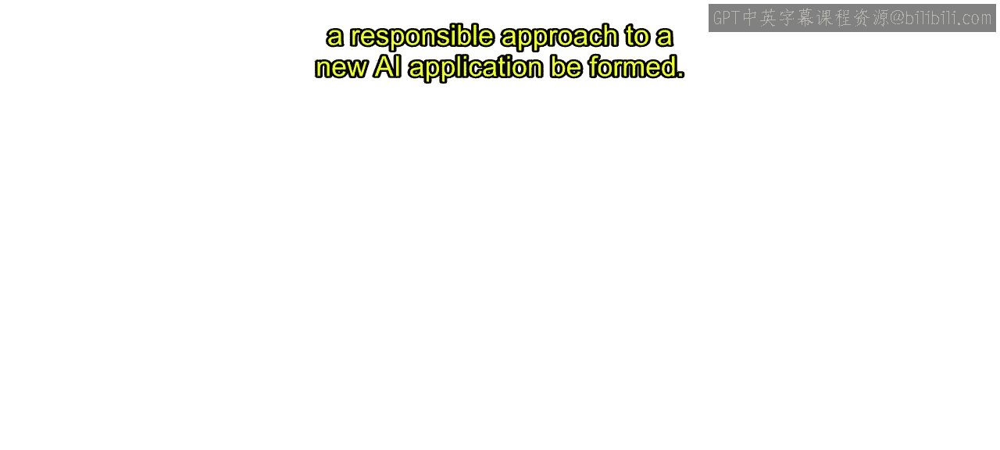

# 017：问题发现过程 🔍

在本节课中，我们将要学习谷歌在实践其AI原则时，一个至关重要的环节：**问题发现过程**。这是一个系统性地识别AI用例中潜在伦理问题的过程，旨在确保AI技术的负责任开发与应用。

## 问题发现过程概述

上一节我们介绍了AI治理与审查的重要性，本节中我们来看看谷歌如何具体执行这一过程。在谷歌，将AI原则付诸实践时，AI治理和审查流程的一个关键部分是**问题发现**。

这个过程旨在识别所讨论的AI用例中可能存在的伦理问题。谷歌意识到，人们需要一个指南来帮助发现伦理问题。

## 从清单到批判性思考

然而，这个指南不能是一个简单的清单，因为清单可能会阻碍批判性分析。相反，谷歌的问题发现方法基于提供一系列问题，这些问题要求人们对他们开发的技术进行批判性思考。

这些问题植根于成熟的伦理决策框架，这些框架强调寻找额外信息和考虑最佳与最坏情况的重要性。这有助于发现那些原本可能被忽视的潜在伦理问题。

## 问题涵盖的范围

以下是问题所涵盖的一系列主题，这些问题旨在引导全面的思考：

*   **整体产品定义**：正在解决什么问题？目标用户是谁？
*   **数据与模型**：使用什么数据？模型如何训练和测试？
*   **用例背景**：用例的目的和重要性是什么？其对社会有益的应用有哪些？被滥用的可能性有多大？

这些问题旨在强调设计决策可能产生的影响，这些影响可能关系到AI模型的公平和负责任使用。

## 审查流程与高风险领域

我们从假设“总存在可以解决的问题”这一前提出发，评估所有AI用例，即使某个用例看起来明显对社会有益。如果在这个批判性思考过程中出现了可能与AI原则的伦理目标相冲突的问题，就会进行更深入的审查。

在进行AI原则审查的过程中，我们认识到AI开发中的某些复杂领域值得进行更密切的伦理审查。识别与你的业务背景相关的用例的风险和危害领域至关重要。在构建这些领域的AI应用时应格外谨慎。例如，这些可能包括涉及监控或合成媒体等的用例。

对你业务而言的复杂领域在很大程度上取决于你的领域和客户。识别新出现的风险和社会危害领域是整个行业内积极讨论的一部分，我们可以期待该领域即将出台的标准和政策。

## 案例分析：ASD护理机器人

现在，让我们通过一个假设的用例，使用问题发现方法来评估是否有任何AI原则正在或有可能被违反。我们将审查一个名为“自闭症谱系障碍护理机器人”的虚构产品，该案例改编自圣克拉拉大学马库拉应用伦理学中心的案例研究。

ASD的成因存在很大争议，但研究表明其患病率正在增加，并且早期诊断并提供关键服务的儿童更有可能充分发挥其潜力。一些学校已经成功使用机器人在训练有素的治疗师监督下帮助学生练习语言技能和社交互动，但这还不是一种负担得起或广泛可用的资源。因此，并非所有学校都提供这种支持。

现在，想象一个AI产品团队提议构建一个面向学龄前儿童、旨在家庭中使用的、价格合理的ASD护理机器人。他们设想了一个基于云的AI聊天机器人，具备语音、手势、面部情绪分析功能，以及用于强化积极社交互动的个性化学习模块。

## 应用问题发现方法

在问题发现中，首先识别需要对该用例进行批判性思考的问题是有用的。例如：

*   谁是该产品的利益相关者？
*   他们希望从中获得什么？
*   不同的利益相关者是否有不同的需求？
*   ASD护理机器人的开发和使用可能如何实现或违反每一条AI原则？

你的AI原则审查可能会提出比你立即能回答的更多问题，但分析将揭示需要探索的领域，这些领域最终将影响你的团队如何推进。

以下是针对各AI原则可能提出的具体问题示例：

**社会效益**
> 该产品的目标是扩大一种治疗形式的可及性，目前并非所有能从中受益的人都能获得。然而，这是提供这种治疗的最佳或正确方式吗？ASD是否应该被视为需要这种干预的东西？

**避免不公平偏见**
> 团队可能如何影响模型的公平性？在审查产品设计和集成时，应在哪些方面密切考虑和评估公平性？我们是否获得了将直接受护理机器人影响的人的必要意见？训练数据将从何处获取？这些数据代表谁？是否有某些患有ASD的个人或群体可能未被充分代表？

**安全性**
> 如果这个模型没有按预期运行，或随着时间的推移出现模型漂移或衰减，会发生什么？会危及人类安全吗？

**隐私保护**
> 家庭可以被视为一个高度敏感和共享的环境，甚至比教室更甚。这个护理机器人将收集什么样的数据？是否存在可能构成特殊隐私风险的数据集？哪些设计原则有助于确保为这个高度敏感的用例提供适当的隐私保护？

**问责制**
> 如何确保对系统的人类监督？确定对于使用该系统的人来说，什么样的知情同意是合适的？例如，应该允许护理机器人将自己表现为朋友吗？有哪些可能的积极和消极影响需要考虑？

**科学卓越性**
> 产品所有者是否具备开发此类工具所需的专业知识？或者是否应考虑与专门研究ASD或教育治疗的 external partner 合作，以深入了解学生的需求？确定这一点的相关问题包括：为确保其性能并带来预期效益，对此用例进行何种测试和审查是合适的？负责任地做到这一点的技术和科学标准是什么？

**遵循原则的可用性**
> 该解决方案是否会广泛提供给用户（例如，价格合理且易于获取）？

## 总结

通过提出**问题发现**问题，团队可以进行批判性思考，以评估用例的潜在益处和危害。只有经过彻底的审查，才能形成对新的AI应用的负责任方法。

本节课中我们一起学习了谷歌的“问题发现过程”。我们了解到，这并非一个简单的检查清单，而是一套基于批判性思考的问题框架，它覆盖了从产品定义、数据使用到安全性、公平性等全方位的伦理考量。通过一个虚构的ASD护理机器人案例，我们看到了如何将这套问题应用于具体场景，从而系统性地识别和评估潜在风险，确保AI开发与谷歌的AI原则保持一致，并最终走向负责任的人工智能。