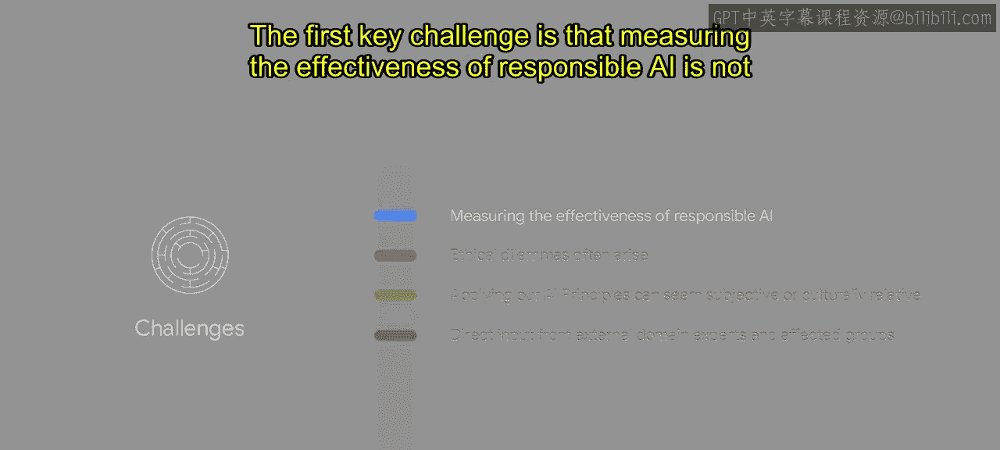
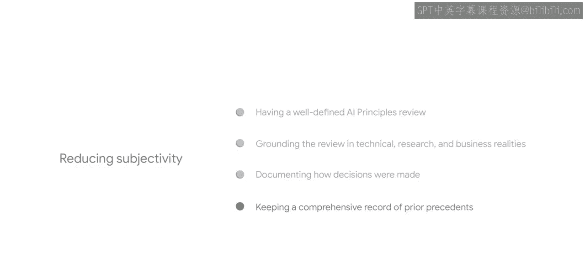

# 018：实施AI原则过程中的挑战 🧩

在本节课中，我们将探讨在将谷歌的AI原则付诸实践的过程中，团队所遇到的一系列关键挑战。理解这些挑战对于任何希望负责任地开发和部署AI的组织都至关重要。

将谷歌的AI原则付诸运营，需要众多人员的协作与辛勤工作。我们持续从成功与挑战中学习这一过程，并致力于不断迭代、演进和分享经验，以助力你的旅程。

接下来，我们将深入探讨在AI原则实施过程中经常遇到的一些挑战。我们推测，这些挑战可能并非谷歌独有。

---

## 挑战一：衡量负责任AI的有效性并非易事 📊

上一节我们介绍了实施AI原则的整体框架，本节中我们来看看第一个具体挑战：如何评估其效果。

衡量负责任AI的有效性并非直截了当。评估缓解措施如何解决伦理问题，可能比评估技术性能更为困难。在一个重视影响力指标和可量化结果的领域，衡量那些旨在防止潜在危害或问题发生的缓解措施的有效性，并不容易。

因此，指示负责任创新成功的指标，可能与传统的商业指标有所不同。以下是几种我们采用的衡量方式：

*   **追踪问题与缓解措施**：我们追踪产品中的相关问题、对应的缓解措施及其具体实施情况。
*   **评估治理影响力**：我们考察AI治理在建立客户信任和加速交易成功方面的影响。
*   **收集用户反馈**：通过调查和客户反馈，收集最终用户的体验和感知，是另一种衡量有效性的方法。

这些类型的指标有助于追踪影响、识别趋势并建立先例。

---

## 挑战二：伦理困境的权衡 ⚖️

在应用我们的原则时，伦理困境经常出现，而非简单的对错抉择。审查委员会的成员们各自对AI原则有不同的解读、生活经验和专业知识，他们会将自己的价值观应用于伦理问题。这会在不同价值观之间产生张力，引发大量辩论。

需要记住的是，这些困境以及由此产生的审慎讨论，正是AI原则审查的核心目标之一。解决这些困境需要开放、坦诚的对话，并理解这些并非容易做出的决定。这些对话最终有助于识别和评估我们不同选择之间的**权衡（trade-offs）**。

---

## 挑战三：原则应用的主观性与文化相对性 🌍

另一个挑战是，应用我们的AI原则可能显得主观或具有文化相对性。我们通过以下几种方式来减少主观性：

*   **明确的审查流程**：拥有定义清晰的AI原则审查和决策流程，以培养对该流程的信任。
*   **立足现实**：将审查建立在技术、研究和商业现实的基础上，将缓解措施与现实世界的问题联系起来。
*   **记录决策过程**：记录决策是如何做出的，可以提供必要的透明度，并确保审查团队及其他相关方的问责。
*   **建立先例记录**：保持全面的先前案例记录，通过评估当前案例是否与过去案例有显著不同，来确保决策的一致性。

---

## 挑战四：获取外部专家与受影响群体的直接意见 🗣️

我们面临的另一个挑战是获取外部领域专家和受影响群体的直接意见。这至关重要，但并非易事，我们承认这个过程可能很困难。没有一个人能完全代表你试图代表的群体观点。我们的目标是尽可能广泛地听取各种声音，以确保产品是为所有人而设计的。

---

## 总结与展望

以上只是开发负责任AI过程中可能面临的众多挑战中的几个例子。在负责任AI的旅程中，问题和挑战将始终存在。认识到这一点，是努力最小化和缓解这些挑战的起点。

本节课中，我们一起学习了实施AI原则时在**有效性衡量**、**伦理困境**、**主观判断**以及**外部意见获取**等方面遇到的主要挑战。理解这些挑战，是构建更强大、更负责任的AI治理体系的第一步。