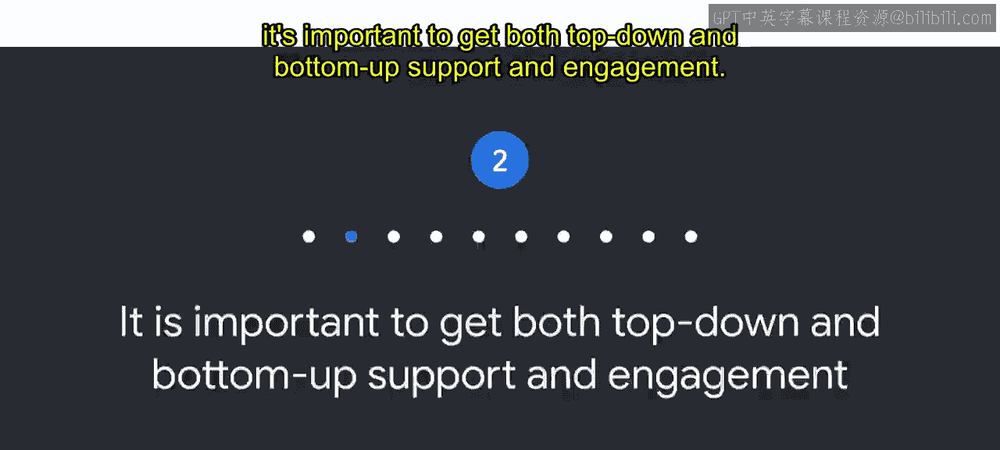
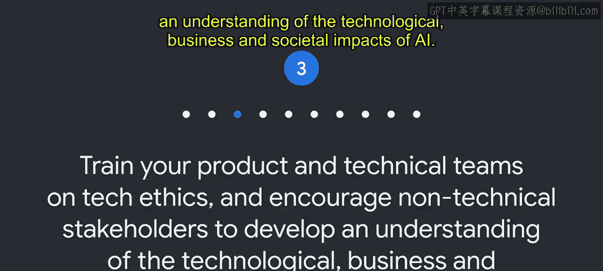
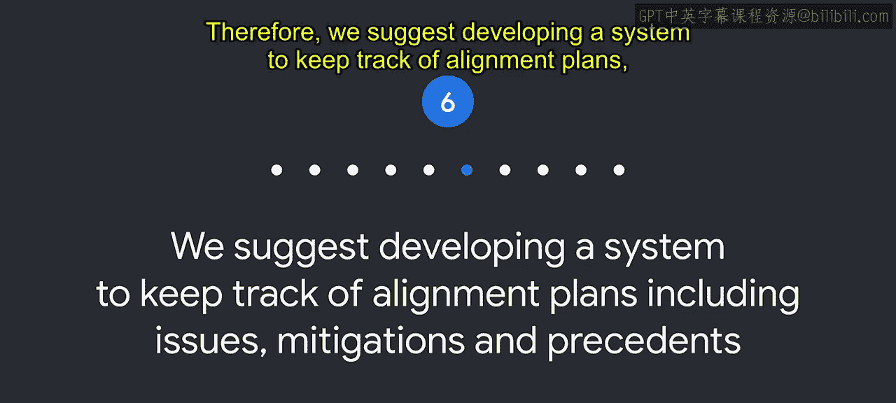
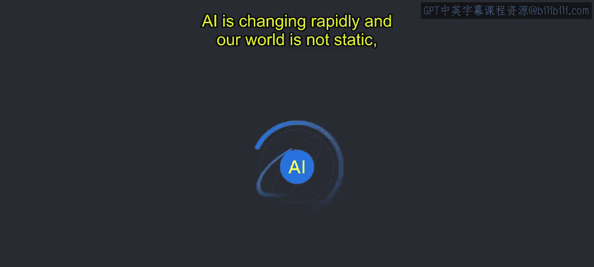

# 019：从实施AI原则中学到的最佳实践 🎯

在本节课中，我们将探讨谷歌在将其AI原则付诸实践的过程中所汲取的经验教训，以及这些经验如何催生出一套行之有效的最佳实践。这些实践旨在帮助组织负责任地开发和应用人工智能技术。

---

## 概述

我们将探索从AI原则实施中获得的经验，并了解这些经验如何引导我们形成一套最佳实践。我们鼓励您根据自身组织的需求，选择、调整并应用这些实践。

---

### 组建多元化的审查委员会

上一节我们介绍了AI原则的重要性，本节中我们来看看如何有效地实施这些原则。研究表明，组建一个在文化背景、专业知识和资历层级上多元化的审查委员会大有裨益。在谷歌，我们发现这是关键所在。

所有AI原则都需要解读，因此，组建一个能更贴近代表您当前或潜在用户群体的审查委员会至关重要。

以下是构建多学科团队时需要考虑的要点：
*   在组建团队时，必须纳入**多样性、公平性和包容性**的考量。
*   汇集多元化的群体有助于做出更明智的决策，从而产生更具可操作性和可行性的解决方案。

---

### 获取自上而下与自下而上的支持

关于AI原则的采纳，我们认识到同时获得自上而下和自下而上的支持与参与非常重要。

高层领导授权采纳AI原则是必要的，但这还不够。我们了解到，真正的文化变革需要整个组织的广泛采纳。

我们的经验是，团队自下而上的参与有助于使其常态化，这是将负责任AI嵌入公司文化的关键一步。同样，我们的经验表明，团队通常对负责任AI这一主题非常感兴趣，并且对此往往有自己的见解和信念。利用这种驱动力和知识，有利于整体的采纳。

---

### 通过教育推动采纳

在谷歌，负责任AI的采纳源于对团队的教育。因此，我们建议您对产品和技术团队进行技术伦理培训，并鼓励非技术利益相关者理解AI在技术、商业和社会层面的影响。

这有助于建立一种拥抱负责任AI的公司文化，将伦理道德直接与技术开发和产品卓越性联系起来。

---

### 统一商业目标与AI责任目标

认识到商业目标与负责任AI团队的目标和动机是一致的，这一点很重要，因为**负责任AI = 成功的AI**。

构建负责任的AI产品意味着直面伦理问题和困境，有时甚至需要放慢脚步以找到正确的前进道路。在这里，商业动机和负责任AI的动机可能看似冲突，但实际上，发布一个对所有人都运行良好的产品，既有利于商业，也有利于世界。

---

### 追求治理过程的透明度

我们力求在负责任AI治理过程中保持透明。

我们相信，围绕我们的流程和相关人员的透明度能够建立信任。虽然单个审查的细节通常需要保密，但治理过程的透明度有助于建立信任和可信度。

---

### 建立追踪与记录系统

在谷歌，我们还认识到当前的工作会影响未来的决策。因此，我们建议开发一个系统来追踪一致性计划，包括问题、缓解措施和先例。

谷歌审查团队的一个具体目标是识别模式并保存记录，以追踪决策及其制定过程，从而为未来的工作和审查提供参考。这个系统也有助于向利益相关者提供透明度，表明审查团队遵循了一条经过验证且可信的路径来做出决策。通过这种能在整个组织内提供一致信息的文档记录，我们发现负责任AI的倡议能够扩展到影响更多人。

---

### 保持谦逊与开放的态度

在我们的负责任AI之旅中，我们也认识到了保持谦逊态度的重要性。AI技术正在飞速变化，我们的世界也并非静止不变。

我们尝试有意识地记住，我们始终在学习，并且总能改进。我们相信，必须在确保解读的一致性与对新研究和新信息保持开放和响应之间保持微妙的平衡。在实施负责任AI实践时，我们相信保持开放演进的态度将使我们能够做出最佳、最明智的决策。

---

### 投资于心理安全感

我们了解到投资于心理安全感的好处。当一个团队拥有心理安全感时，成员通常会感到可以安全地承担风险，并在彼此面前展现脆弱。

在审查过程中，团队需要感到自在，能够探索“如果……会怎样”的问题和滥用领域，以便共同发现潜在问题。然而，尽管探索所有潜在问题是此过程中的重要一步，但为了避免“分析瘫痪”，在制定全面的防护措施之前，必须将问题发现建立在技术、商业和社会的现实基础之上。

---

### 明确效率并非首要目标

另一项最佳实践是：效率并非AI原则流程的首要目标。

需要在产品开发目标与进行全面AI审查所需的时间之间取得平衡。如果过于关注效率，可能会错过那些给客户带来后续伤害的潜在问题。虽然我们的AI原则需要解读并包含试错的成分，但它们仍需支持业务的速度和规模。深思熟虑和健康的意见分歧为人们提供了探索风险和缓解措施的空间。但一个周到且稳健的伦理流程也意味着要支持产品开发目标。

---

### 预设每个AI应用都需要关注

从假设每个AI应用都需要关注开始。伦理问题并非总是源于最明显的争议性用例和AI产品。即使是看似有益或无伤大雅的AI用例，也可能存在相关的问题和风险。这种假设推动我们去设想“如果……会怎样”，并探索所有可能的场景，以制定一套全面的缓解措施。我们的AI原则审查正是指导这些对话的框架。

---

## 总结

本节课中我们一起学习了谷歌从AI原则实施中总结出的一系列最佳实践，包括组建多元化委员会、获取全方位支持、重视教育、统一目标、保持透明与记录、秉持谦逊态度、营造心理安全感、平衡效率与深度审查，以及预设全面关注。我们知道这些实践将随时间进一步演进。我们希望这些最佳实践在您创建和实施自己的负责任AI流程时能有所帮助。