# 020：迈向负责任的AI之旅 🚀

在本节课中，我们将学习谷歌如何构建负责任的AI，并探讨如何将相关原则与实践应用到您自己的项目中。课程将涵盖谷歌的AI原则、其组织内的实施方式，以及如何为您自己的团队制定策略。

---

在谷歌，我们坚信对如何负责任地构建AI进行严格评估，不仅是正确之举，更是创造成功AI的关键组成部分。

产品和技术应服务于每个人。我们的AI原则使我们被一个共同的目标所激励，引导我们以最符合全球人民利益的方式使用先进技术，并帮助我们做出符合谷歌使命和核心价值观的决策。

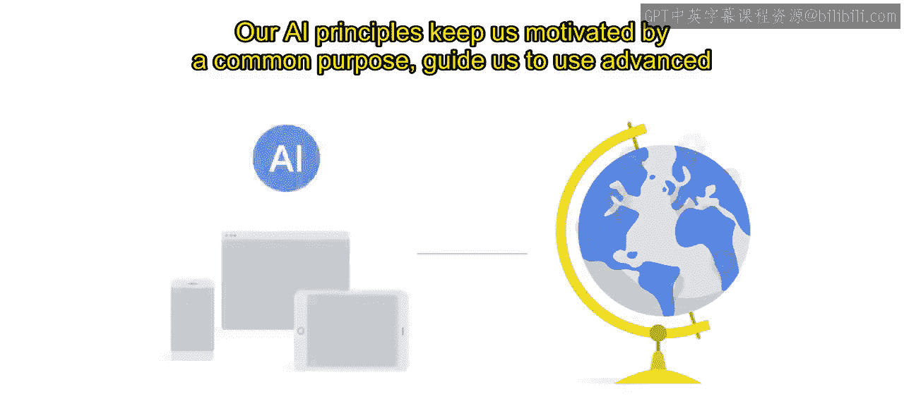

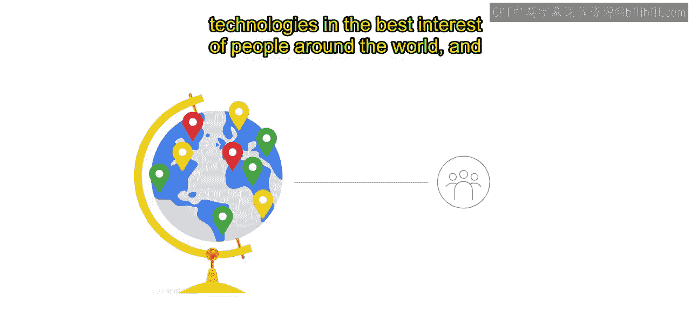

在如何应用负责任的AI方面，我们都将扮演一个角色。

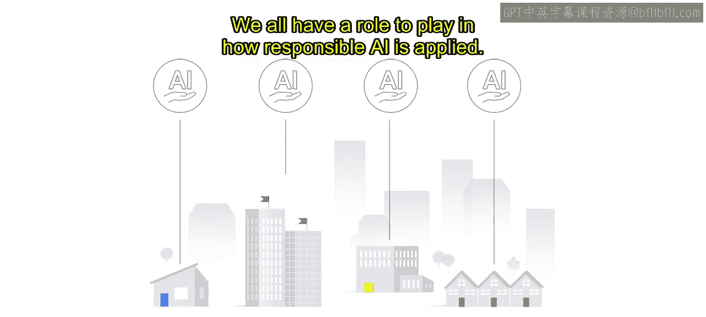

我们的目标是，通过参加本课程，您能理解谷歌如何制定其AI原则，以及如何在组织内部将其付诸实践。

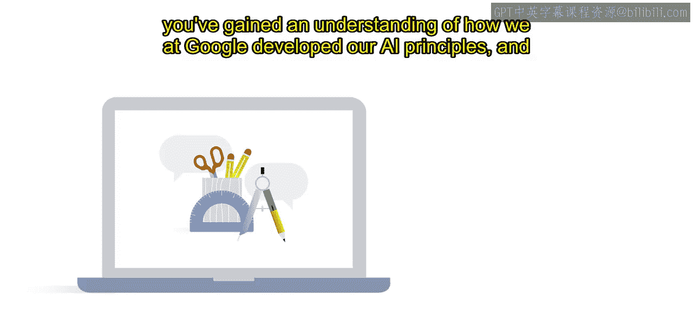

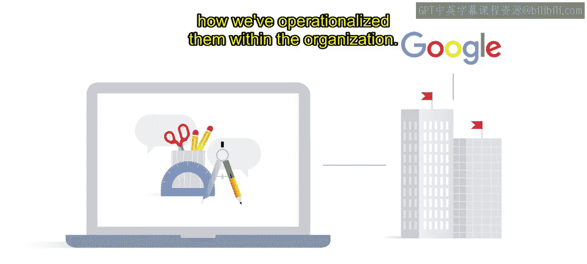

我们希望您能将本次培训中学到的经验教训和最佳实践作为一个起点，与您的团队合作，进一步推进您的负责任AI战略。

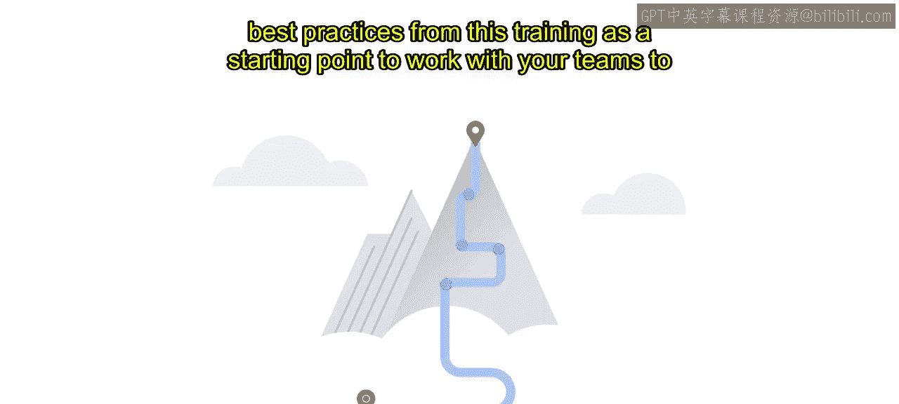

我们向您提出的挑战是，您现在可以运用这些知识，制定您自己的AI原则及相应的审查流程。

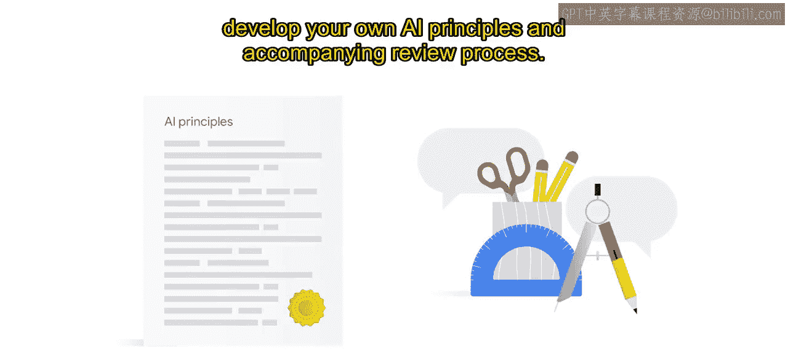

无论您在AI之旅中处于何处，一个有价值的目标是与您的团队讨论，在您自身业务背景下，负责任的AI意味着什么。

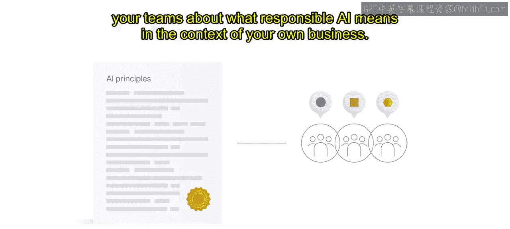

这些讨论在您规划自己的AI原则时将有所帮助。

我们知道，无论是人类系统还是AI驱动的系统，都不会是完美的。因此，我们不认为改进它的任务会终结。

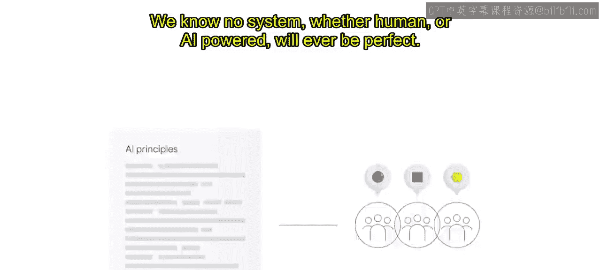

我们期待继续向您更新我们的所学和进展。

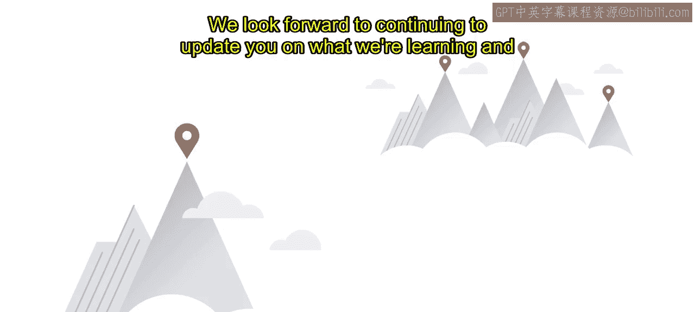

我们在谷歌和谷歌云的负责任AI页面上分享这些信息。

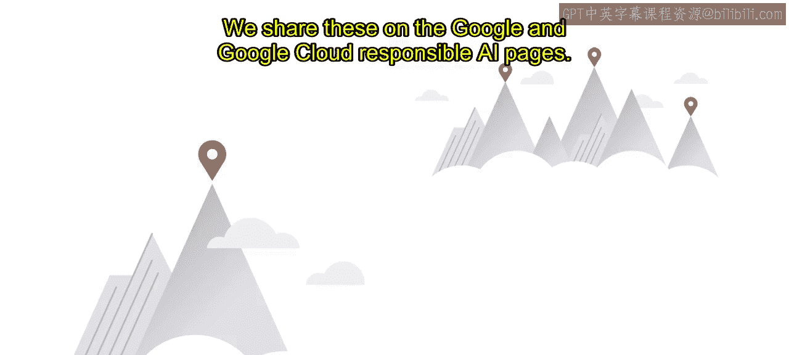

如果您想采取下一步行动，与谷歌合作开展您的下一个项目或实现业务目标，您可以随时联系您当地的谷歌云客户代表或谷歌云机器学习专业合作伙伴。

如果您对负责任的AI有具体问题，可以直接联系谷歌云负责任AI团队。

我们对负责任的AI的承诺坚定不移。

感谢您加入这段旅程并与我们一同学习。

---

本节课中，我们一起学习了谷歌构建负责任AI的核心信念与原则。我们了解到，严格的评估和明确的指导原则对于AI的成功至关重要。课程鼓励我们将这些经验作为起点，与团队协作定义自身的AI原则，并认识到这是一个持续改进的过程。最后，我们知道了如何获取更多资源并与谷歌合作，共同推进负责任的AI实践。