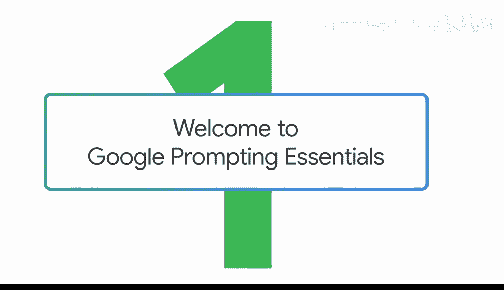
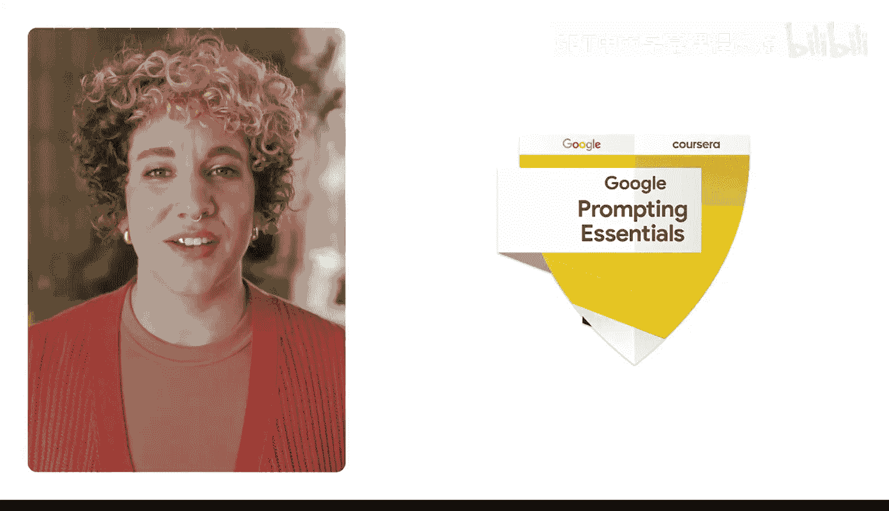

#  001：欢迎来到谷歌提示词基础课程

在本节课中，我们将要学习谷歌提示词基础课程的概述，了解课程目标、内容结构以及你将获得的收获。

🎼

🎼

你可能已经尝试过生成式人工智能，并且可能得到了一些有用的结果，也可能有一些结果不尽如人意。在本课程中，谷歌的人工智能专家将教你区分好的提示词和优秀的提示词，以便你能借助生成式人工智能更快速、更智能地工作。

我们还将分享在工作中可以使用生成式人工智能的实际案例。

大家好，我是Aina，在谷歌从事生成式人工智能相关工作。在本课程中，我和我的同事们将教你如何充分利用生成式人工智能。

你将学习何时使用生成式人工智能，以及如何通过设计更好的提示词来获得最佳结果。你将通过动手实践活动和测验来应用所学知识，从而提升你的提示词技能。

完成本课程后，你将通过大量实践，掌握如何将生成式人工智能应用到对你和你的工作至关重要的场景中。😊

作为对你学习成果的认可，你将获得一份谷歌颁发的证书，可以与你的社交网络和潜在雇主分享。

我们准备了许多令人兴奋的内容，让我们开始吧。

🎼

本节课中我们一起学习了谷歌提示词基础课程的介绍，明确了课程旨在提升提示词设计能力，并通过实践获得认证。接下来，我们将深入探讨如何构建有效的提示词。