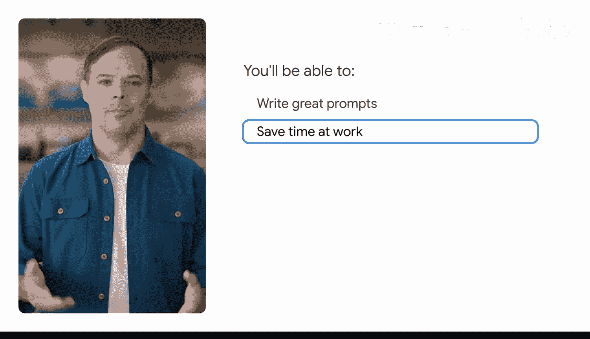
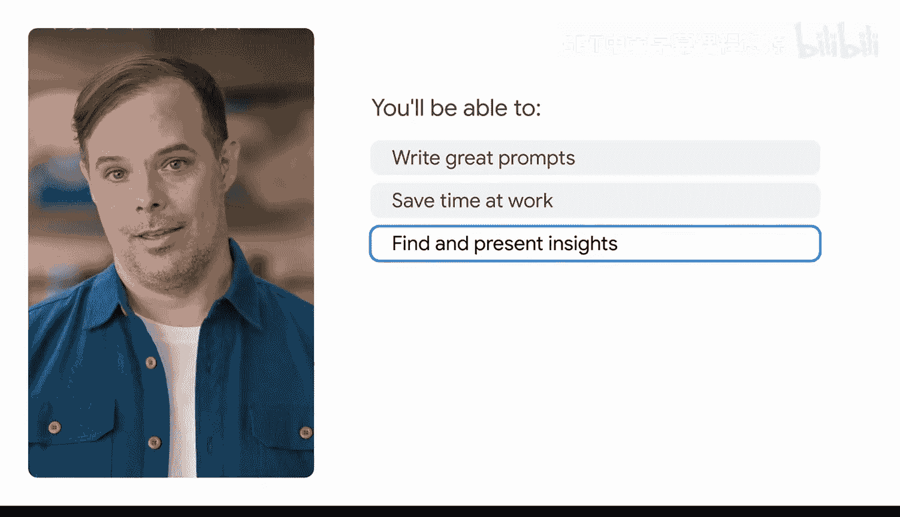
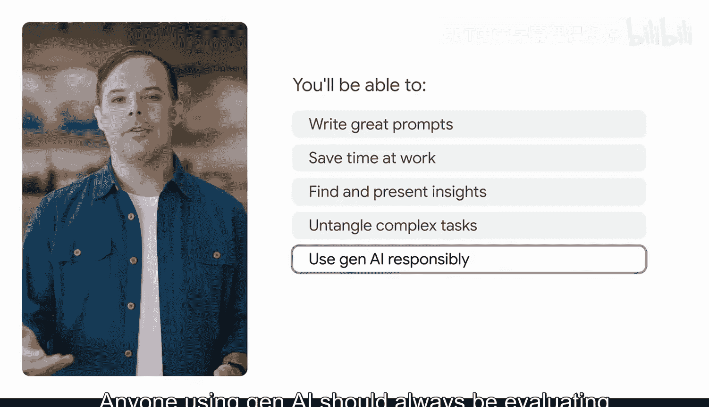

#  002：探索AI如何在工作中助你一臂之力 🚀

在本节课中，我们将要学习生成式人工智能（Gen AI）如何成为你工作中的得力助手。我们将了解什么是提示词，以及如何通过有效的提示词框架，将AI应用于各种实际工作场景，从而提升效率。

---

我是 Timothy，在谷歌担任开发者关系总监。过去14年，我一直在帮助开发者和谷歌更好地协作。最近，我更多地使用生成式AI来完成技术写作和代码生成等任务。我也在帮助更多开发者将生成式AI集成到他们的应用中。

提示词是我们许多人（包括我自己）正在学习和努力掌握的一项新技能。

我第一次使用生成式AI并感受到其变革力量的经历，源于一个相当简单的任务。我需要快速收集团队成员对一个重要会议的时间安排。我在聊天群里询问，大家回复的格式五花八门。要手动整理这些信息非常繁琐。但在生成式AI的帮助下，我成功地将所有人的时间安排整理成表格，并按日期而非聊天顺序进行了排序。这个手动操作需要花费大量时间的任务，借助生成式AI只花了我几分钟。这就是我的突破性时刻，我开始在日常工作中使用生成式AI，将曾经令人头疼的事情变得简单轻松。

这正是本课程的核心：使用生成式AI帮助你完成工作。

那么，究竟什么是提示词？简单来说，**提示词**是指向生成式AI工具提供特定指令，以获取新信息或实现某项任务预期结果的过程。这些指令就叫做提示词。当我们为生成式AI工具编写提示词时，我们是在给它一系列输入，并告诉它我们希望它生成什么。有些生成式AI工具可以生成文本或图像，而另一些则可以生成视频、音频甚至代码。

提示词既是一门艺术，也是一门科学。为了获得最佳结果，我们需要精确地定义需求。这类似于你帮助新同事开始一个项目：提供背景信息和设定参数，才能从生成式AI那里获得最佳输出。

你首先将学习的是**提示词框架**。这是一个用于编写优秀提示词的公式。你将在整个课程中使用这个框架。

之后，重点是将提示词应用于能为你节省时间的特定任务中。你将使用生成式AI来集思广益、制定计划，并为不同受众起草邮件。我们将教你如何总结会议记录、分配行动项等。

我们还将教你如何使用生成式AI分析数据和电子表格。

你将编写提示词，帮助你挖掘隐藏在数据中的洞见。然后，你将使用生成式AI将这些洞见转化为可视化图表，并最终将其整合成一份带有演讲要点的演示文稿幻灯片。

接下来，你将学习高级提示词技巧，以帮助你处理复杂任务。例如，你将学习如何创建提示词，让长期、复杂的项目更易于规划和执行。你还将学习如何设计提示词来创建你自己的个性化AI助手，用于模拟面试练习或准备困难的工作对话。

最后，你将学习如何负责任地使用生成式AI，包括在工作中和团队中使用它的指导原则。这至关重要。生成式AI工具是辅助你工作的，而不是代替你工作。任何使用生成式AI的人都应始终评估和核实其输出。

市面上有很多生成式AI工具。在本课程中，我们将演示如何使用Gemini及其他谷歌AI工具（如适用于Google Workspace的Gemini和Google AI Studio）进行提示词交互。但你在本课程中学到的所有技巧和最佳实践，同样适用于其他生成式AI工具，如ChatGPT、Copilot或Claude。

最后一点，我们设计这门课程是为了让你能立即在工作中应用所学技能。因此，你将要学习的所有课程和技巧都根植于真实场景。你应该进行实验和探索，找出最适合你的方法。在学习本课程时，请随时暂停视频，用你当前正在处理的工作来测试刚学到的内容。

现在，让我们开始编写第一个提示词吧。😊