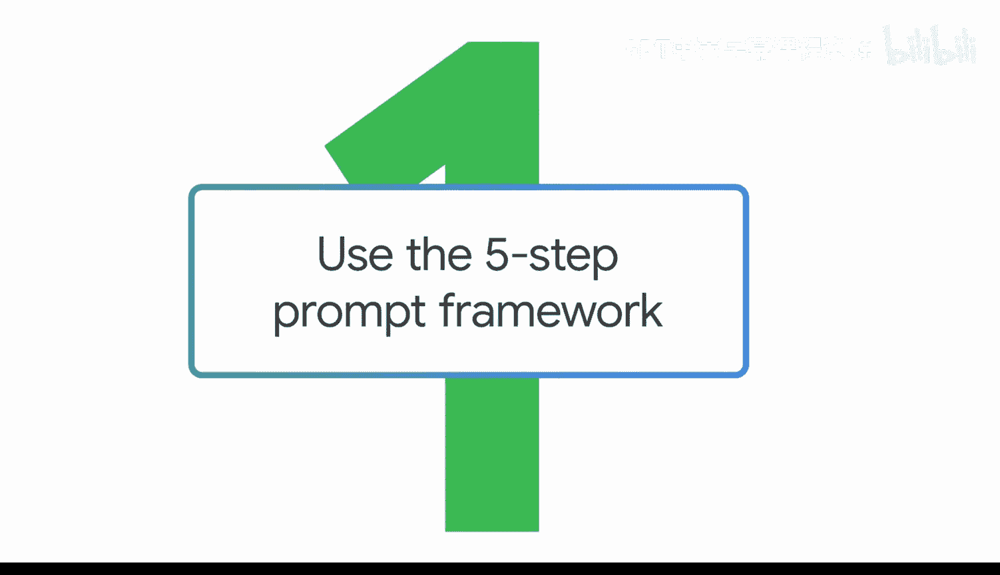
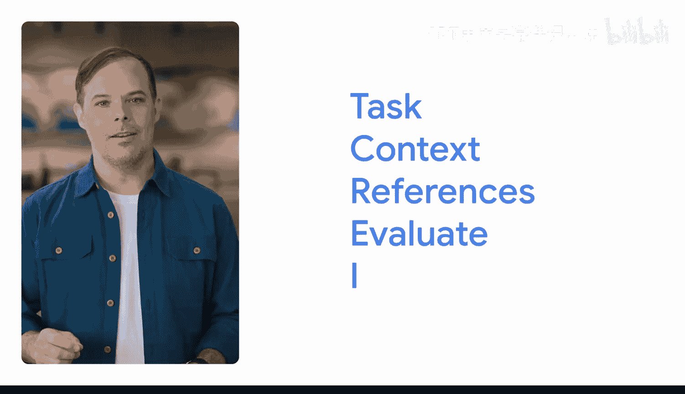
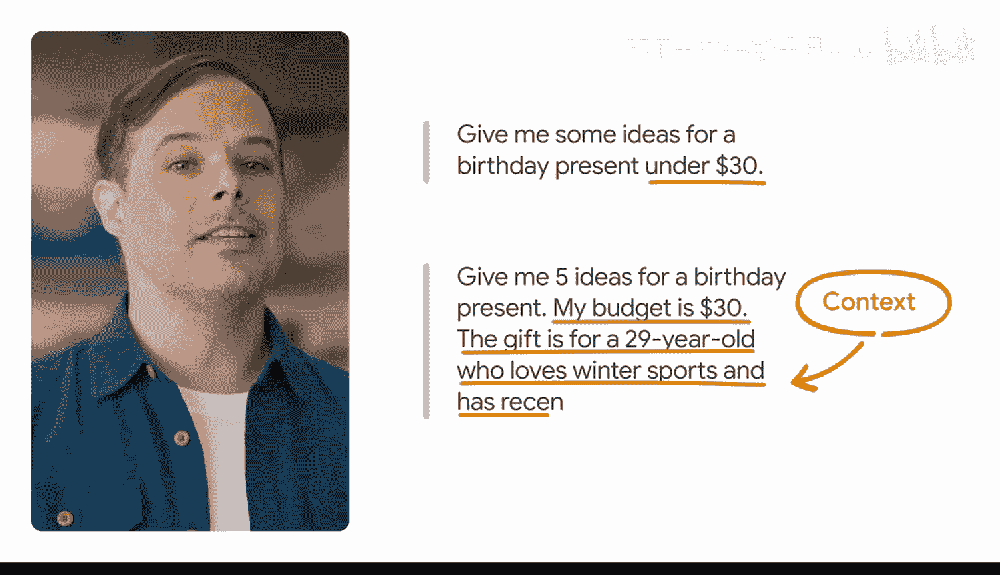
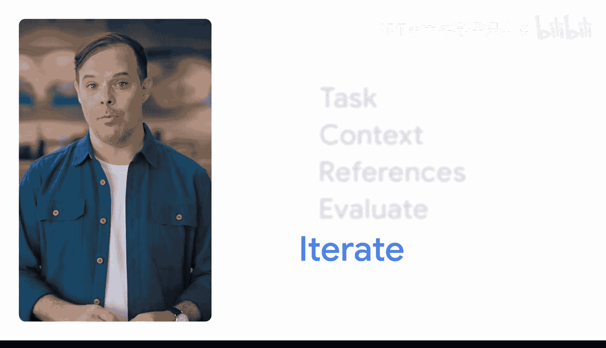

#  004：使用五步提示词框架 🎯

在本节课中，我们将学习如何创建有效的提示词。一个好的提示词遵循一个简单的框架。

## 概述

我们将介绍一个由五个步骤组成的提示词框架，它能帮助你系统地构建提示词，从而从生成式AI工具中获得更准确、更有用的输出。这个框架可以概括为：**任务、背景、参考、评估和迭代**。

如果你忘记了步骤，只需记住这个口诀：**深思熟虑地创造真正优秀的输入**。

---

## 第一步：任务

首先，你需要描述你希望生成式AI工具帮助你完成的任务。这应该包括一个**角色**和一个**格式偏好**，以使任务具体化。

*   **角色**指的是你希望AI工具借鉴何种专业知识。你可以要求工具扮演一个角色，例如“专业的演讲稿撰写人”或“拥有15年经验的营销主管”。你也可以要求它为特定受众（如客户或你的经理）创建输出。在任务中添加角色时，你可以尽可能详细。
*   **格式**指的是你希望输出以何种形式呈现，无论是**项目符号列表**、**短句**还是**表格**。

这样，你就完成了“任务”部分。

---

## 第二步：背景

接下来，你需要提供**背景信息**，即必要的细节，以帮助生成式AI工具理解你的需求。

背景信息是区分模糊请求和精准请求的关键。例如：

*   **模糊请求**：“给我一些30美元以下的生日礼物点子。”
*   **精准请求**：“给我五个生日礼物点子。我的预算是30美元。礼物是送给一位29岁、热爱冬季运动、最近刚从单板滑雪转为双板滑雪的人。”

通过添加背景信息，你可以引导AI生成更贴合你具体情况的答案。

---

## 第三步：参考

有时，你需要在提示词中添加**参考**，供AI工具在创建输出时使用。

例如，你刚刚要求AI工具提供生日礼物点子。如果你能附上过去送过的生日礼物作为参考示例，AI工具就能给出更有用的输出。

当然，并非所有任务都有明确的参考，尤其是在处理更抽象的工作或寻找灵感和想法时。

---

## 第四步：评估

一旦你获得了输出，就该进行**评估**。问问自己：你提供的输入是否得到了你需要的输出？

评估是判断提示词有效性的关键环节。

---

## 第五步：迭代

评估输出后，如果我们确定没有得到想要的结果，就可以进入框架的最后一步：**迭代**。

你可以通过添加更多信息或调整提示词来再次尝试。这是有效提示的关键部分，我们将在课程后面深入探讨。

---

## 关于框架的重要说明

构建有效提示词的方法有很多种。提示词的**构建顺序**远不如提示词本身的**实质内容**重要。

只要你遵循“**深思熟虑地创造真正优秀的输入**”这一原则，你的输出结果就会很棒。

---

## 总结

本节课我们一起学习了构建有效提示词的五步框架：**任务、背景、参考、评估和迭代**。记住，核心在于为AI提供清晰、具体、有上下文的指令，并通过评估和迭代不断优化。掌握这个框架，你将能更高效地与生成式AI工具协作。