#  005：将提示词框架付诸实践 🚀

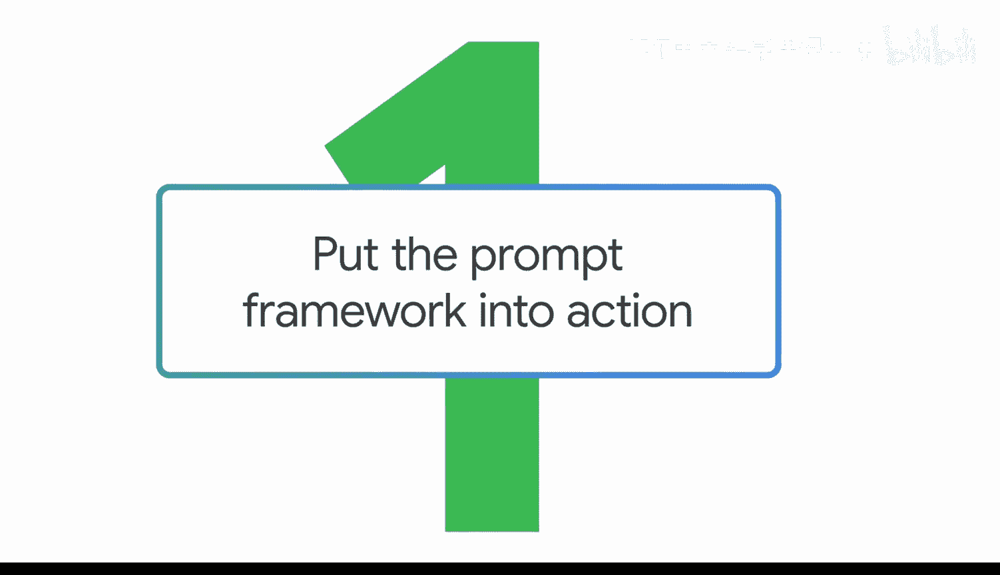

在本节课中，我们将通过一个具体的案例，学习如何将提示词框架（任务、上下文、格式、参考）付诸实践，以生成更高质量、更符合需求的AI输出。我们将以构思一款高性能运动鞋产品线为例，逐步优化我们的提示词。

---

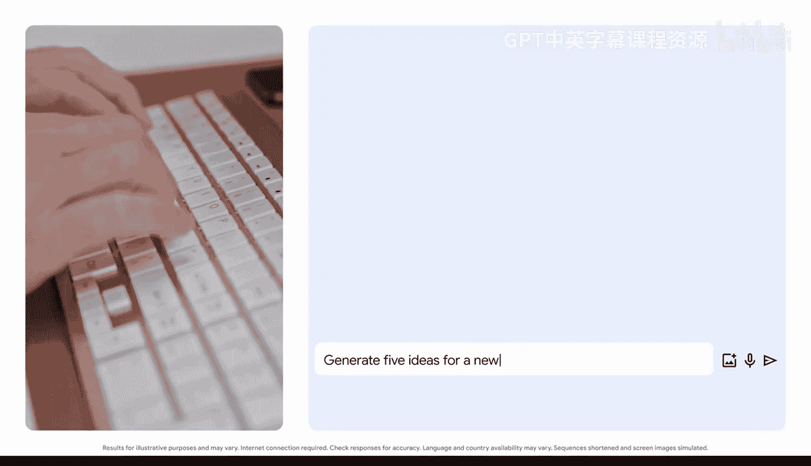

## 概述

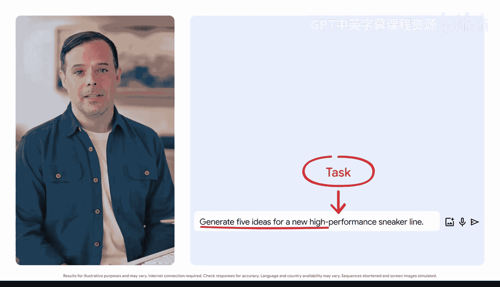

我们将登录Gemini工具，并尝试让它帮助我们为一个新的高性能运动鞋系列进行头脑风暴。通过逐步应用提示词框架的各个要素，我们将看到提示词从简单到复杂的演变过程，以及每一次优化如何显著提升输出结果的质量和相关性。

---

## 从简单任务开始


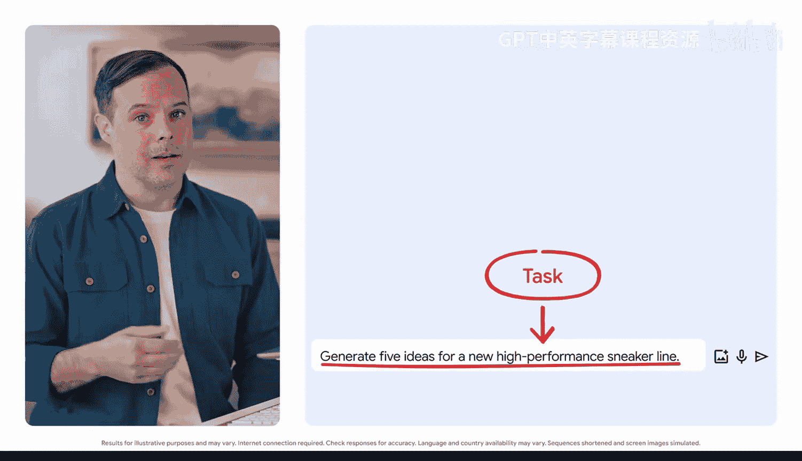

首先，我们从一个最基本的任务型提示词开始。

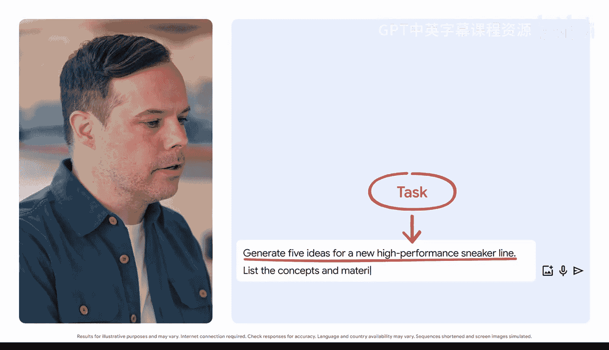

**提示词：**
```
Generate five ideas for a new, high performance sneaker line.
```

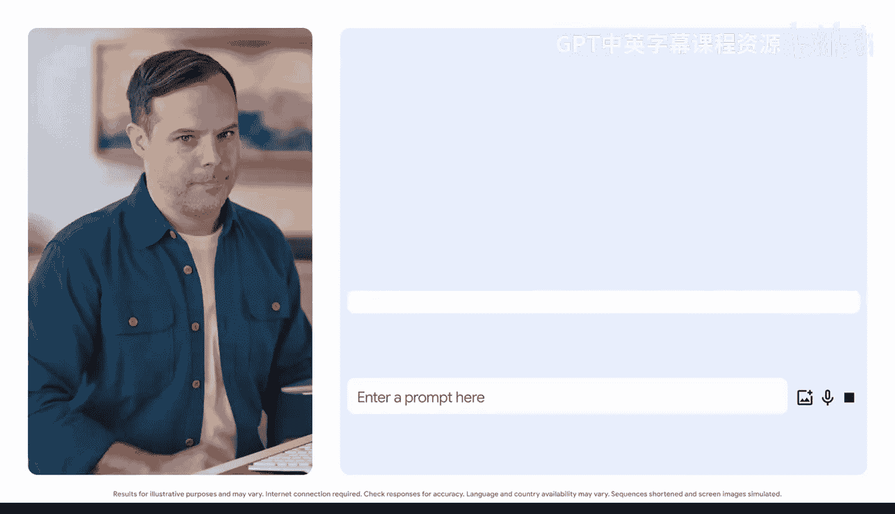

这个提示词只包含了任务，没有其他任何信息。Gemini生成了五个带有独特名称和描述的想法。虽然这是一个不错的起点，但结果可能过于宽泛，实用性有限。

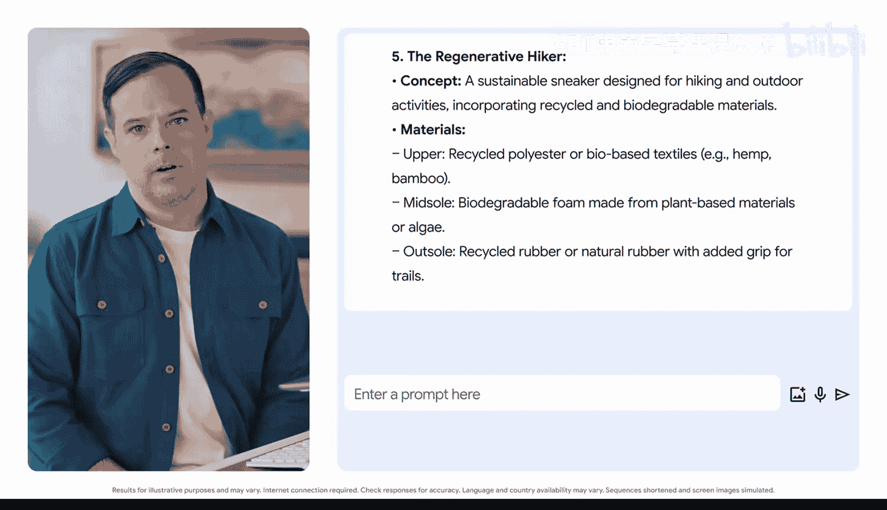

上一节我们介绍了提示词框架的四个核心要素。本节中我们来看看，如何通过添加更多要素来优化结果。


---

## 添加格式要求

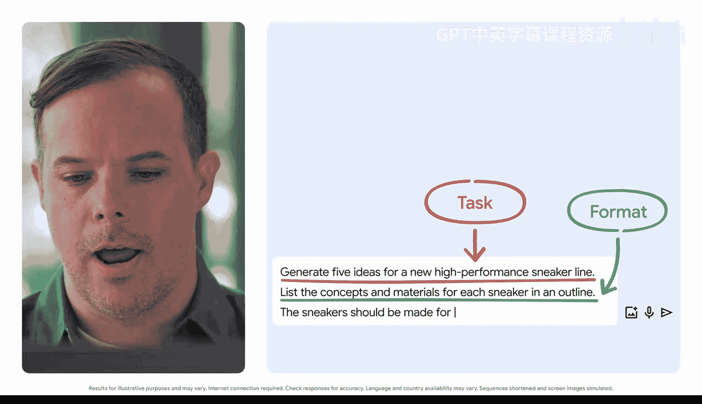

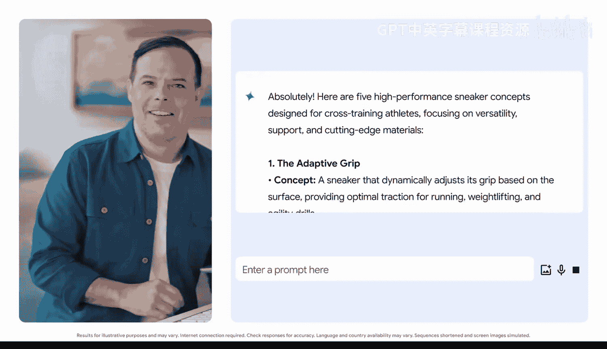

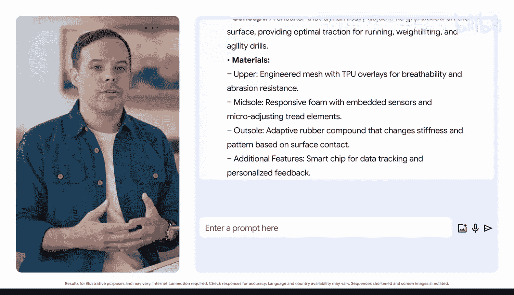

为了让输出更结构化、更易于使用，我们可以在提示词中明确指定期望的格式。

**优化后的提示词：**
```
List five concepts for a new, high performance sneaker line. For each sneaker, list the concepts and materials in an outline.
```

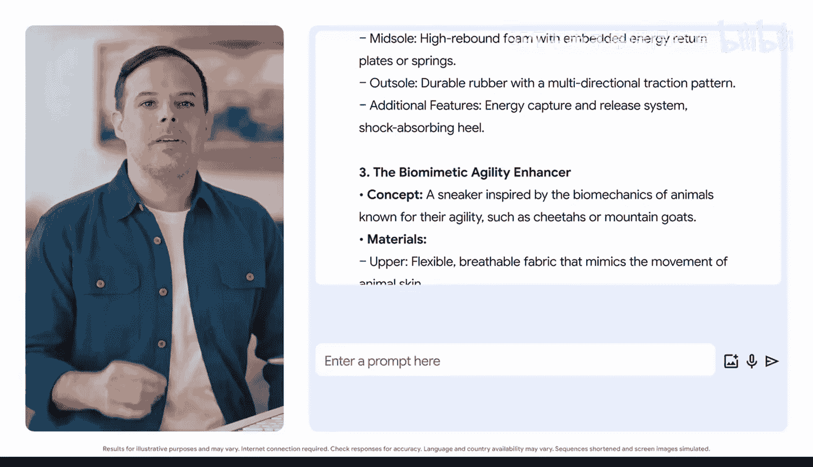

现在，我们不仅要求生成想法，还指定了输出格式（大纲形式）和更具体的任务（列出概念和材料）。结果得到了显著改善，我们获得了一套包含每款鞋所用材料的独特想法，并且是以我们喜欢的大纲格式呈现的。

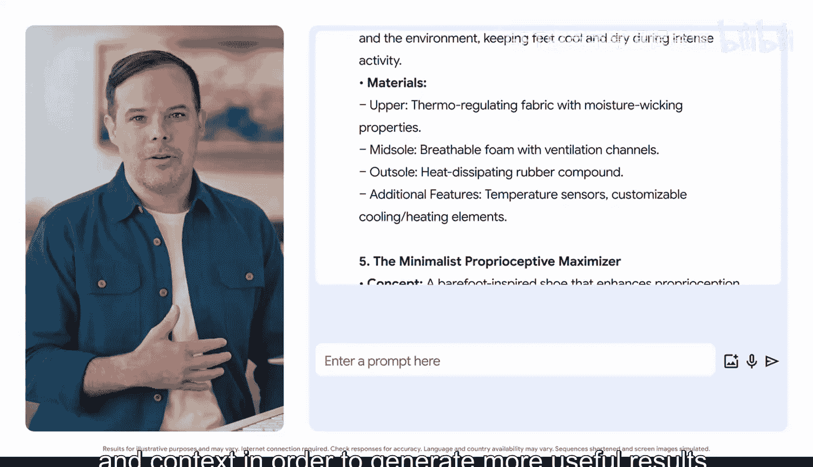

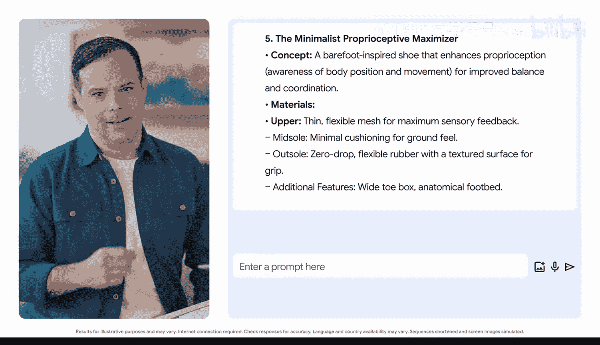

---

## 添加上下文信息

为了使想法更具针对性，我们需要为AI工具提供更多背景信息，即添加上下文。


**进一步优化的提示词：**
```
List five concepts for a new, high performance sneaker line. For each sneaker, list the concepts and materials in an outline. The sneakers should be made for athletes doing cross-training activities.
```

通过添加“适用于进行交叉训练运动员”这一上下文，Gemini生成的五个新运动鞋想法更加贴合我们的特定目标。这表明，提供更多细节和上下文有助于生成更有用的结果。

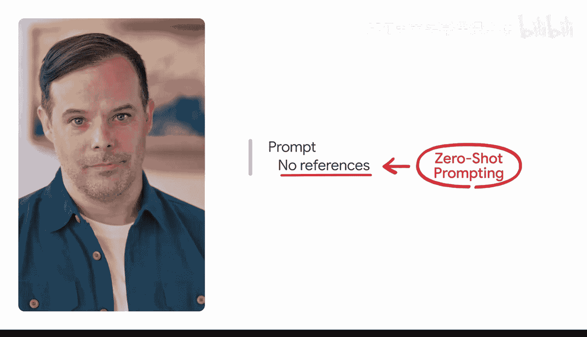

---

## 引入参考示例

要获得真正量身定制的输出，我们可以为生成式AI工具提供参考示例，让它学习特定的风格、语调或结构。这种方法也称为**少样本提示（Few-Shot Prompting）**。

以下是参考提示的几种类型：
*   **零样本提示（Zero-Shot）**：不提供任何参考示例。
*   **单样本提示（Single-Shot）**：提供一个参考示例。
*   **少样本提示（Few-Shot）**：提供2到5个参考示例。这通常是效果最佳的“甜点区”。

现在，让我们为运动鞋构思任务加入两个现有鞋款的描述作为参考。

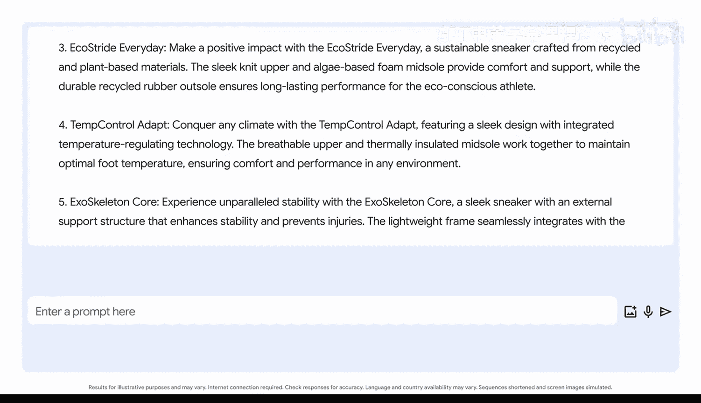

**最终优化的提示词：**
```
Keep the five ideas generated, but refine them using these two examples as references:
[在此处粘贴第一个参考鞋款描述]
[在此处粘贴第二个参考鞋款描述]
```

通过提供参考，AI能够融合示例中的特点（例如，来自预算产品线、采用新型自适应鞋底），生成更具创意和贴合需求的选项，例如一款能调节温度的鞋。

---

## 评估与迭代

评估输出和迭代改进是提示词框架的最后环节，也是我们进行实验和发挥创造力的地方。每一次新的输出都是进一步优化提示词的机会，直到获得满意的回应。


事实上，在整个实践过程中，我们一直在进行评估和迭代：
1.  我们评估了第一个提示词生成的鞋款想法。
2.  我们通过添加上下文进行了迭代。
3.  我们再次评估输出，并通过添加参考示例进行了迭代。


我们始终可以**添加细节**或**调整措辞**来改变输出。记住这个口诀：**ABI（Always Be Iterating，持续迭代）**。

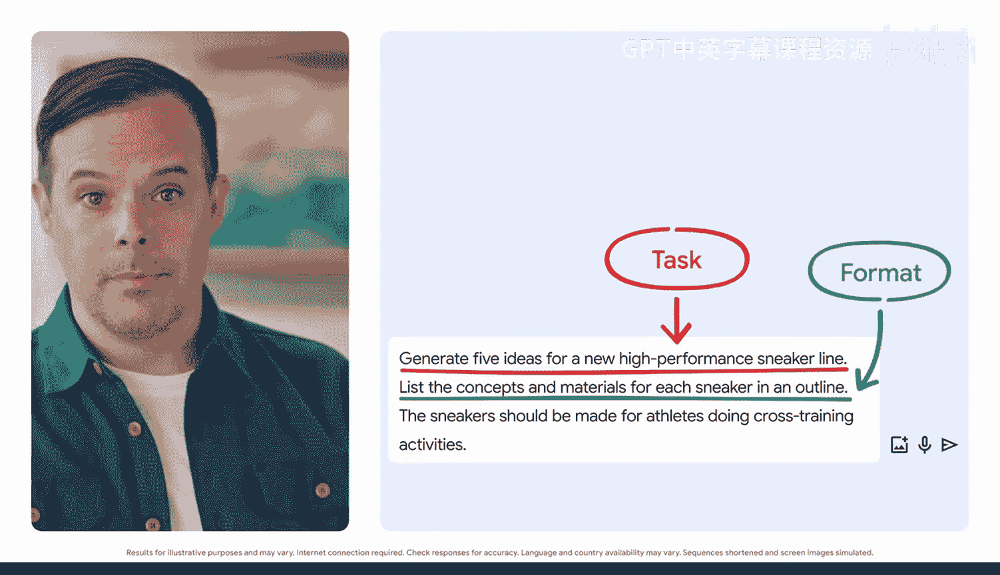

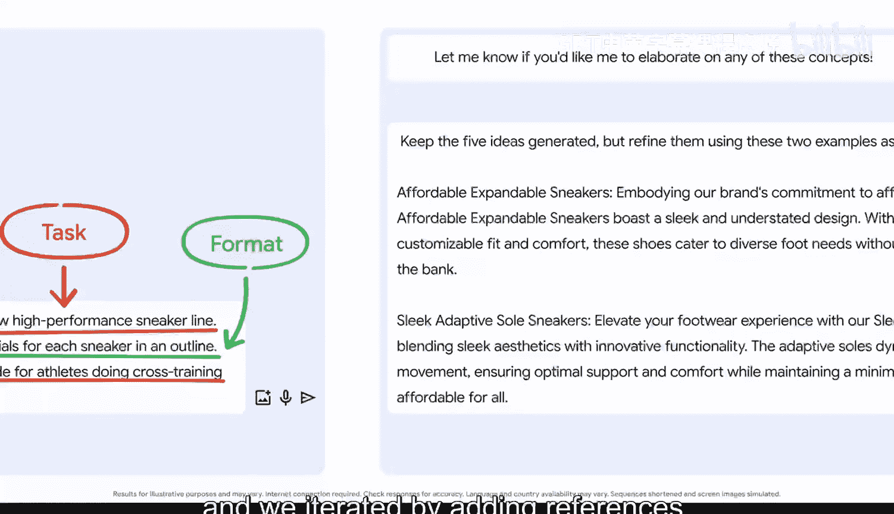

---

## 总结与建议

本节课中我们一起学习了如何将提示词框架应用于实际场景。我们从一个简单的任务开始，逐步添加了**格式**、**上下文**和**参考**信息，最终得到了高度定制化的运动鞋设计概念。

以下是给初学者的实践建议：
*   **从简单开始**：总是从简单的提示词入手，然后逐步增加复杂性。
*   **持续迭代**：根据输出结果不断调整和优化你的提示词。
*   **适时回溯**：如果输出质量开始下降，可能需要返回并简化你的提示词，这很正常。
*   **不断学习**：了解什么有效、什么无效是整个学习过程的一部分。


如果你在过程中遇到困难，只需记住核心原则：**深思熟虑地创建真正优秀的输入**，你就能重回正轨。现在，就请你自己尝试运用这个提示词框架吧！