#  007：四种实用的提示词迭代方法 🛠️

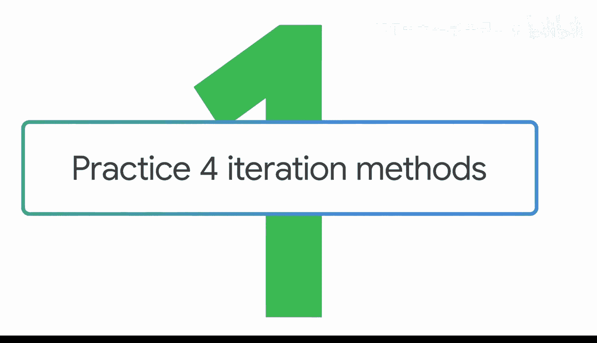

在本节课中，我们将学习当生成式AI的输出结果不理想时，如何通过迭代优化提示词，而不是从头开始。我们将介绍四种具体的方法来改进提示词，以获得更有用的输出。

有时，你的提示词可能无法给出你想要的结果。与其放弃所有工作并从零开始，不如思考如何通过迭代来塑造输出，使其更有用。

## 回顾提示词框架 📝

上一节我们提到了输出不理想的情况，本节中我们首先来看看第一种迭代方法：回顾提示词框架。

第一种方法是重新审视提示词框架，确保你在**任务**、**上下文**和**参考**方面提供了足够的细节。例如，如果你写“给我五个博客文章创意”，生成式AI工具可能反应平平。但如果你调整提示词，包含**角色**和**格式**，效果会更好。


以下是优化后的提示词示例：
```
你是一位运动营养学专家。为与职业篮球运动员合作的物理治疗师受众，提供五个总结行业最大趋势的博客文章标题。
```

## 拆分复杂提示词 ✂️

在确保框架完整后，如果输出仍然复杂或混乱，可以尝试将提示词拆分成更短的句子。

第二种方法是将你的长提示词分解为更小的任务。从一个长输入开始，例如：“总结这份报告中的关键数据点和信息，然后根据数据创建可视化图表，并将关键信息缩短为要点。”

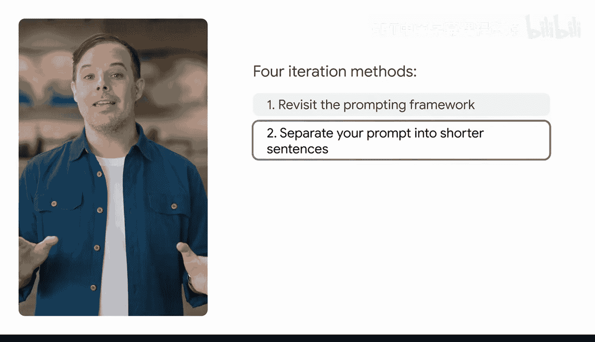


你可以将其拆分为更短的句子，并作为单独的提示词输入。你将输入每个提示词，接收输出，然后跟进新的提示词，直到完成所有任务。

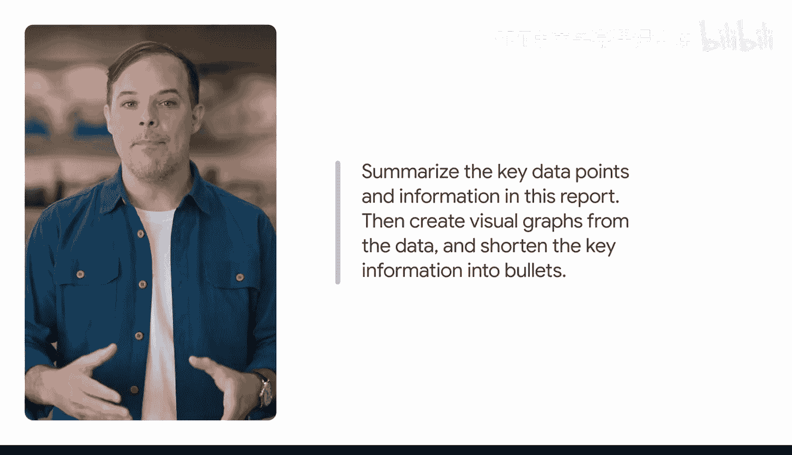

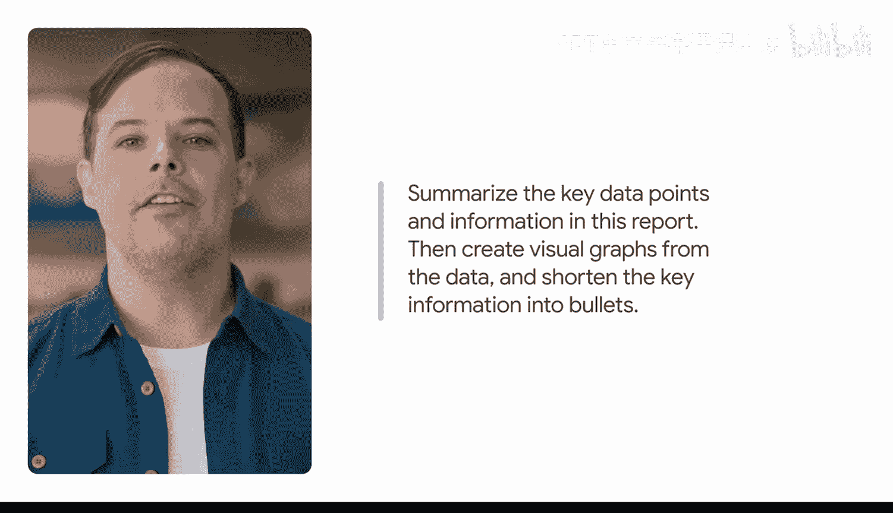

以下是拆分步骤：
1.  首先，输入：“总结这份报告中的关键数据点和信息。”
2.  然后，跟进：“用你总结的数据创建可视化图表。”
3.  最后，输入：“将你总结的关键信息缩短为要点。”

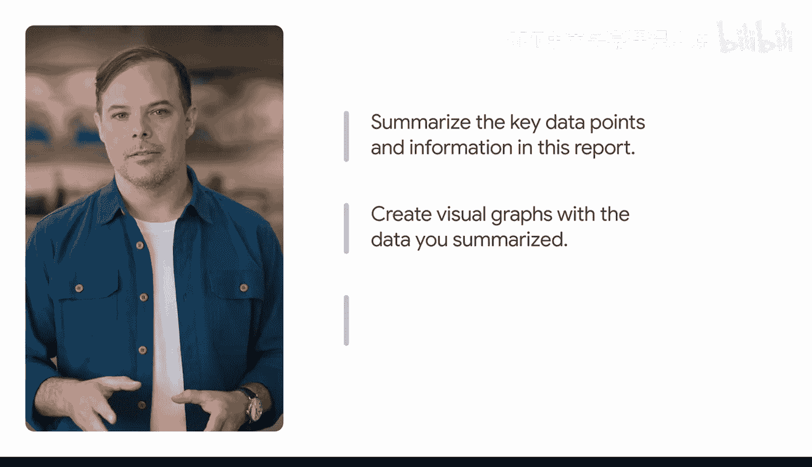

有时，更短的句子可以产生更精确的结果，因为生成式AI工具可以一次解析一个小任务，而不是一次性识别所有任务之间的关系。

## 尝试不同表述或类比任务 🔄

如果拆分任务后效果仍有限，我们可以尝试改变提问的角度。

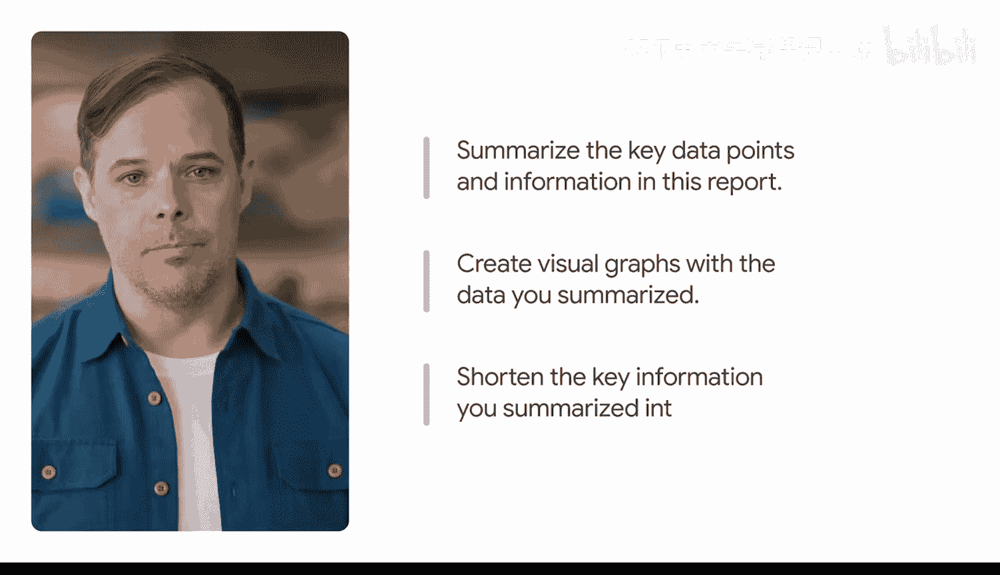

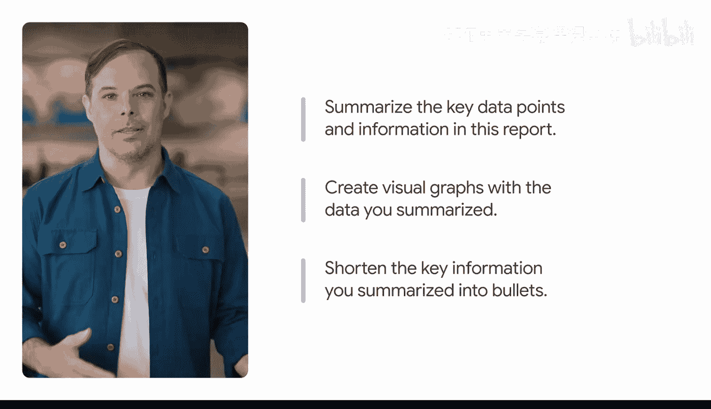

第三种方法是尝试使用不同的措辞，或切换到**类比任务**。类比任务与你试图完成的任务非常相似，但又足够不同以触发新的响应。

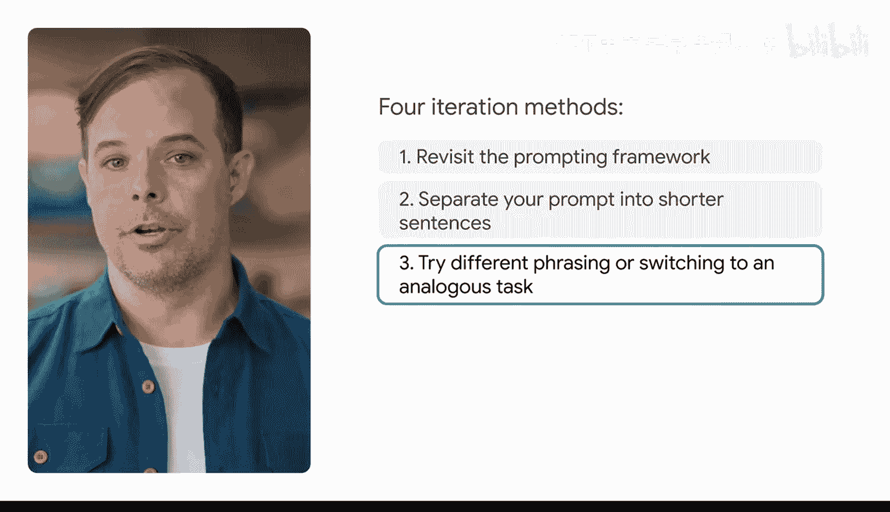

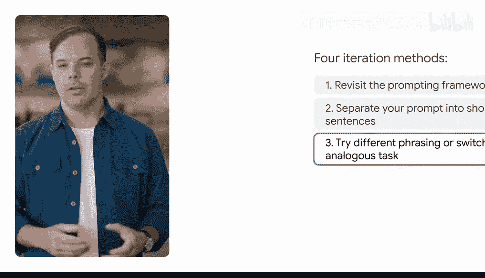

例如，如果你要求生成式AI工具帮助为产品或服务撰写营销计划，但结果不理想，你可以改为要求它：“写一个关于这个产品如何融入我们目标客户生活场景的故事。”

通过从“写一份营销计划”转变为“写一个故事”，你要求生成式AI工具以不同的方式处理任务，这可能会让你更接近有用的输出。

## 引入约束条件 🎯

最后，如果输出过于宽泛或缺乏新意，我们可以尝试为其增加一些限制。

第四种方法是引入约束条件，这也有助于聚焦生成式AI工具的输出。例如，假设你想为即将到来的公路旅行制作一个播放列表，并且正在思考要包含哪些艺术家。你已经添加了一些关于你最喜欢流派的背景信息，但结果有些乏味，都是你听过无数遍的歌曲。

为了获得更好的、更出人意料的输出，你可以开始添加约束条件，例如指定你只想要来自某个特定地区的艺术家，或者近五年内发布过音乐的艺术家。


在你的提示词中添加约束条件将帮助AI工具缩小输出范围，为你提供更有帮助或更独特的内容。


## 总结 📚

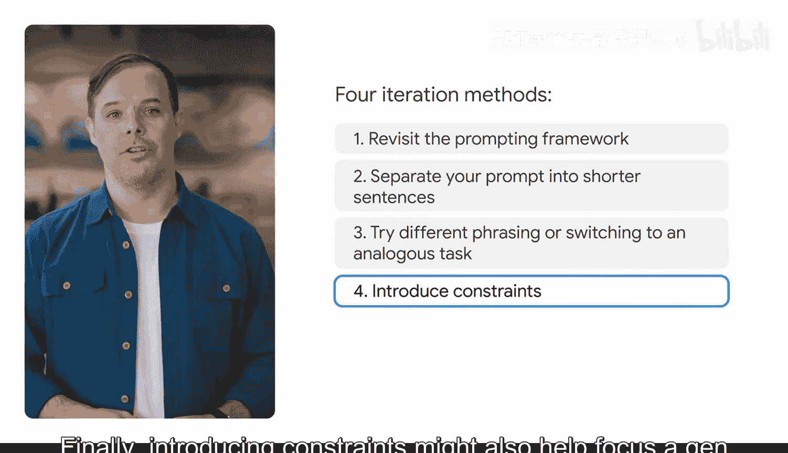

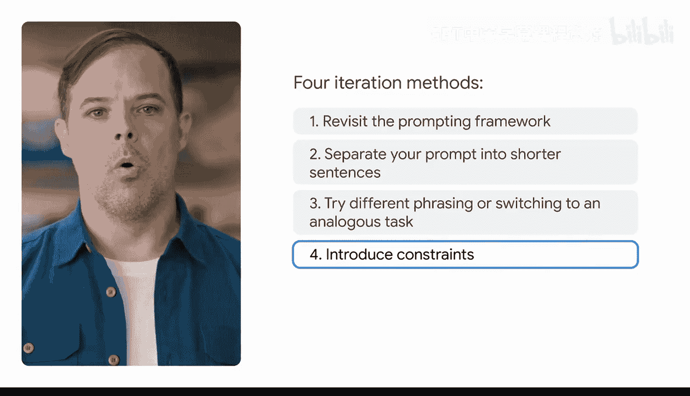

本节课中我们一起学习了四种改进提示词的迭代方法：
1.  **回顾框架**：确保提示词在任务、上下文和参考方面足够具体。
2.  **拆分任务**：将复杂的提示词分解为一系列更短、更简单的句子。
3.  **改变表述**：尝试不同的措辞或使用类比任务来获得新的视角。
4.  **增加约束**：通过添加限制条件来聚焦和优化输出结果。


你评估和迭代的能力越强，你的输出结果就会越好。