#  009：用生成式AI创作图像 🎨

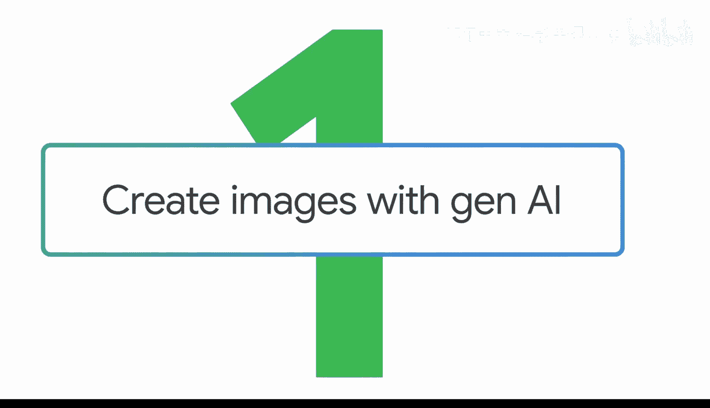

在本节课中，我们将学习如何使用生成式AI工具来创作图像。我们将探讨如何为文本和图像生成任务构建提示词，并了解两者在提示方法上的细微差别。

## 概述

当您想要传达想法时，图像和视觉内容可能与文字同等重要。本节课程将教您如何使用生成式AI工具来创建视觉内容。到目前为止，我们要求生成式AI工具以所谓的“基于文本的模态”来生成回应。

模态是指生成式AI工具接收或生成信息的不同格式，无论是文本、图像、视频、音频还是代码。不同的生成式AI工具更擅长处理某些特定的模态。请务必检查您正在使用的生成式AI工具，以了解它能够使用或生成哪些模态。

## 从图像生成开始

让我们从图像生成开始。一些生成式AI工具可以创建图像，例如日出、一束花，甚至是一只螃蟹或一只海豚。但同样的工具也可以为商业或专业演示制作图像。

假设您是一位在新奥尔良演出的音乐家，想要宣传您的音乐会，您可以使用生成式AI工具来帮助您创建宣传演出的海报。

让我们提示Gemini同时创建文本和图像，以便讨论为每种模态构建提示词的细微差别。

## 首先创建文本提示

我们将首先处理文本。请记住，要时刻牢记“深思熟虑地创建优秀输入”的框架。基于文本的提示词在我们指定任务并添加一些清晰上下文时效果最佳。

因此，我们可以这样提示：

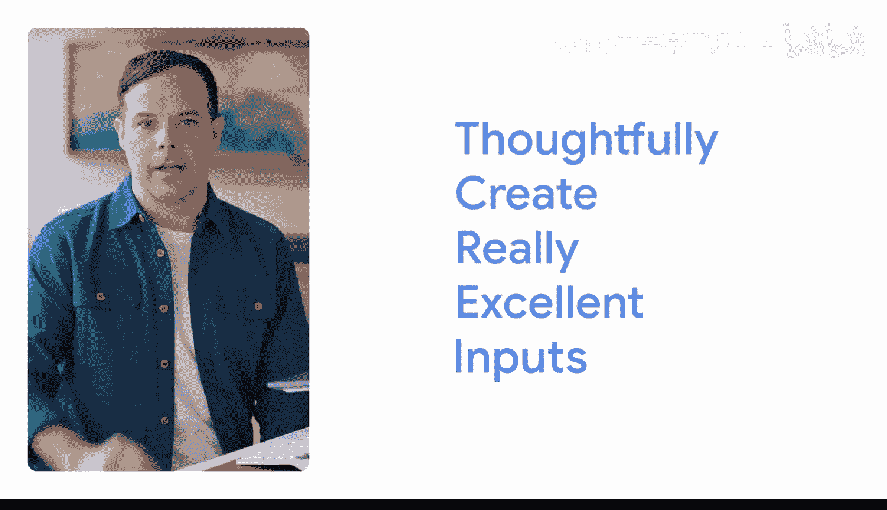

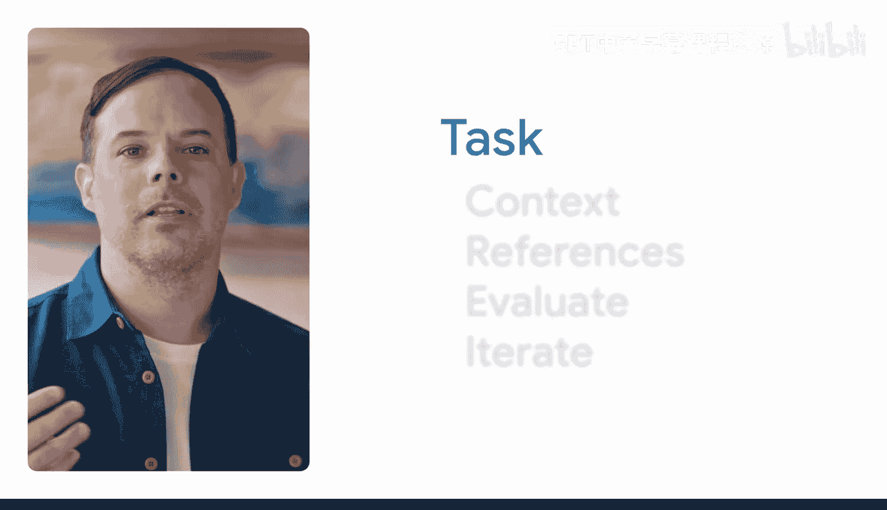

**`生成用于宣传新奥尔良摇滚音乐会的海报标题。`**

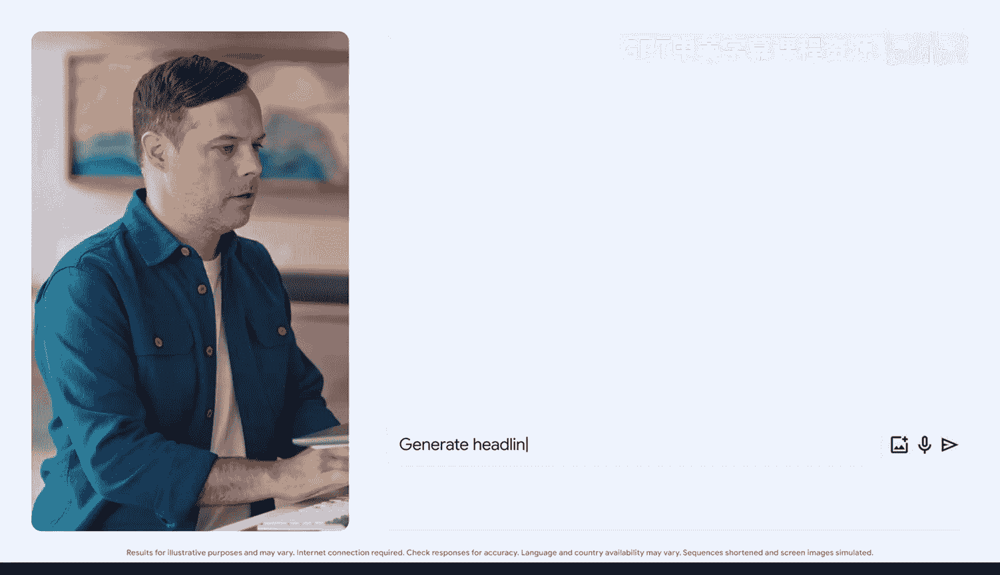

为了给任务增加更多上下文，我们可以写道：

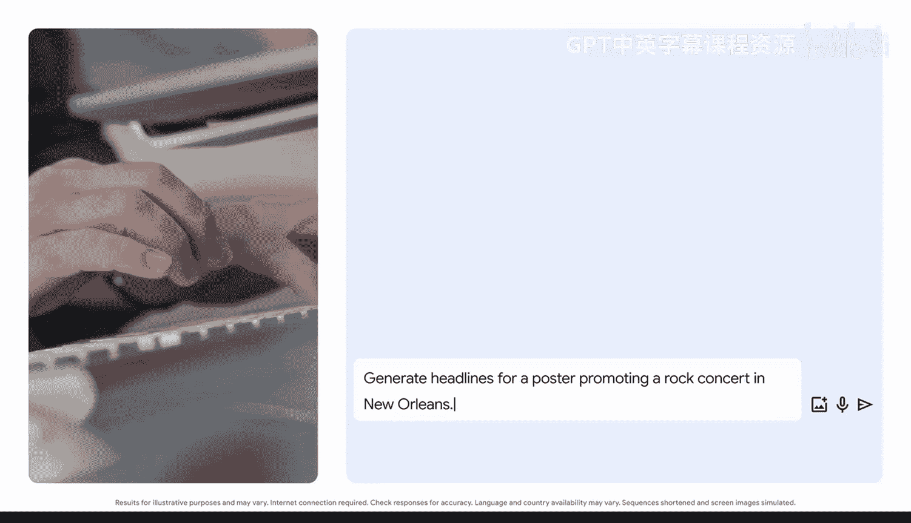

**`音乐会仅此一晚，标题应鼓励观众不要错过。`**

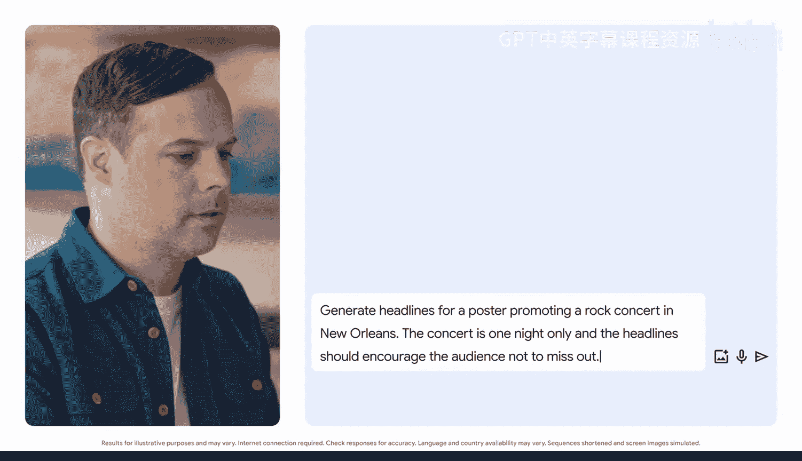

通过指定我们的任务并添加上下文，我们正在引导生成式AI工具生成我们想要的基于文本的输出。

就这样，Gemini为海报想出了一些朗朗上口的标题。这是一个很好的例子：“新奥尔良，就是今晚，难忘的摇滚，仅此一夜。”它既吸引人又切中要点。

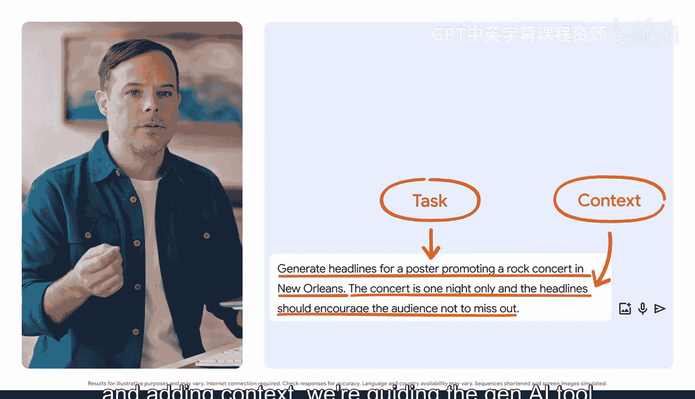

## 转向图像生成提示

现在，为了提示生成式AI工具生成图像，我们需要调整我们的语言。我们仍然会使用提示框架，但需要提供更生动的描述，以帮助生成式AI工具确定它需要创建的图像类型。

这意味着要指定图像中事物的大小、颜色和位置，以及我们想要的整体美学风格。

以下是构建图像提示的步骤：

首先，我们指定任务和格式。

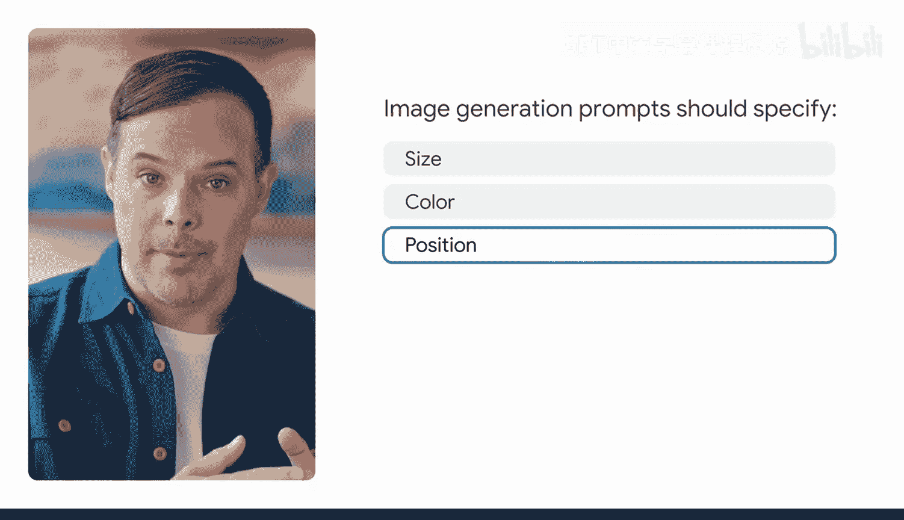

**`生成一张电吉他的图像用于海报。它应该是摄影风格。`**

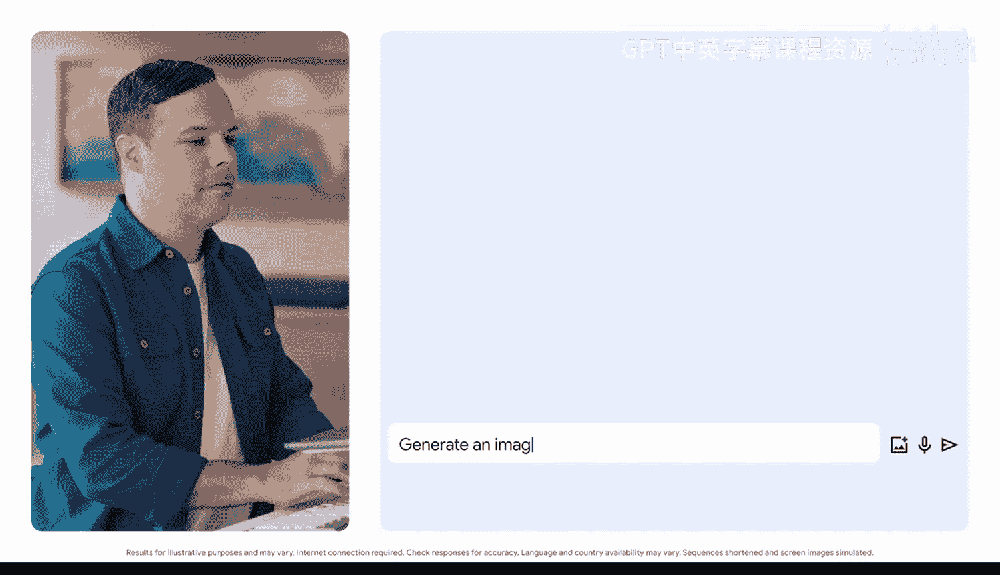

接下来，添加一些生动的描述。

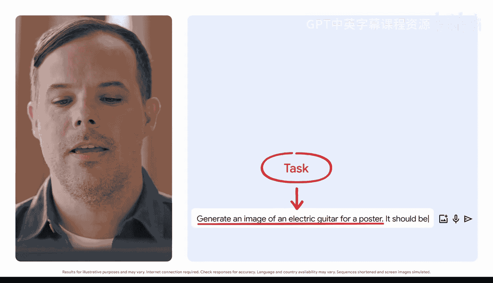

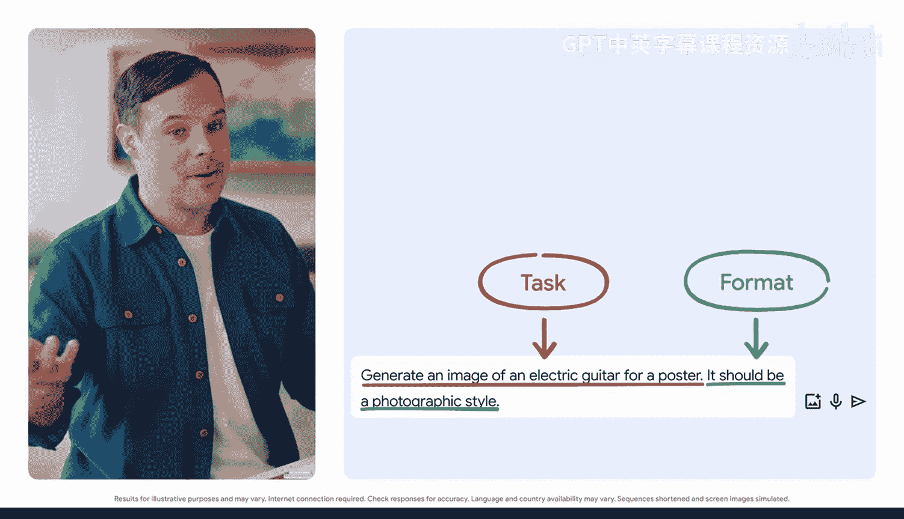

**`吉他应该是闪闪发光的，并营造出一种兴奋感。吉他应该在前景中，并给人一种它漂浮在天空中的感觉。`**

很好，Gemini创建了四张不同的图像，您可以在海报上使用。

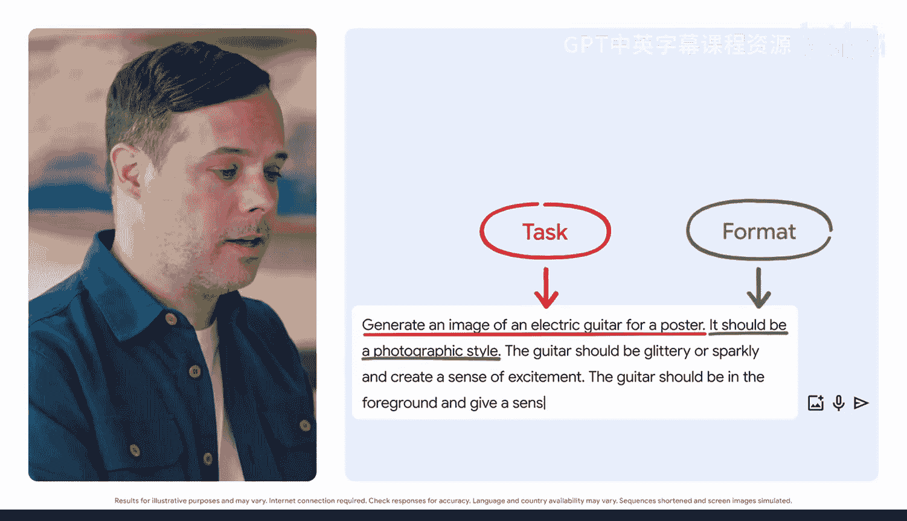

## 迭代和优化图像提示

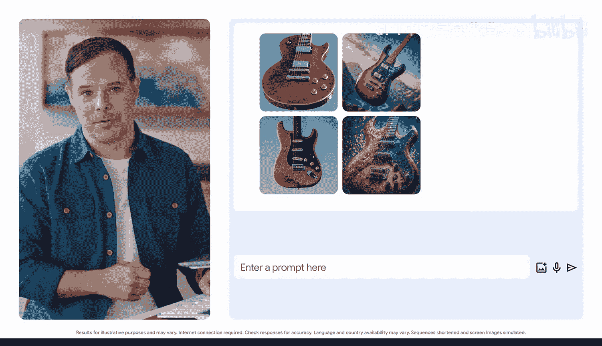

那么，我们如何让这些图像变得更好呢？让我们分解一下如何迭代和优化图像提示词。

我们仍然会使用提示框架，但对音乐会海报进行一些小的调整。也许您喜欢吉他的外观，但想通过添加一场风暴，让闪电击中吉他，使其更加激动人心。

我们可以通过这样写来优化它：

**`现在让天空变得暴风雨密布，闪电击中吉他。`**

您可以选择保留这张图像，或者继续评估并一次又一次地迭代，从每个新的输出中添加相关细节，直到获得一个满意的作品。

## 总结

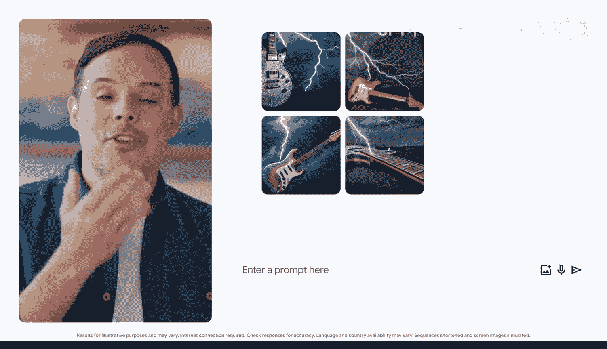

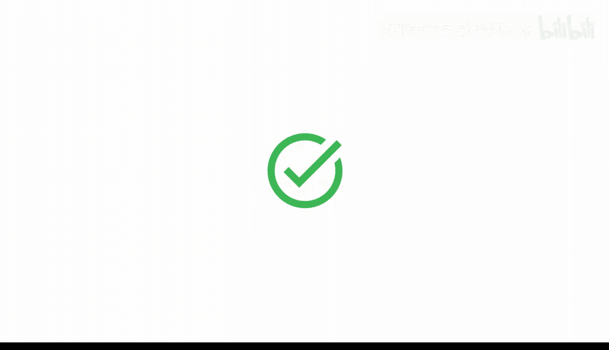

在本节课中，我们一起学习了如何使用生成式AI工具创作图像。我们了解到，为图像生成构建提示词需要比文本生成更生动、更具体的描述，包括对大小、颜色、位置和整体美学的详细说明。通过指定任务、添加上下文并进行迭代优化，我们可以引导AI生成符合我们需求的视觉内容。记住，不同的AI工具擅长不同的模态，选择适合的工具并清晰表达您的需求是成功的关键。