#  011：在提示词中运用图像、文档等多元素材

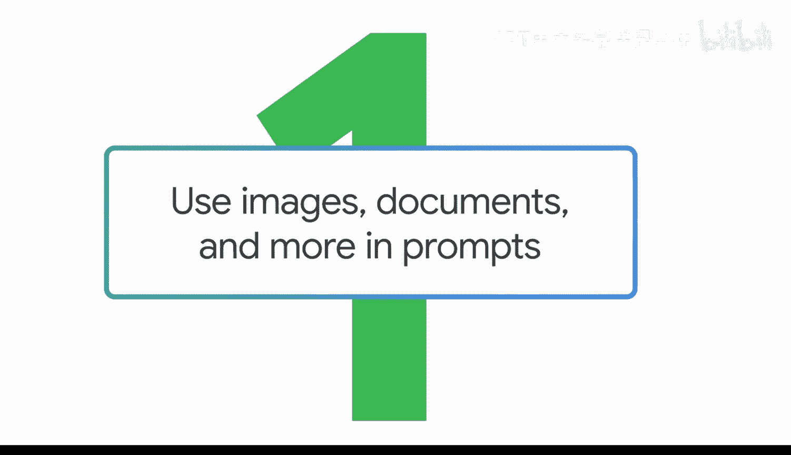

在本节课中，我们将要学习如何超越纯文本，在提示词中结合图像、音频等多种类型的素材，以激发生成式AI工具产生更丰富、更精准的输出。这种技术被称为“多模态提示”。

上一节我们介绍了使用文本来生成图像。本节中我们来看看如何将图像本身作为提示词的一部分，来创造不同类型的输出。这就是多模态提示。

多模态提示的核心在于使用不同类型的媒体来引导生成式AI工具。例如，可以同时输入图像和文本，或者音频和文本。这在工作场景中尤其有用。

以下是多模态提示在工作中的几个应用场景：
*   你可以拍摄一张图表照片，要求AI工具用通俗语言解释其中的数据。
*   你可以上传公司品牌重塑的几个备选Logo作为参考，然后提示AI工具基于每个方向为你生成更多选择。
*   你可以录制一段外语音频，要求AI将其转录成你能理解的语言。

## 🖼️ 图文结合提示示例：为美甲设计撰写社交媒体文案

让我们通过一个例子来具体说明。我们将同时使用图像和文本来提示Gemini，并获得一个基于文本的输出。

假设你是一位创业者，正在销售一系列新的美甲设计，需要帮助撰写社交媒体文案。你可以拍摄一张美甲设计的照片，然后请求帮助写一段文案。

我们有一张美甲设计的照片，将其输入到Gemini中，并给出提示词：“写一篇包含这张图片的社交媒体帖子。帖子应该有趣、简短，并重点说明这是我正在销售的新设计系列。”

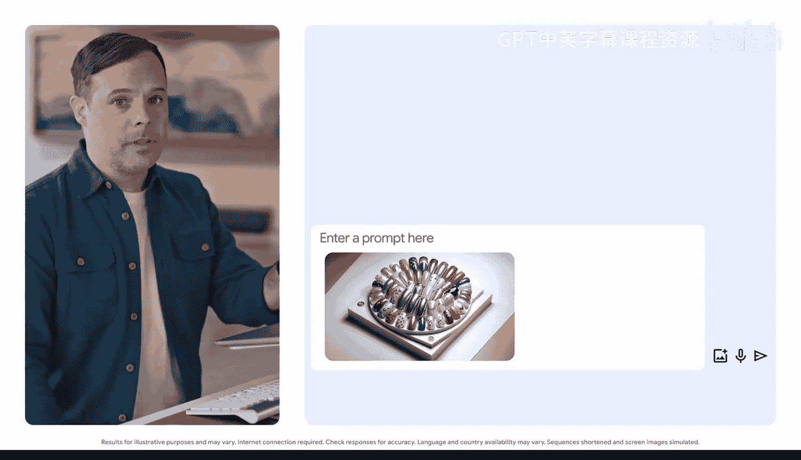

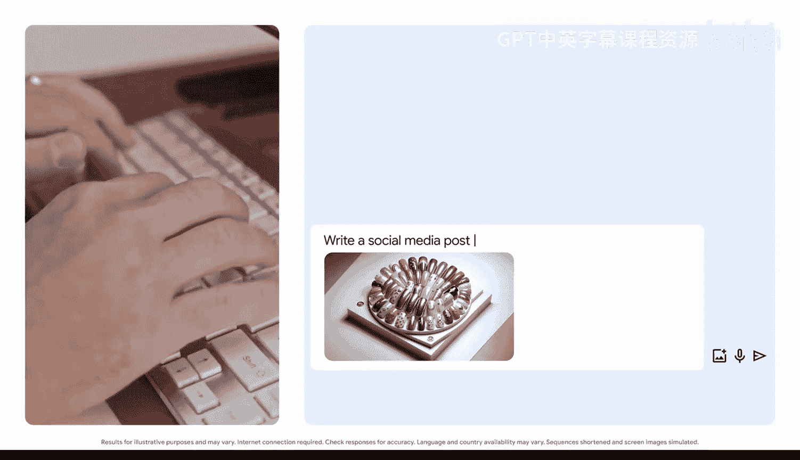

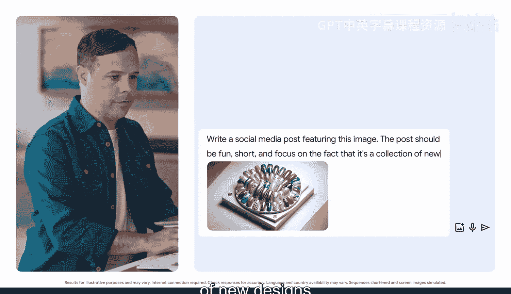

请注意，除了包含美甲设计的参考图片，我们仍然运用了提示词框架的其他要素。我们明确了**任务**（写帖子），添加了**背景**（新设计系列），并指定了**格式**（有趣、简短）。虽然我们没有提供其他参考，但如果我们希望AI工具匹配特定的语气或风格，我们完全可以输入几条过往帖子的文案作为参考。

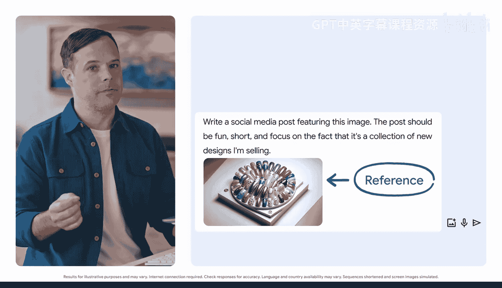

结果很棒。Gemini分析了图像，并创建了一段有趣、可用于营销美甲设计的文案。注意它是如何使用表情符号来分隔文本，以及如何通过询问粉丝最喜欢哪个设计来与他们互动。

多模态提示的妙处在于，它反映了你体验世界的方式。在工作中做演示时，你不仅仅是讨论文字或图片，而是在它们之间建立联系，从而更全面地理解主题。文字、图像和其他模态的结合，可以开辟解决问题或节省时间的新途径。

## 📄 从文档图像中提取信息示例

让我们看另一个例子。假设你去参加一个会议，收到了一份活动日程表，你希望你的团队特别关注其中的几项活动。

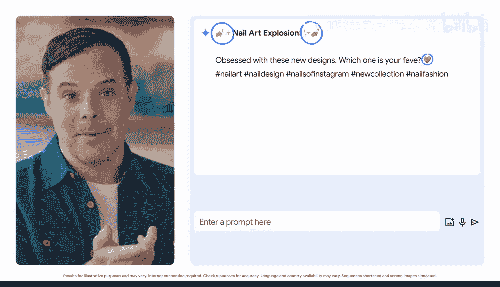

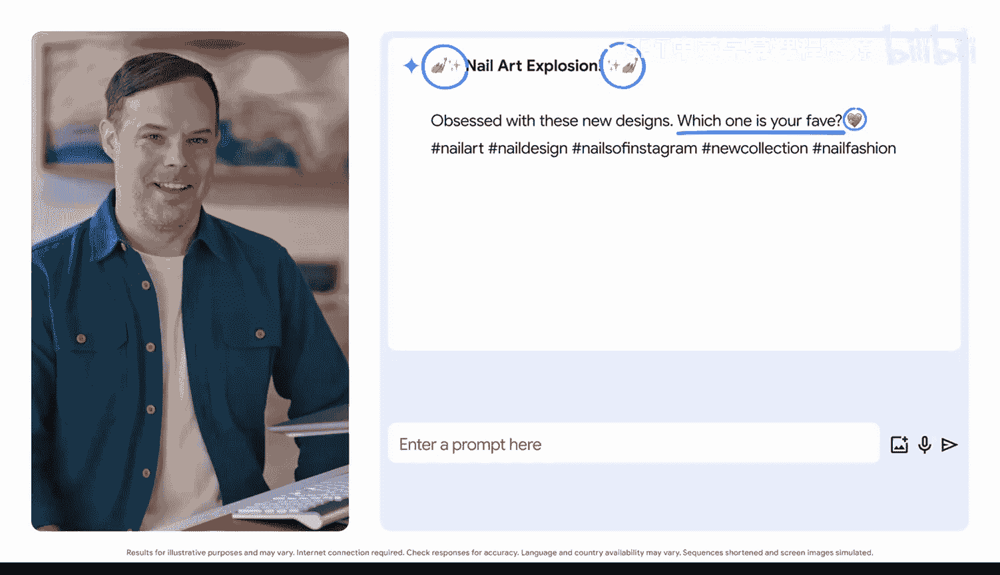

你可以将日程表的图片输入AI，并给出提示：“我想给同事发一个关于会议日程中特定活动的提醒。请从这份日程表中提取主题演讲和两场小组讨论的时间，整理成一个表格。”

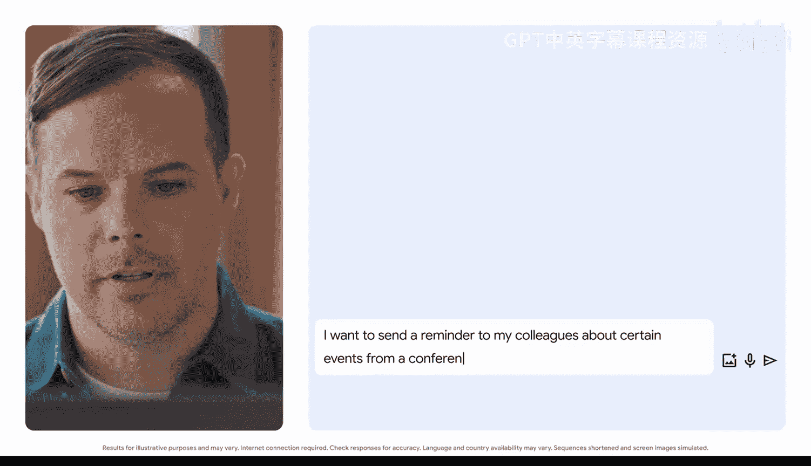

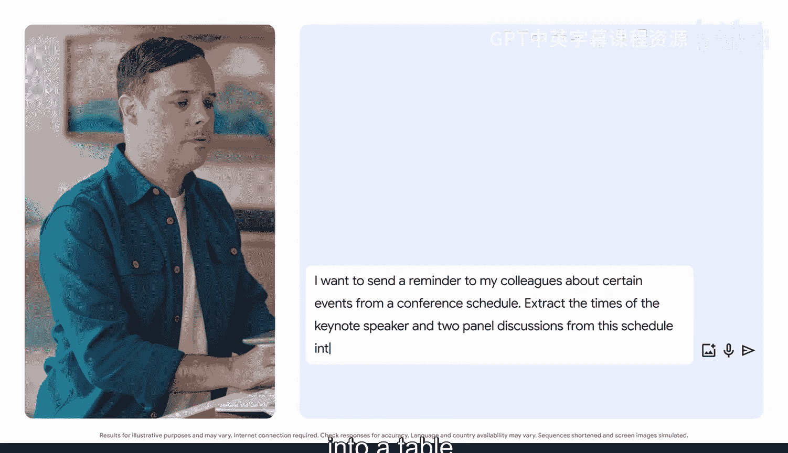

同样，我们在输入日程表图片之前，明确了**任务**（提取信息），提供了有用的**背景**（用于提醒同事），并指定了**格式**（表格）。让我们看看结果。

很好，生成的表格让你和团队能一目了然地知道需要参加哪些活动以及具体时间。你甚至可以更进一步，提示Gemini根据这些信息起草一封邮件。我们将在课程后面探讨如何提示AI起草邮件。

无论你使用哪种模态进行提示，请务必牢记提示词框架，以获得最佳效果。

## 📝 总结

本节课中我们一起学习了多模态提示。我们了解到，多模态提示允许我们结合图像、文本乃至音频等多种类型的输入，来引导生成式AI。通过两个具体示例——为美甲图生成社交媒体文案、从会议日程图中提取信息——我们实践了如何在实际工作场景中应用这一技术。关键在于，即使使用了图像等非文本素材，我们依然需要遵循清晰的提示词框架：明确任务、提供背景、指定格式。思考一下，你可以在工作中如何利用不同的模态来提升效率呢？

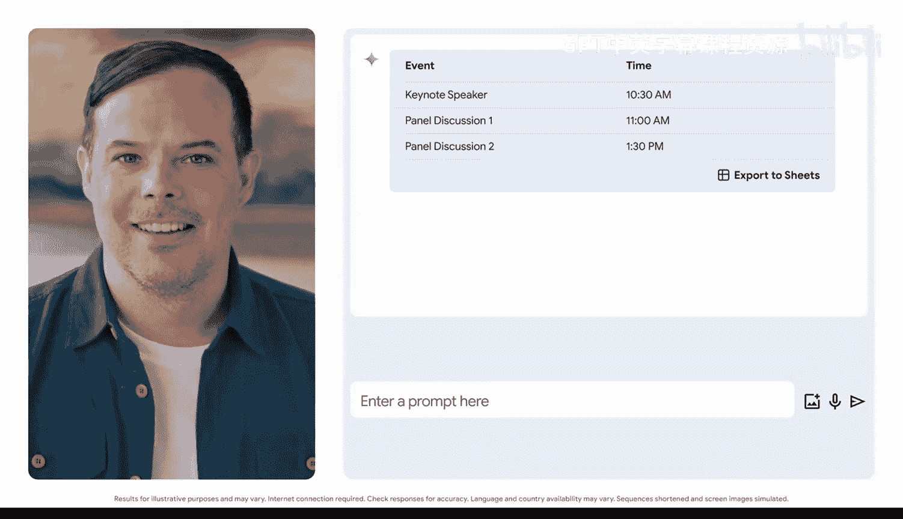

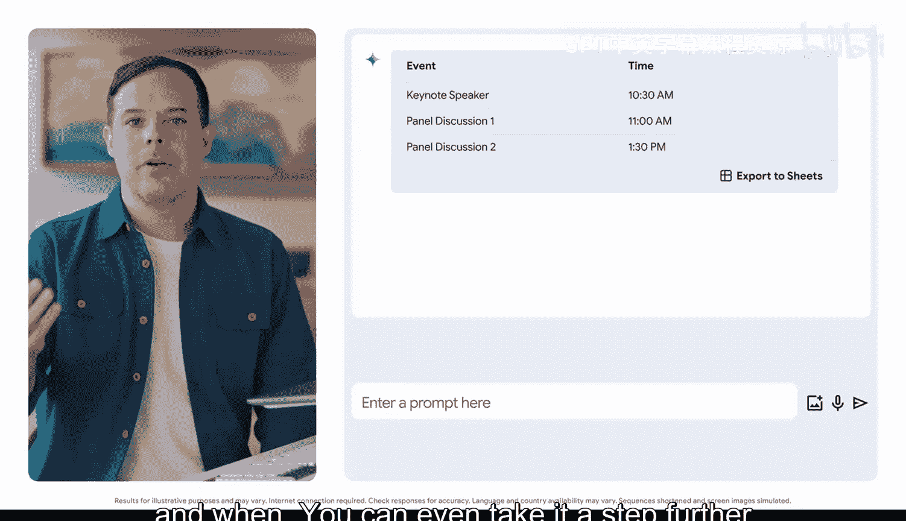

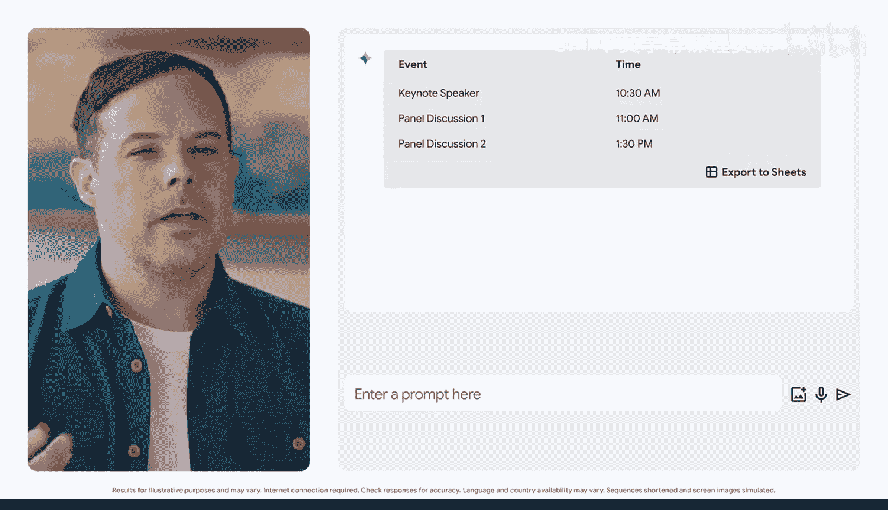

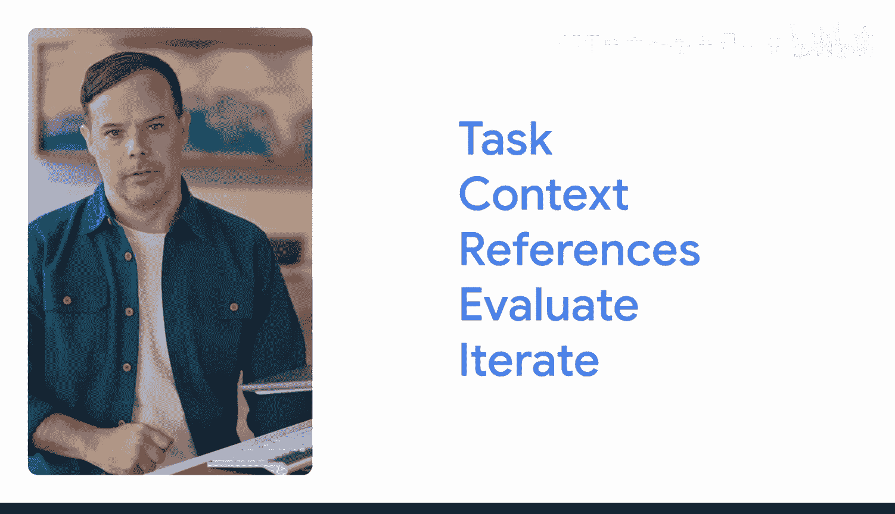

