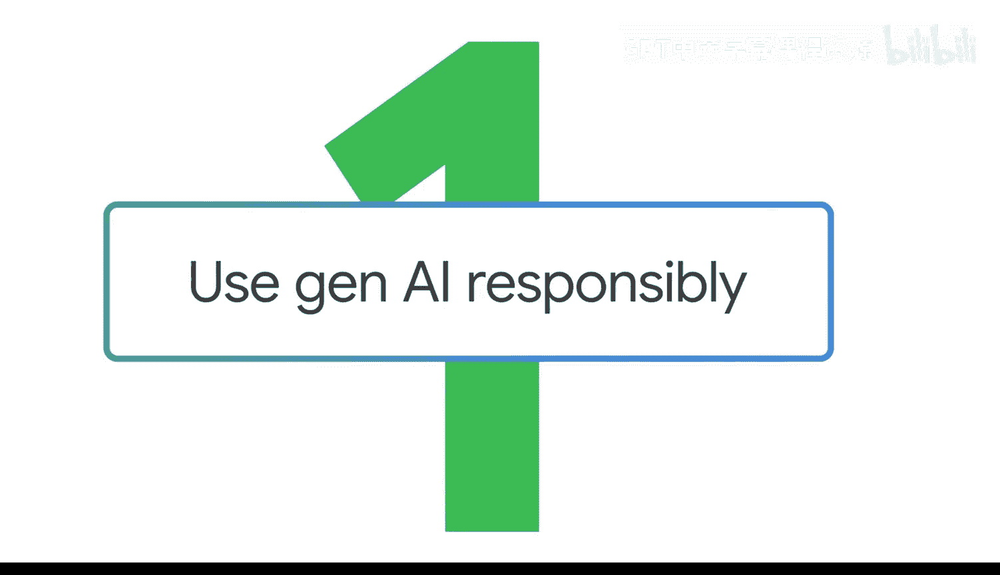
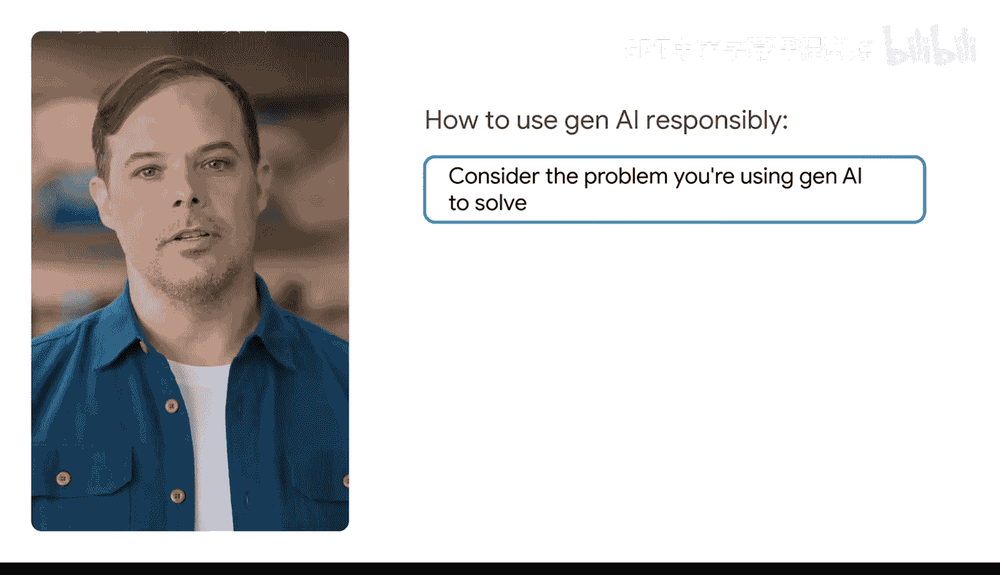
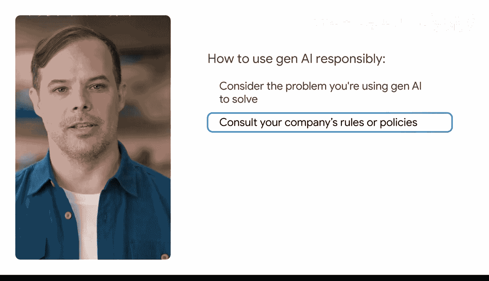
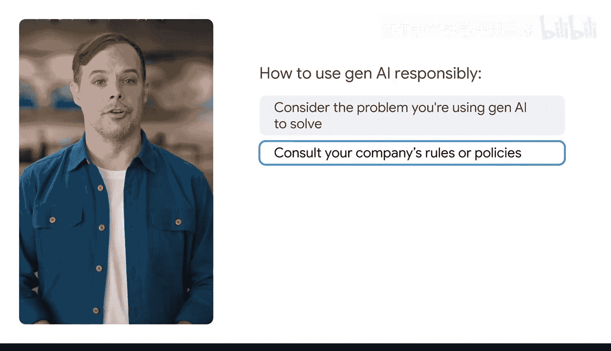
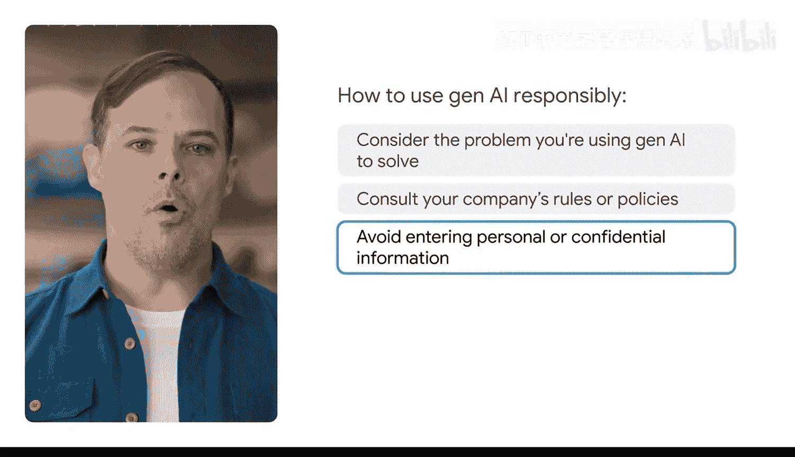
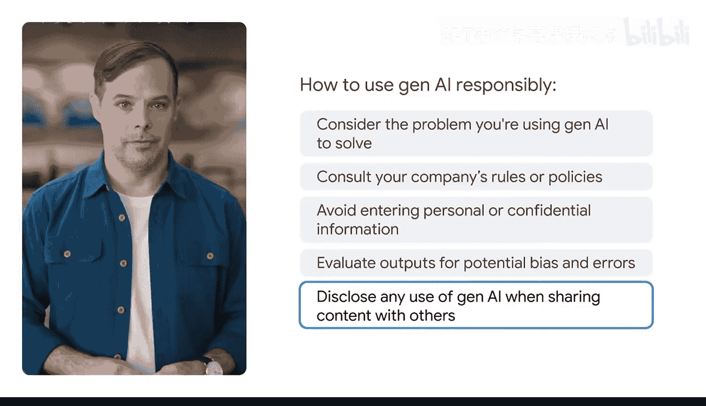

#  012：负责任地使用生成式AI 🛡️

在本节课中，我们将学习如何负责任地使用生成式AI工具。生成式AI功能强大，但与其他工具一样，负责任地使用至关重要，尤其是在工作场景中。我们将探讨如何评估任务、保护数据、审查输出以及避免偏见，确保AI成为我们高效且可靠的助手。

---

## 第一步：评估任务与目标的一致性 ✅

上一节我们介绍了负责任使用AI的重要性，本节中我们来看看具体如何操作。首先，你需要考虑你计划使用生成式AI解决的问题。

你需要评估该任务是否与你的个人目标、以及对客户和同事的义务保持一致。同时，必须考虑你所在组织的相关政策，以及关于使用生成式AI执行此类任务的当地法律。

如果任务与这些目标、政策或法律不符，那么你应该重新思考你的流程，并判断生成式AI工具是否适合此项工作。

---

## 第二步：保护机密与敏感数据 🔒

在将任何数据输入生成式AI工具之前，数据安全是首要考虑。以下是关于数据保护的关键步骤：

*   **查阅公司政策**：在向生成式AI工具输入机密或敏感数据前，务必先查阅公司的规章制度。
*   **使用企业版工具**：检查公司是否提供了允许处理特定类型数据的企业版生成式AI工具。
*   **注意个人使用**：如果你为个人目的使用公开可用的生成式AI工具，应避免输入关于你个人的隐私或机密信息，并始终留意你所输入的数据可能被如何利用。

---

## 第三步：审查输出的准确性与偏见 🔍

作为负责任的生成式AI使用者，意味着你需要评估输出内容是否存在潜在偏见和错误，并在与他人分享内容时披露AI的使用情况。

虽然可以借助生成式AI的帮助，但你仍需像对待任何其他来源的信息一样，评估其输出的准确性。对于“幻觉”现象尤其如此。

**幻觉**是指生成式AI工具产生不一致、不正确甚至毫无意义的输出。当用户给出的指令模糊不清，或工具对其不完全理解的问题进行猜测时，最常发生幻觉。

幻觉可能难以识别，因此对输出内容进行事实核查和交叉比对至关重要，以确认其中的事实或陈述是否真实。请记住，生成式AI工具无法像人类一样进行批判性思考。保持“人在回路”的方法非常重要。

**“人在回路”** 意味着在使用生成式AI的输出之前，应由人类进行验证。

例如，我曾为一次演示生成一张图片。我的提示词是：“一群猫乘坐火箭前往月球”。然而，输出结果有些偏差：猫在火箭顶部，而不是内部。这对猫来说并不安全。虽然我在提示词中写了“猫在火箭上”，但我并非字面意思如此，而工具无法理解这一点。因此，我进行了迭代，并明确指定猫应该安全无恙地出现在火箭内部，而不是顶部。

一些生成式AI工具（如Gemini）内置了事实核查功能，允许你使用谷歌搜索对输出进行交叉比对。将输出并排比较，可以更容易地判断初始输出的准确性，并发现任何差异。

---

## 第四步：避免偏见与使用包容性语言 🌍

那么，如何在问题发生前就避免它们呢？你需要识别输出中的偏见及其可能带来的负面后果。

偏见可能表现为对某类人群的刻板印象或不公平描述。避免产生带有偏见或负面影响的输出，始于输入具体、详细的提示词，并根据需要进行迭代。

另一个关键部分是使用包容性语言。在你的输入中，应使用涵盖所有背景、性别和种族人群的语言，并避免刻板印象和笼统概括。

例如，如果你使用生成式AI工具帮助你撰写职位描述，应避免使用“服务员”或“工人”这类带有性别色彩的词汇。相反，应使用“服务人员”或“工作人员”，这样工具就不会写出只针对特定性别认同者的描述。

请始终记住，生成式AI只是工具。它们无法进行批判性思考，也无法像人类一样理解细微差别。每次使用生成式AI工具时，带入人类的视角和判断是你的责任。

---

## 总结 📝

本节课中，我们一起学习了负责任使用生成式AI的四个核心步骤：
1.  **评估任务**：确保使用AI的目的符合目标、义务与法规。
2.  **保护数据**：在处理敏感信息前，务必遵循公司政策，优先使用安全工具。
3.  **审查输出**：对AI生成的内容进行事实核查，警惕“幻觉”，坚持“人在回路”。
4.  **避免偏见**：使用具体、详细的提示词和包容性语言，从源头减少偏见输出。

通过遵循这些准则，你可以更安全、更有效、更符合伦理地利用生成式AI的强大能力。