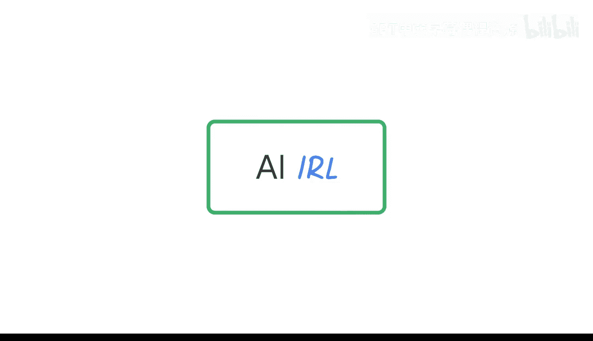

#  013：探索缓解AI幻觉的策略 🤖

在本节课中，我们将要学习什么是AI幻觉，并探讨几种实用的策略来缓解或应对AI生成内容时可能出现的幻觉问题。

## 什么是AI幻觉？ 🤔

上一节我们介绍了课程的整体背景，本节中我们来看看AI幻觉的具体定义。

AI幻觉是指AI生成的输出内容与现实不符的情况。这些输出内容不真实。有时，这在创作虚构故事或创意作品时可能是有益的。然而，当你试图获取事实信息或进行分析时，AI产生完全虚构的答案，甚至是细微但错误的答案，这就可能非常不受欢迎。

## 缓解AI幻觉的策略 🛡️

理解了AI幻觉的概念后，我们来看看如何应对它。对于所有使用AI的人来说，最重要的事情之一是检查所有输出是否存在幻觉。尤其是在你试图获取事实性、非创意性输出时，确保AI生成的内容符合现实是你的责任。这通常比看起来更困难。

以下是几种有效的缓解策略：

*   **利用工具内置功能**：一些工具，如Gemini，实际上内置了事实核查功能。强烈推荐使用这类功能。
*   **通过搜索验证**：利用搜索引擎验证AI提供的信息。
*   **运用自身知识判断**：依靠你自己的知识储备进行判断。
*   **借助社群力量**：与你的社区、朋友或同事一起核对信息。

这些策略都能有效帮助我们发现和纠正AI幻觉。

本节课中我们一起学习了AI幻觉的定义及其潜在影响，并掌握了几种实用的缓解策略，包括利用工具功能、主动验证和多方核对。记住，对AI输出保持审慎和验证的态度，是负责任地使用AI的关键。