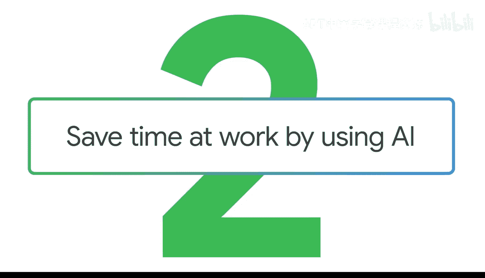
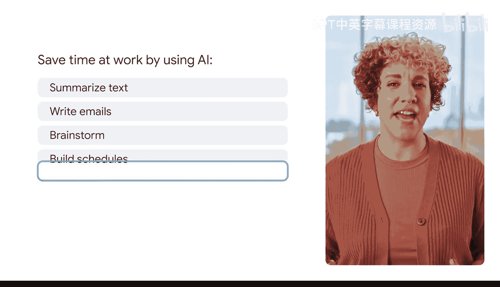

#  014：使用AI节省工作时间

在本节课中，我们将学习如何通过生成式AI工具来提升工作效率，特别是在处理文本摘要、邮件撰写、头脑风暴、日程规划和会议记录等任务时。

## 概述

我的工作需要阅读大量研究论文。有时一天会收到好几篇。虽然我很乐于了解领域内的最新动态，但总有无法逐字逐句读完每篇论文的时候。遇到这种情况，我会将论文上传到生成式AI工具，并开启对话。我会提示它找出研究中最关键的点，然后针对我好奇的信息提出后续问题。这帮助我快速熟悉了许多主题，就像拥有一位可以随时对话、富有创造力的助手。

上一节我们介绍了使用AI处理研究论文的基本场景，本节中我们来看看如何将这一能力应用到更广泛的日常工作场景中。

## 核心应用场景

现在，让我们深入了解如何运用这些提示，以及它们如何在工作中为你带来益处，从而提升你的生产力并激发创造力。

以下是生成式AI工具可以助你提升效率的几个核心应用方向：

*   **总结文本**：快速提炼长文档、报告或文章的核心要点。
*   **撰写更好的邮件**：优化邮件内容，使其更清晰、专业或具有说服力。
*   **升级头脑风暴**：激发新想法，拓展思维边界，为项目或问题寻找创新解决方案。
*   **轻松制定日程**：根据任务列表或目标，自动生成结构清晰的时间安排计划。
*   **即时整理会议记录**：从冗长的会议对话或录音中，快速提取关键决策、行动项和要点。

## 总结

本节课中，我们一起学习了如何将生成式AI作为高效的工作助手。通过有效的提示，你可以让它帮助你总结文献、优化沟通、激发创意、规划时间并管理会议信息，从而显著节省工作时间并提升工作质量。