#  016：使用生成式AI撰写邮件 📧

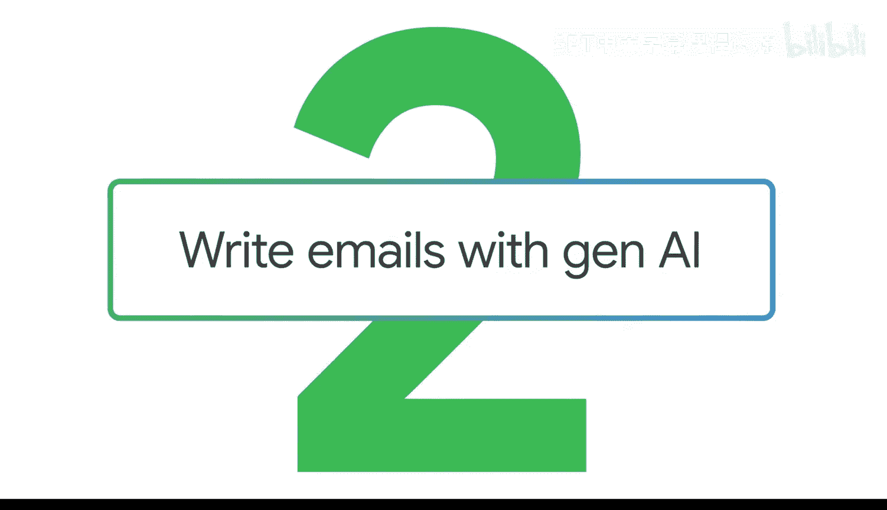

在本节课中，我们将学习如何利用生成式AI工具来撰写和优化邮件。我们将通过一个健身房经理通知员工和会员新课程表的实际案例，演示如何构建提示词、调整语气，并为不同受众定制内容。

---

## 概述

生成式AI非常擅长协助起草邮件、调整写作语气或风格，并提供改变沟通方式的思路。无论你是撰写广告文案的文案、为高管起草讲话要点的演讲撰稿人，还是需要通知日程变更的健身房经理，这项练习都很有用。

我们将使用一个提示词框架：**设定角色、提供背景、明确任务，然后评估并迭代**。

---

## 第一步：为内部员工撰写邮件

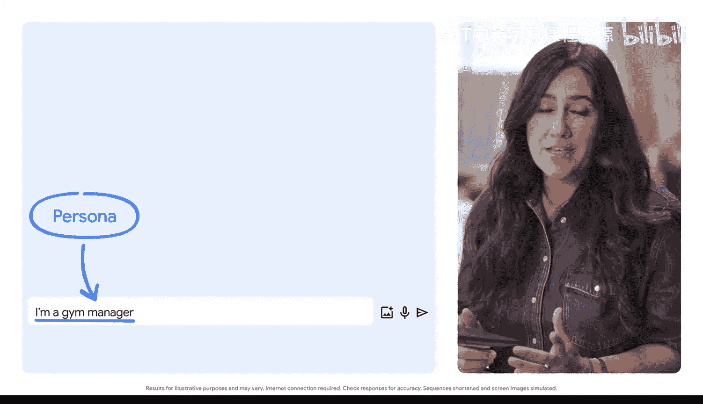

首先，我们需要设定一个身份。在这个例子中，我的身份是**健身房经理**。

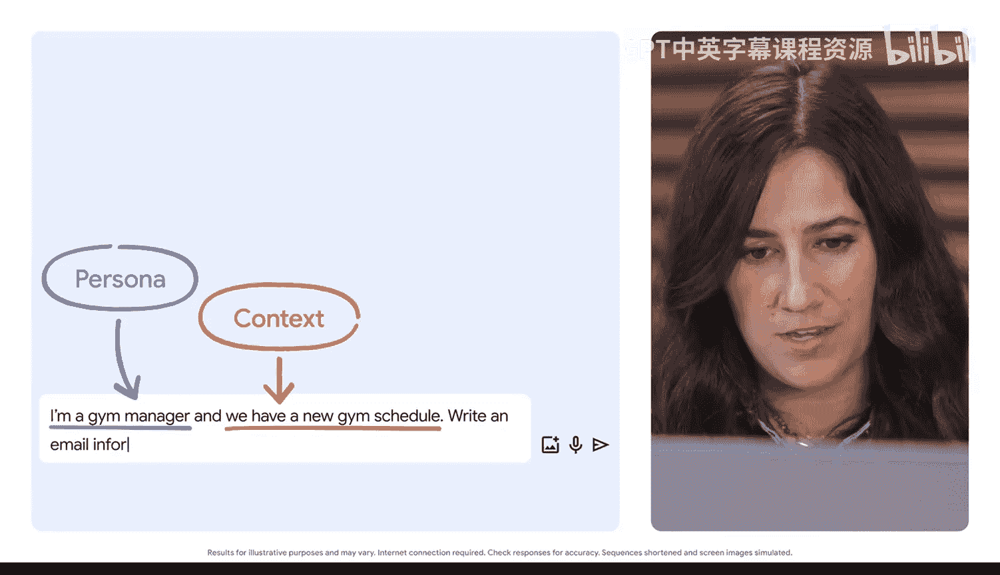

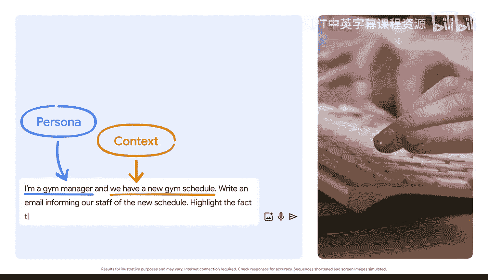

接下来，我们提供背景信息：我们有一份**新的健身房课程表**。

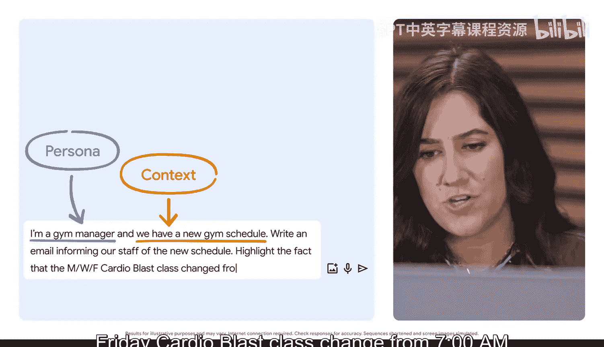

然后，我们明确任务：**撰写一封邮件，通知员工新的课程表**。需要特别强调，周一、周三、周五的“心肺冲击”课程时间已从**上午7点改为上午6点**。

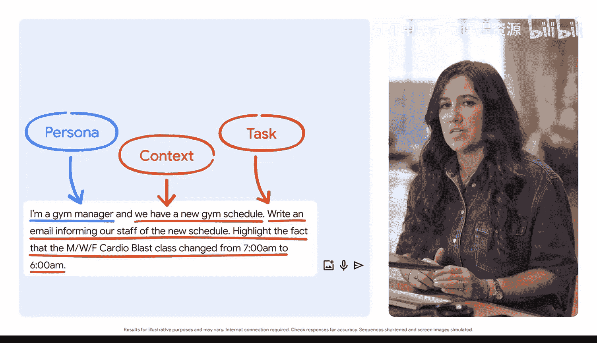

为了让邮件更具体，我们还需要指定邮件的内容和格式，包括语言或语气。

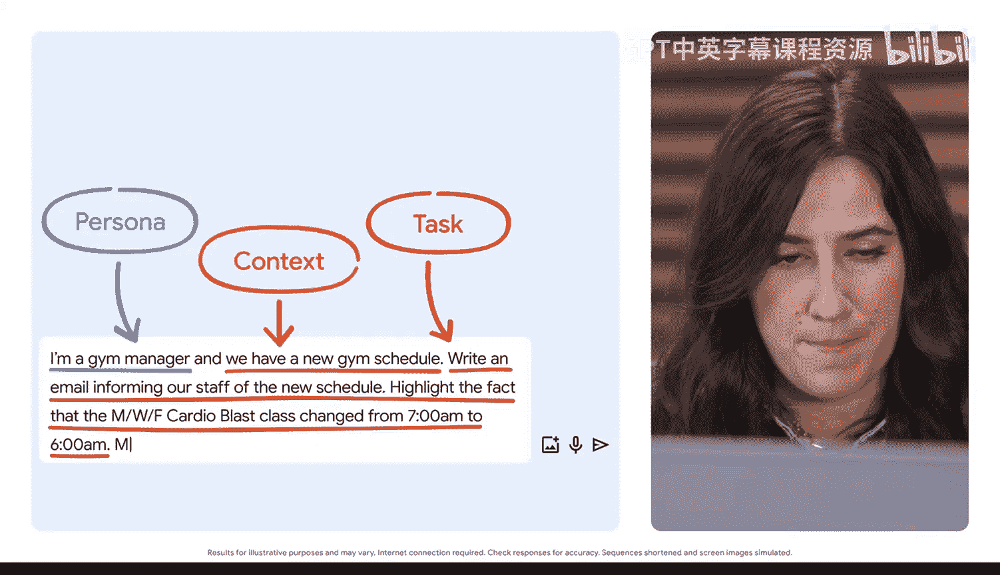

以下是完整的初始提示词：

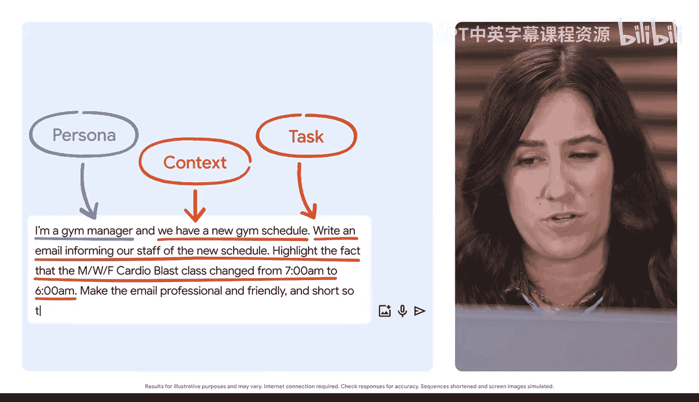

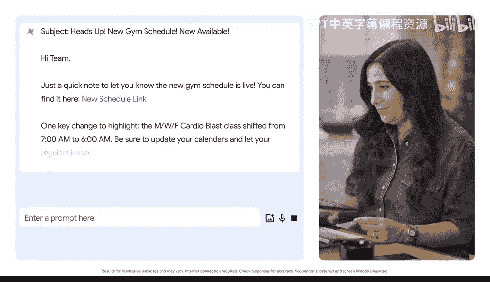

```
角色：健身房经理。
背景：我们有一份新的健身房课程表。
任务：撰写一封邮件，通知员工新的课程表。特别强调周一、周三、周五的“心肺冲击”课程时间已从上午7点改为上午6点。
要求：邮件需专业且友好，内容简短，便于读者快速浏览。
```

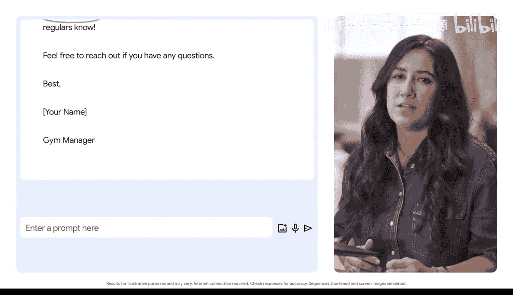

现在，我们将新的课程表信息粘贴进去。

生成的邮件内容清晰，包含了所有关于日程变更的信息，简短易读。这是一个非常适合发送给员工的邮件草稿。

---

## 第二步：为不同受众迭代优化

但你知道吗？你可以要求AI为**新的受众**调整这封邮件的输出。例如，你可能希望输出对小团队更随意，对管理层更正式，或者面向完全不同的受众。

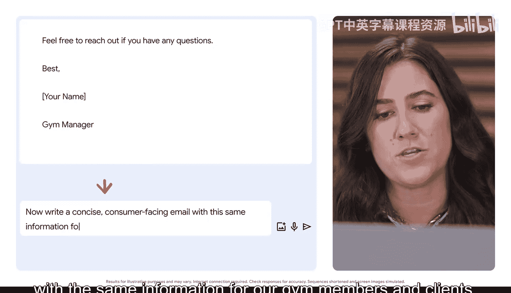

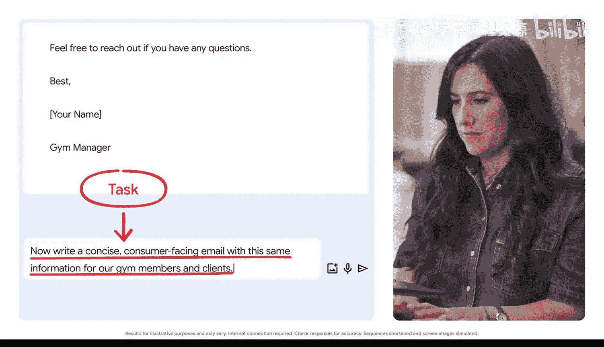

让我们尝试一下。我们将迭代我们的提示词，要求AI以更随意的语气为**健身房会员和客户**撰写一封邮件。

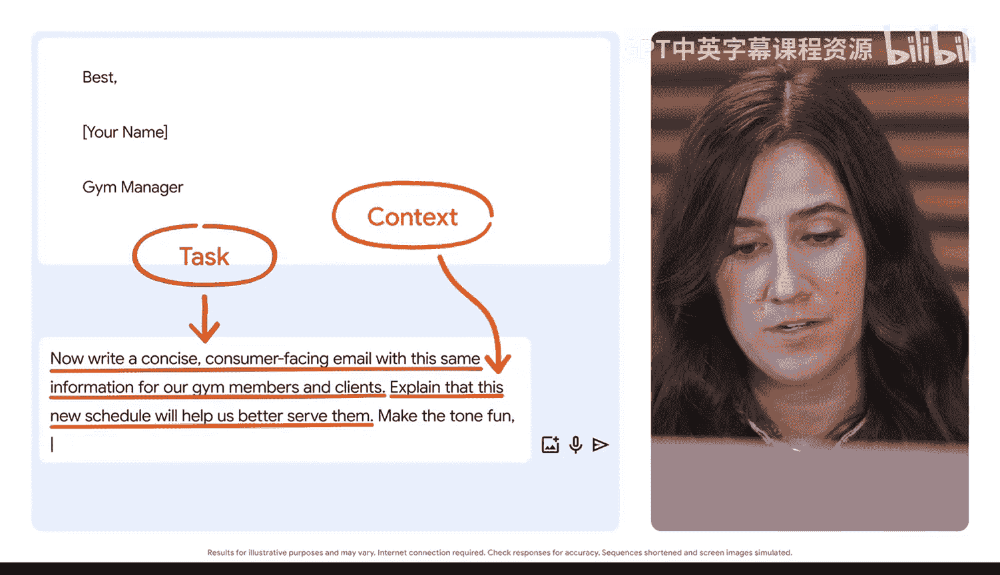

我们在此要求一个具有新细节和背景的新版本。

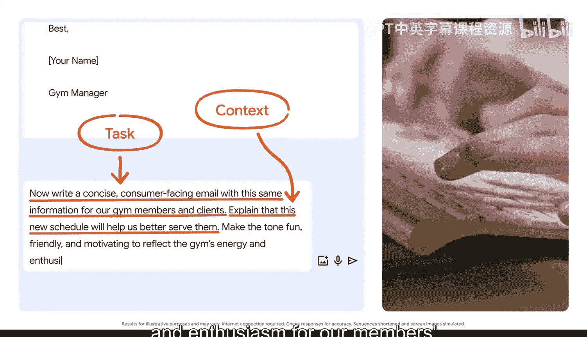

以下是新的提示词：

```
基于之前的课程表信息，为我们的健身房会员和客户撰写一封简洁的对外邮件。
要求：解释新的课程表将帮助我们更好地为他们服务。确保语气有趣、友好且富有激励性，以体现健身房对会员健康目标的热情和活力。邮件中请包含一个关于“举重”的双关语。
```

生成的邮件有趣且充满活力，同时仍然包含了所有关于日程变更的重要信息。仅仅通过一个额外的提示词，我们就为新的受众完全改变了这封邮件的风格，而没有丢失关键信息。

---

## 总结

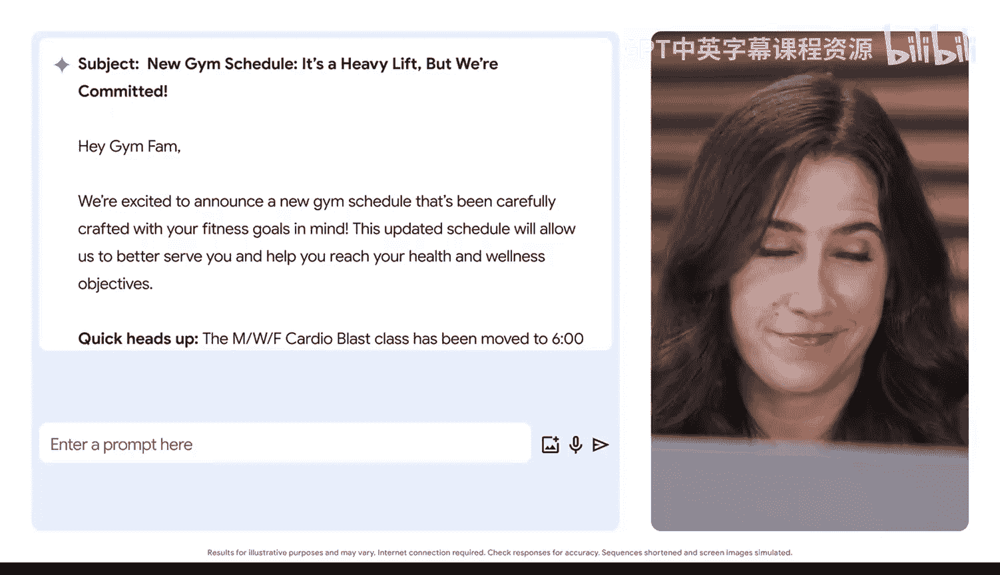

在本节课中，我们一起学习了如何使用生成式AI工具撰写邮件。我们通过一个具体案例，演示了如何：
1.  **构建提示词**：通过设定角色、提供背景和明确任务来获得初始输出。
2.  **迭代优化**：通过修改提示词中的语气、风格和目标受众，为不同群体定制沟通内容。

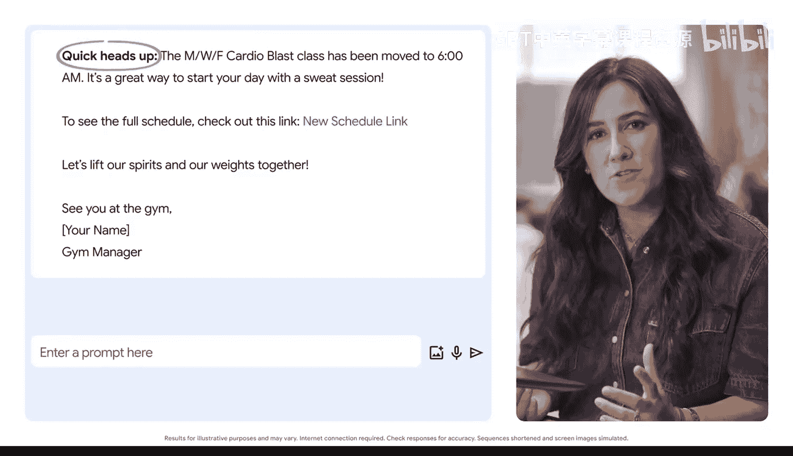

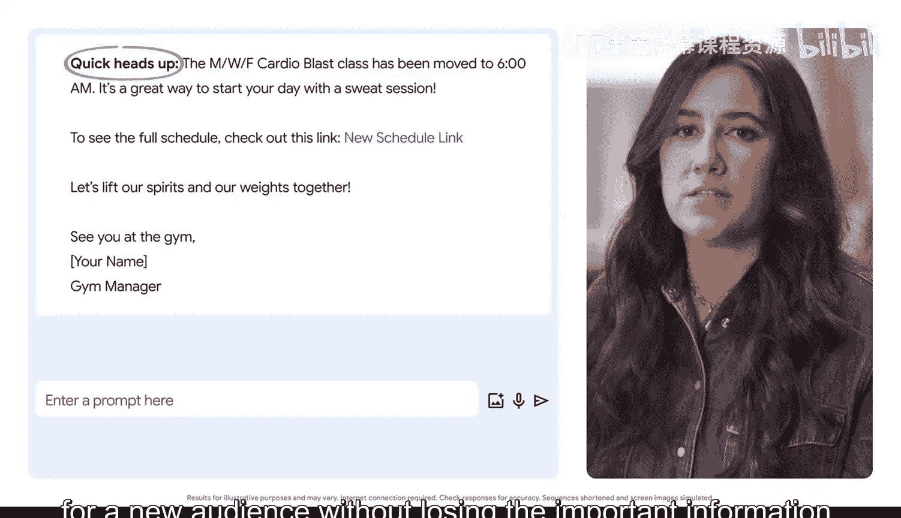

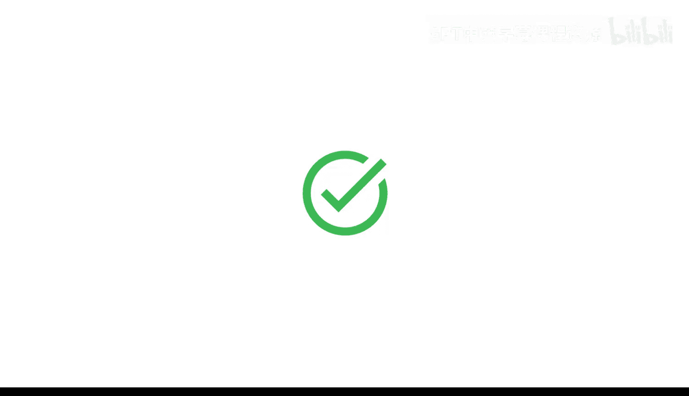

当你借助生成式AI工具起草任何类型的沟通内容时，请确保输出内容是准确的，并通过调整你的提示词来获得对你最有帮助的信息。