#  017：激发创意灵感 🧠

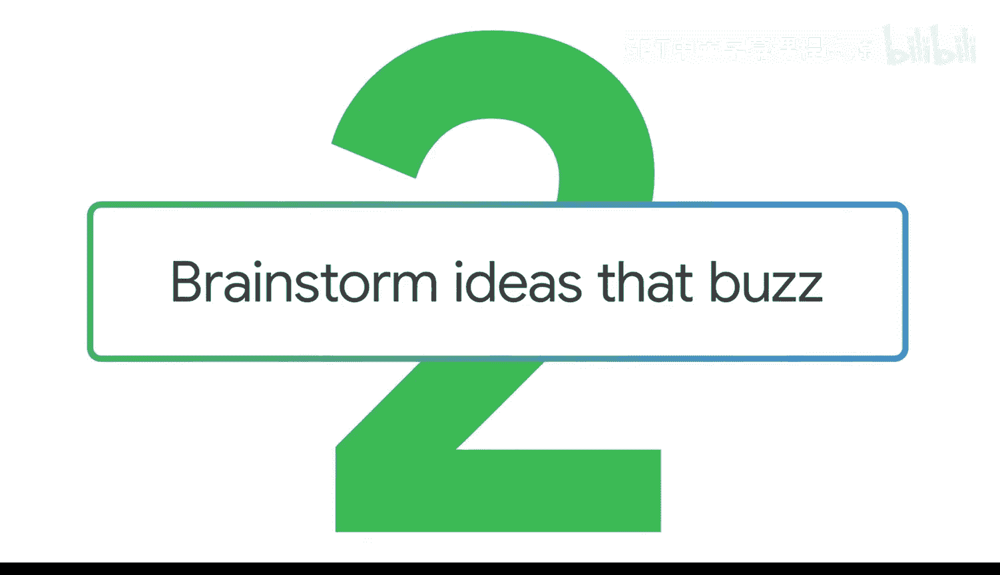

在本节课中，我们将学习如何撰写提示词，以利用生成式人工智能（如Gemini）来激发创意和进行头脑风暴。我们将通过一个具体的案例——为一款新的中世纪奇幻角色扮演游戏策划上市活动——来演示整个过程。

---

## 概述

无论是策划团队建设活动，还是构思工作项目方案，生成式人工智能都能帮助你生成想法、头脑风暴解决方案，从而做出更明智的决策。关键在于精心构建输入内容：你需要明确任务、提供背景信息、包含相关参考，然后进行评估和迭代。

上一节我们介绍了提示词的基本构成，本节中我们来看看如何将这些要素应用于创意生成。

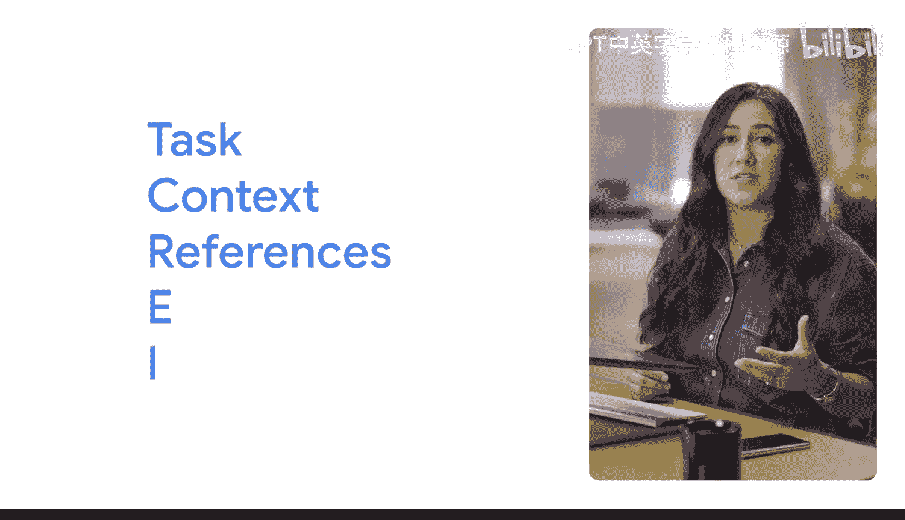

---

## 构建创意提示词

为了从AI获得有价值的创意，你的提示词需要包含几个核心部分：**角色**、**背景**和**具体任务**。

### 1. 设定角色与背景

首先，你需要告诉AI“你是谁”以及“在什么情况下”。这为AI提供了生成相关内容的框架。

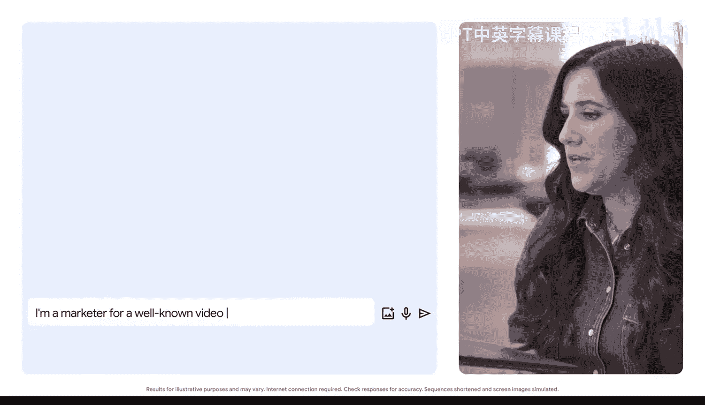

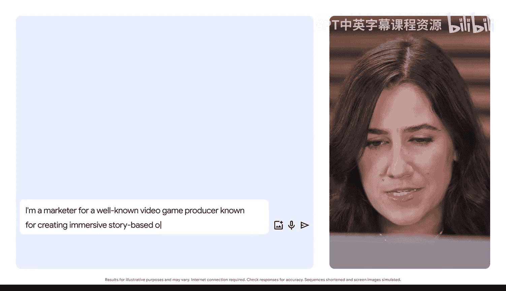

**示例角色与背景设定：**
> 我是一家知名视频游戏发行商的营销人员，公司以制作沉浸式故事型在线游戏闻名。我正在为一款新的中世纪奇幻角色扮演游戏策划上市活动。游戏讲述了一位年轻主角寻找失踪伙伴的故事，主要受众是年轻人。游戏开发已进入最后阶段。

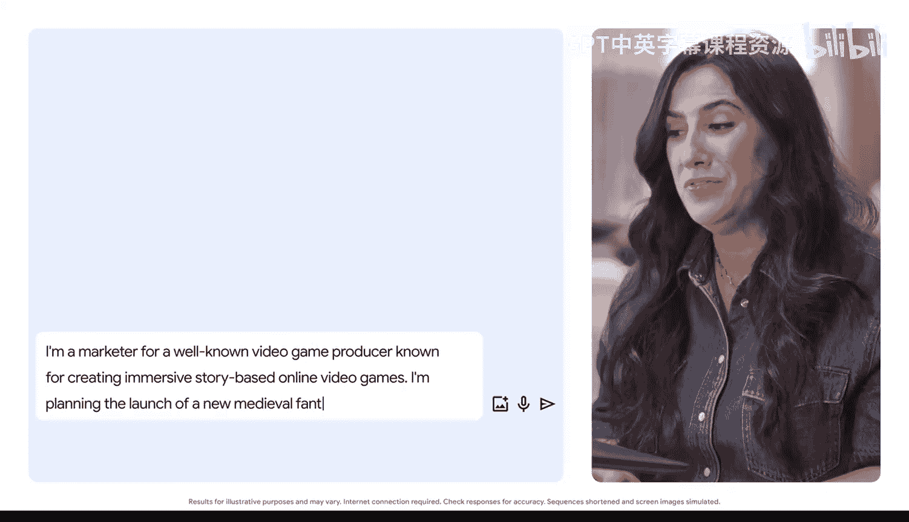

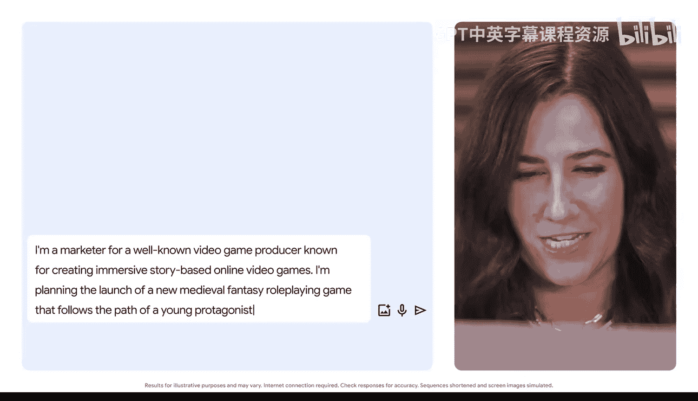

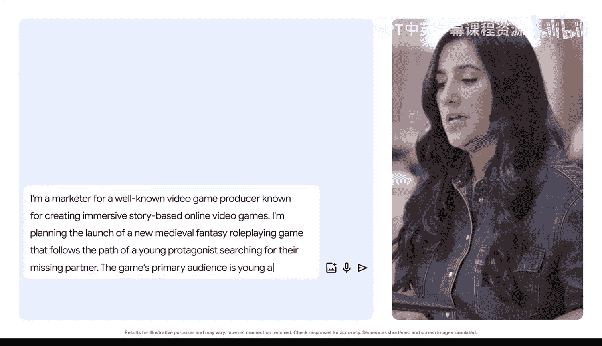

### 2. 明确任务与格式

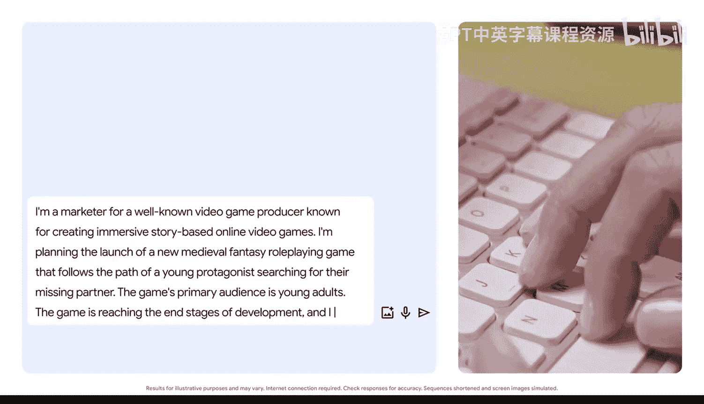

其次，你需要清晰地说明你希望AI具体做什么，以及你期望的输出格式。

**示例任务指令：**
> 请为游戏上线前的一年时间，草拟一个粗略的时间线。同时，提供一些上市前的活动创意，帮助为游戏造势。

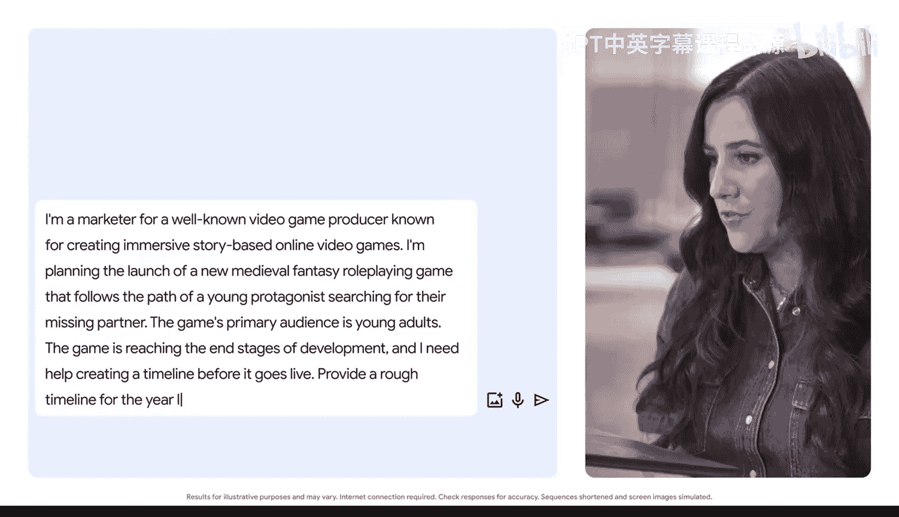

---

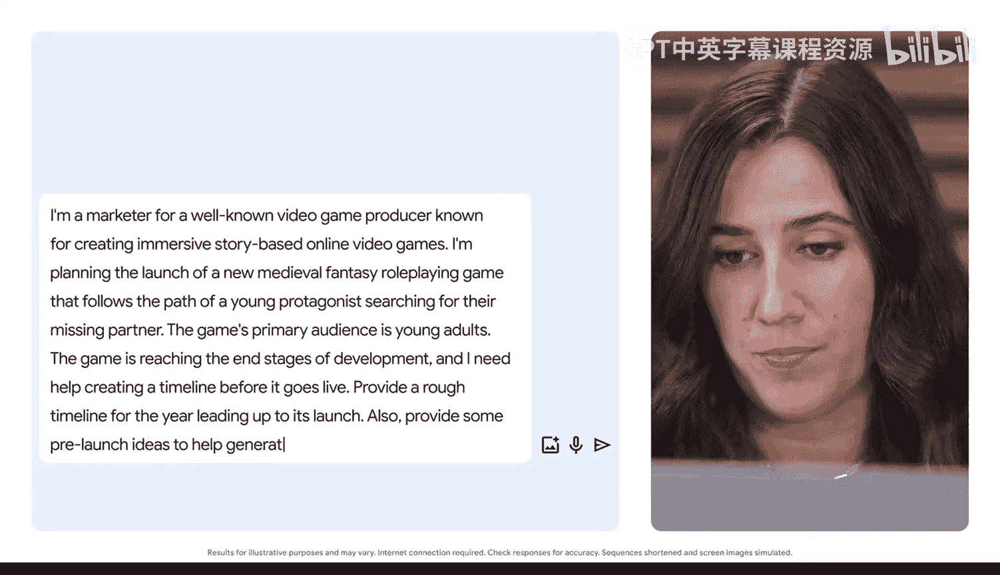

## 评估与迭代：像对话一样

生成初步结果后，评估输出并根据需要进行迭代，这就像与AI进行对话，不断引导它产生更符合你期望的内容。

例如，AI可能给出了一个不错的初步时间线和一些预热活动想法（如举办艺术比赛、发布开发者日志）。但如果你希望活动能吸引全球的年轻受众，可以进一步提出要求。

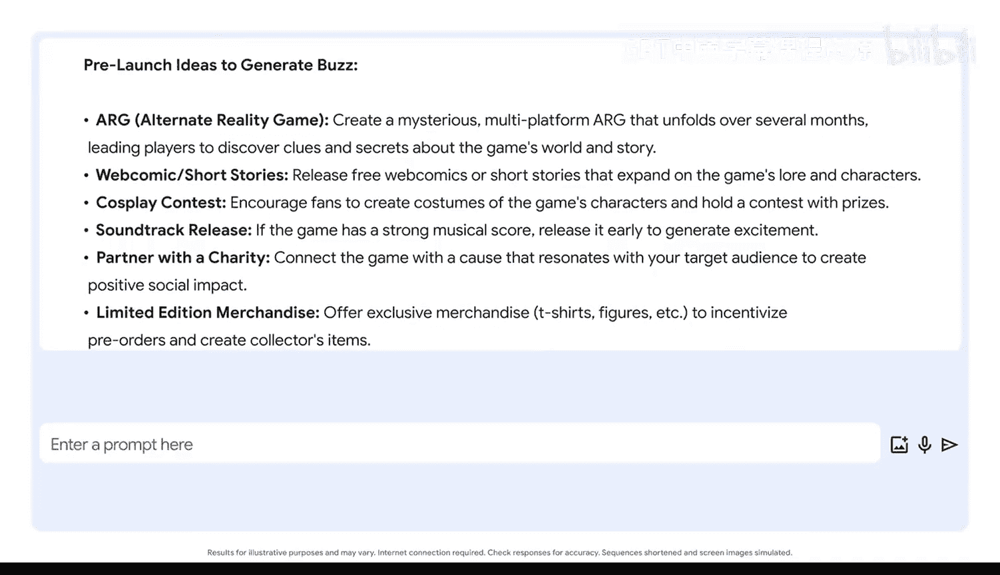

**迭代提示词示例：**
> 现在，请提供一些能吸引全球年轻受众的上市前活动创意。

通过增加“全球受众”这一背景，AI会调整其建议，可能会提出包含文化参考的游戏内容、与全球各地网红合作、举办多语言在线活动等更具国际视野的创意。

---

## 核心步骤总结

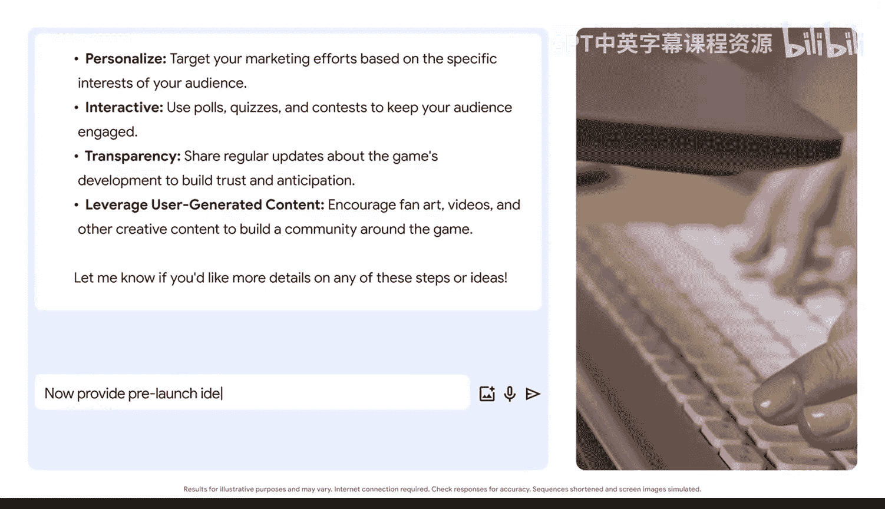

以下是利用AI进行创意头脑风暴的核心步骤：

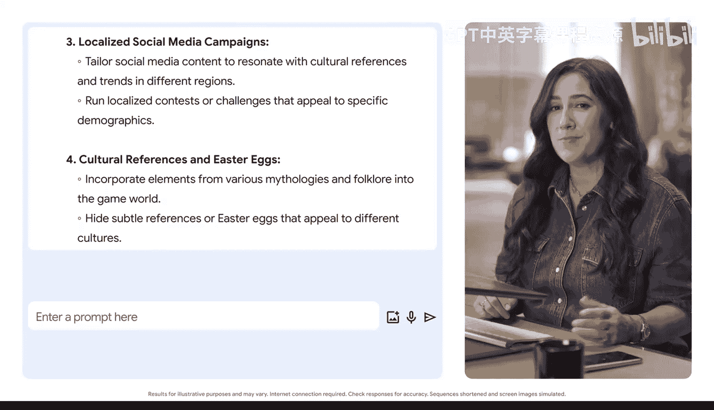

1.  **构建基础提示词**：结合**角色**、**背景**和**具体任务**。
    *   **公式**：`输出 = 角色 + 背景 + 任务`
2.  **生成初步想法**：运行提示词，获取AI的初始反馈。
3.  **评估输出**：检查创意是否符合你的目标和背景。
4.  **迭代优化**：通过补充背景、调整任务或要求更多细节，像对话一样优化提示词，以获得更精准的结果。

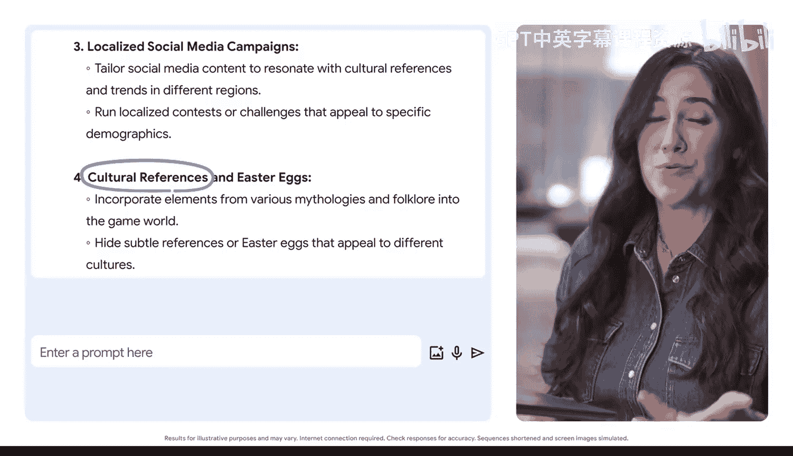

---

## 总结

本节课中，我们一起学习了如何通过精心设计的提示词，利用生成式人工智能来激发创意灵感。关键要点在于：明确你的身份和项目背景，清晰下达任务指令，并将输出评估与提示词迭代视为一个持续的对话过程。无论是规划游戏上市，还是构思团队破冰活动，这个方法都能帮助你高效地生成多样化的创意方案。