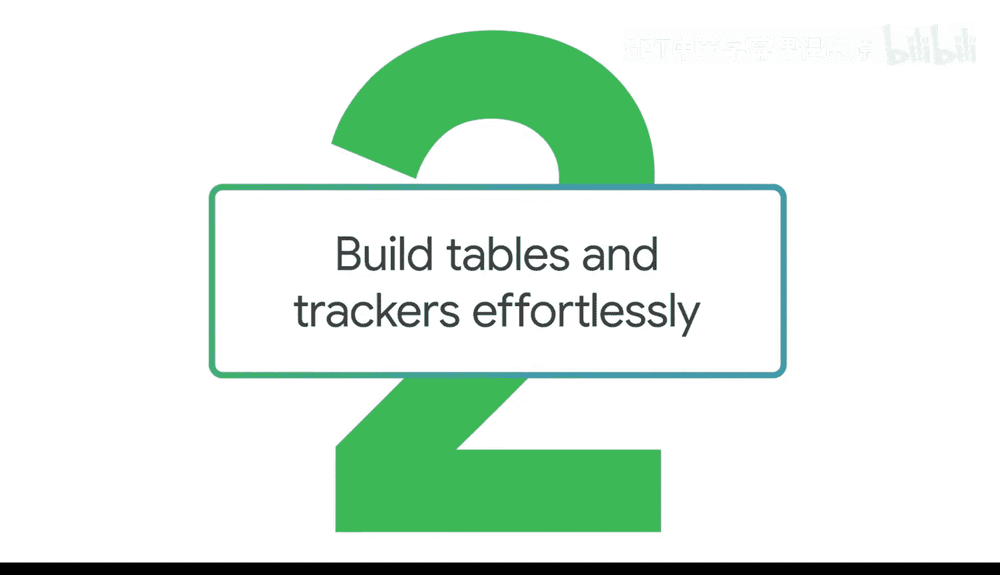
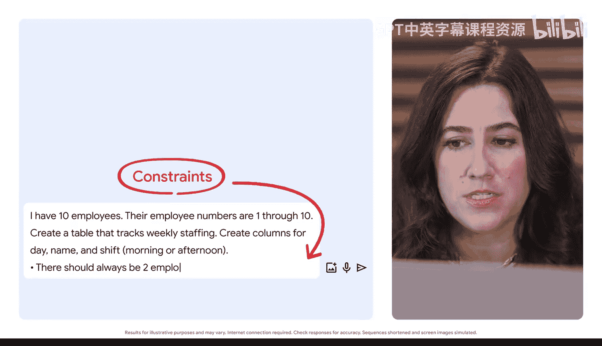
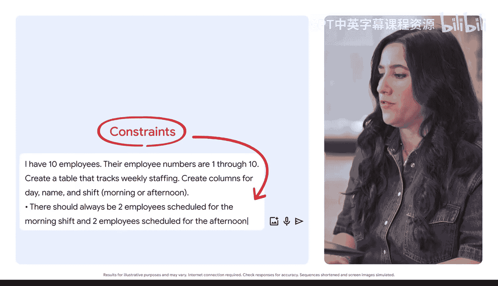
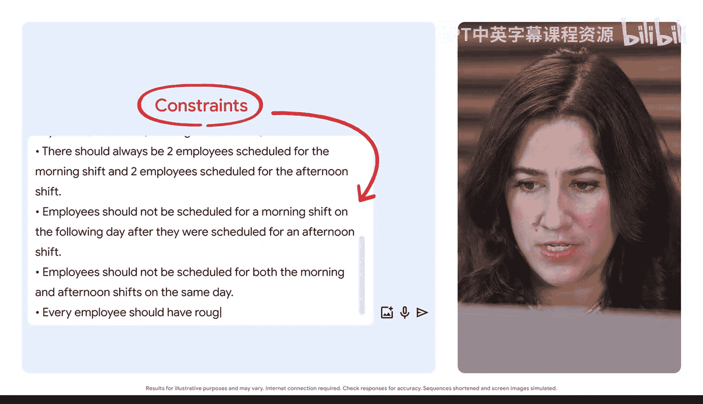
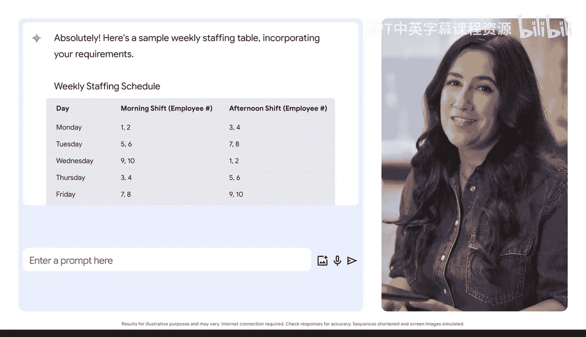
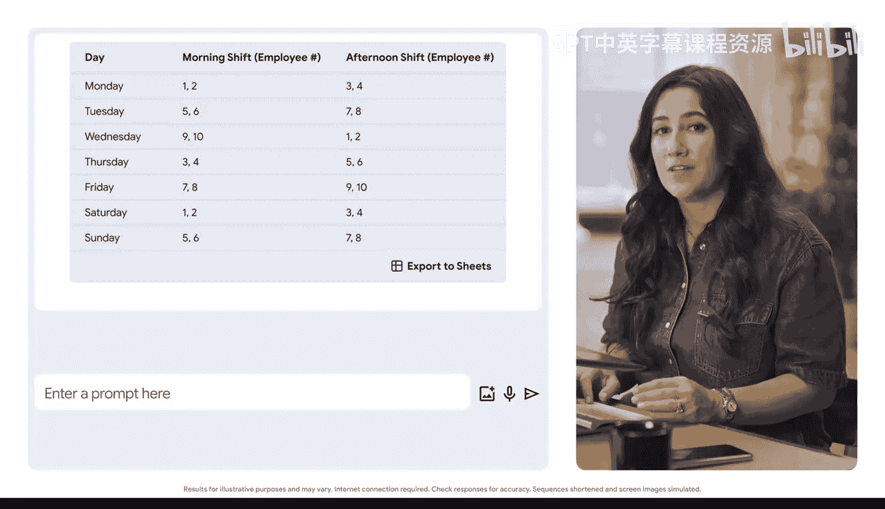

#  018：轻松构建表格与追踪器 📊

在本节课中，我们将学习如何利用生成式人工智能工具，快速、高效地创建结构化的表格和项目追踪器。我们将通过一个员工排班表的实例，演示从构思提示词到生成最终表格的完整流程。

---

上一节我们介绍了生成式AI的基本应用场景，本节中我们来看看如何让它帮助我们处理具体的结构化数据任务，例如创建表格。

表格和项目追踪器在工作中至关重要，它们能帮助团队成员明确职责，并确保时间线和交付成果按计划推进。然而，手动构建这些文档可能非常耗时。生成式AI可以显著加速这一过程。

让我们尝试一个例子：你需要创建一个每周员工排班表，并希望提示Gemini来生成这个表格。

以下是我们的任务、格式和上下文要求：

*   **任务**：创建一张追踪每周员工排班的表格。
*   **格式**：表格需包含“日期”、“员工姓名”和“班次（上午或下午）”这几列。
*   **上下文与约束条件**：
    *   我有10名员工，他们的工号是1到10。
    *   每天上午班次必须安排两名员工，下午班次也必须安排两名员工。
    *   员工在安排了下班次后，第二天不应被安排上午班次。
    *   员工在同一天不应既被安排上午班次又被安排下午班次。
    *   每周每位员工的总班次数应大致相同。

基于以上清晰的指令，Gemini在几秒钟内就生成了一份易于追踪的员工排班表。输出结果严格遵守了我们提示中设定的所有约束条件，例如确保了无人需要连续工作或同日工作两个班次。

---

更便捷的是，我们可以将生成的排班表直接导出到Google Sheets中继续编辑。登录后，我们还可以在Sheets内直接提示Gemini，让它总结我们的排班表、创建新的排班计划，甚至生成公式来快速分析信息。

但请务必记住，在使用生成式AI工具处理工作时，应避免输入任何你不希望工具审核员能够访问的敏感信息。在此案例中，我们不应输入员工的具体个人信息，因此使用了匿名的员工工号。在利用生成式AI工具工作前，请务必查阅你所在组织关于敏感数据和AI使用的相关政策。

---

本节课中我们一起学习了如何通过提供清晰的任务描述、格式要求和约束条件，利用生成式AI快速构建复杂的表格与追踪器。这种方法不仅能节省大量时间，还能确保输出结果符合特定的业务规则。记住，在享受便利的同时，保护敏感数据的安全始终是首要原则。