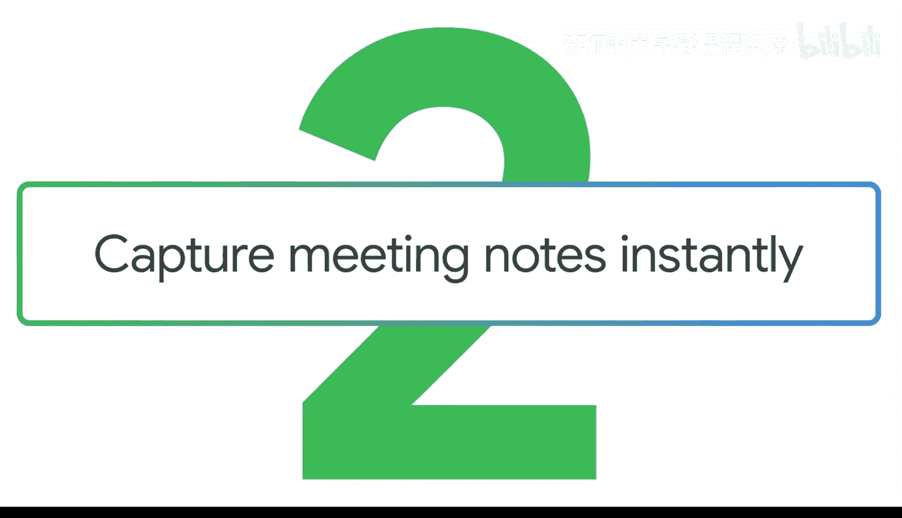
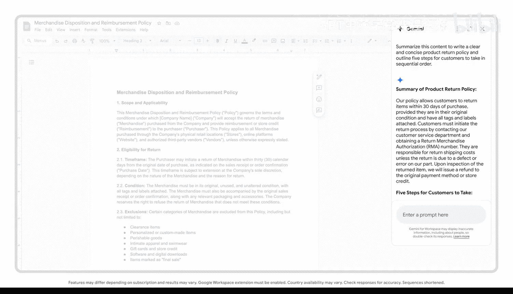

#  019：在文档中即时记录会议笔记




在本节课中，我们将学习如何利用 Gemini 在 Google Docs 中高效处理文本和会议记录。我们将通过两个具体示例，展示如何将复杂的文档内容转化为清晰、可操作的摘要和会议纪要。

---

## 示例一：优化产品退货政策

上一节我们介绍了在文档中使用 Gemini 的基本概念，本节中我们来看看如何应用它来优化具体内容。假设你收到客户反馈，认为公司的退货政策冗长且难以理解。

首先，登录 Google Docs，将现有的退货政策粘贴到文档中。接着，向 Gemini 输入提示词。一个有效的提示词需要明确指定任务和上下文。

以下是构建提示词的步骤：

1.  **指定任务**：明确要求模型执行的操作。
2.  **提供上下文**：给出模型需要处理的原始内容。

基于此，我们可以输入如下提示词：

```
总结以下内容，以撰写一份清晰、简洁的产品退货政策，并按顺序列出客户需要遵循的五个步骤。
```

执行后，你将获得一份可供参考的精炼退货政策，以及一个清晰的客户退货步骤清单。这不仅能帮助你更好地协助客户，也提升了工作效率。

---

## 示例二：从会议转录稿生成会议纪要

除了优化文档，Gemini 还能帮助我们从冗长的会议记录中提取关键信息。想象一下，你刚结束一个内容繁多的会议，需要整理出谁说了什么以及各自的行动项。




你可以先在 Google Meet 中生成会议转录稿，然后将其复制到 Google Docs 中。接下来，使用 Gemini 来创建结构化的会议纪要。关键在于通过精心设计的提示词，准确获取你需要的信息。

我们使用一个由 AI 生成的会议转录稿作为示例。首先，我们构建一个初始提示词：

```
为本次会议创建会议纪要。按发言人划分会议纪要部分，并为每位发言人创建一个包含其关键要点的项目符号列表。如果适用，突出显示每位发言人的行动项。
```

生成初步纪后，你可能会发现，如果能按会议讨论的关键点来组织，并明确责任分配，纪要会更加清晰有用。因此，我们可以对提示词进行迭代优化。

以下是优化后的提示词结构：

1.  **保持核心任务不变**：`为本次会议创建会议纪要。`
2.  **优化输出格式和要求**：`根据从纪要中提取的关键点创建章节。将每个关键点归属于对应的发言人，然后将行动项分配给最合适完成该任务的发言人。`

经过优化，生成的会议纪要将更清晰地展示行动项和每位与会者的核心观点。现在，你可以利用这些笔记与同事对齐项目进度、向利益相关者同步更新、帮助团队成员明确职责，并跟踪交付物的完成情况。

---


本节课中我们一起学习了如何运用 Gemini 在 Google Docs 中执行两项实用任务：**优化复杂文本**和**从会议转录稿生成结构化纪要**。关键在于构建清晰的提示词，明确指定任务、上下文和期望的输出格式。通过迭代优化提示词，你可以获得更精准、更有用的结果，从而显著提升文档处理和信息整理的效率。