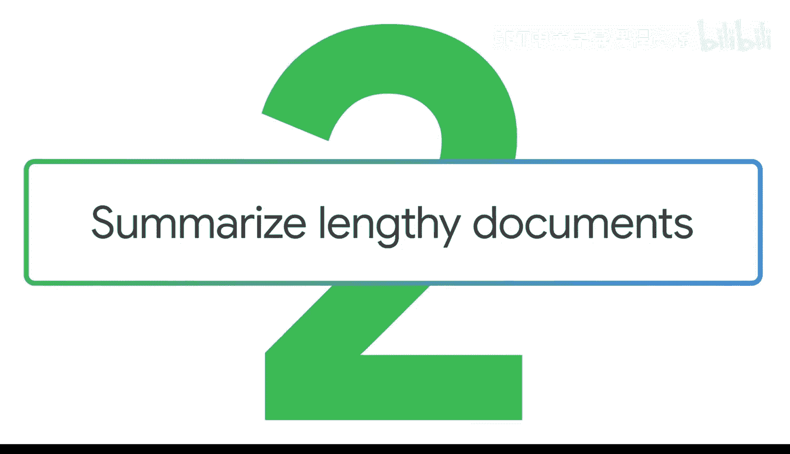
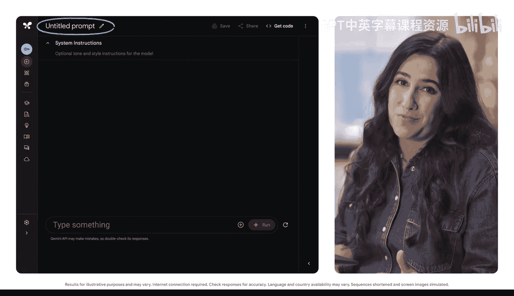
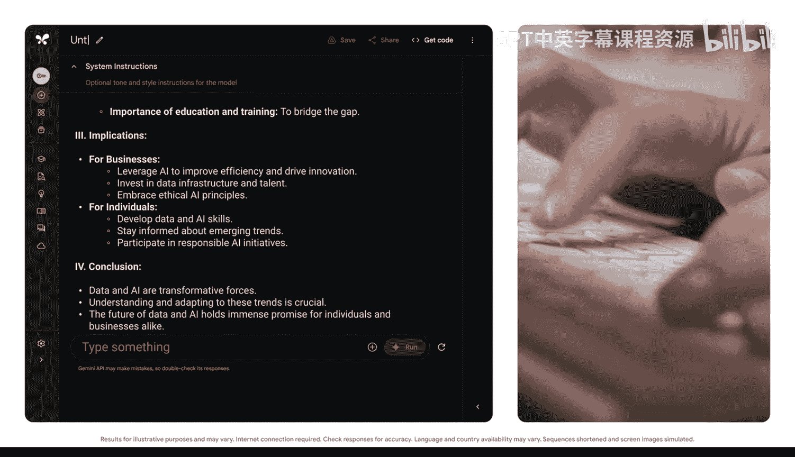

#  020：总结冗长文档 📄



在本节课中，我们将学习如何利用生成式AI工具来总结冗长的文档，提取关键信息，并将其转化为易于理解的新资源。掌握这项技能，能帮助你在研究、撰写报告或分析市场趋势时，高效处理复杂材料。

## 概述：为何需要总结文档？ 🤔

在进行研究、撰写报告或调查市场趋势时，你必然会遇到一些特别复杂或冗长的材料。幸运的是，生成式AI工具可以总结大段文本、提取关键见解，甚至将它们转化为新的资源。你还可以在提示词中指定偏好的输出格式，从而精确获得你想要的输出类型。

## 核心概念：长上下文窗口 📖

上一节我们提到了处理长文档的需求，本节中我们来看看实现这一功能的关键技术：**长上下文窗口**。

当你需要总结一份很长的报告时，必须使用具备**长上下文窗口**的生成式AI工具。长上下文窗口允许模型一次性处理大量不同格式的信息。它还能增强模型理解提示词并生成更连贯、上下文更相关响应的能力。

**核心公式**：
`模型输出质量 ∝ 上下文窗口长度与文档理解深度`

## 实战演练：在Google AI Studio中操作 💻


了解了核心概念后，让我们进入实战环节，看看如何在Google AI Studio中应用这些知识。

首先，打开AI Studio并使用Google账户登录。请注意，我们可以为提示词命名，这便于日后查找，并在与他人共享提示词时非常有用。



现在，让我们开始使用提示词框架。以下是我们需要完成的任务，包括指定的格式。


**任务提示词示例**：
```
Summarize this report in an outline. Focus only on the most essential points.
```

效果非常显著，44页的信息被提炼成了几个要点。我们可以将此提示词命名为“报告总结”。

## 重要限制与变通方案 ⚠️

上一节我们成功总结了报告，但需要注意的是，并非所有生成式AI工具都具备长上下文窗口功能。

长上下文窗口并非在所有生成式AI工具上都可用。因此，根据你使用的工具，它可能无法分析长文档。生成式AI技术是动态且不断变化的，因此请务必反复确认你所使用工具的功能和性能。

这里有一个专业提示：如果你使用的生成式AI工具能够处理大段文本，并且你需要总结，可以将文本拆分，每次粘贴一部分，提示总结每个部分，然后要求总结这些摘要。

## 进阶技巧：个性化总结方式 🎭

无论是进行研究还是分析报告，获取阅读内容的总结都可以帮助你在更短的时间内理解材料。

另一个专业提示是：生成式AI工具不仅能总结冗长文档，还能以不同的方式向你解释它们。通过**融入角色**并**指定受众**，你可以为总结进行个性化定制。

以下是实现个性化总结的方法：

*   **为特定受众总结**：例如，你可以要求“为不擅长数字的人总结这份报告”或“为小企业主总结这份报告”。
*   **使用特定风格总结**：甚至可以要求“用80年代电影台词来总结这份报告”。



通过指定角色和受众，你可以获得更贴合需求的、易于理解的摘要。

## 总结与回顾 🎯


本节课中，我们一起学习了如何利用生成式AI总结冗长文档。我们了解了**长上下文窗口**的核心概念及其重要性，并在Google AI Studio中进行了实践操作。我们还探讨了工具的限制、提供了拆分文本的变通方案，并学习了通过指定**角色**和**受众**来获得个性化总结的进阶技巧。掌握这些方法，将极大提升你处理复杂信息材料的效率。