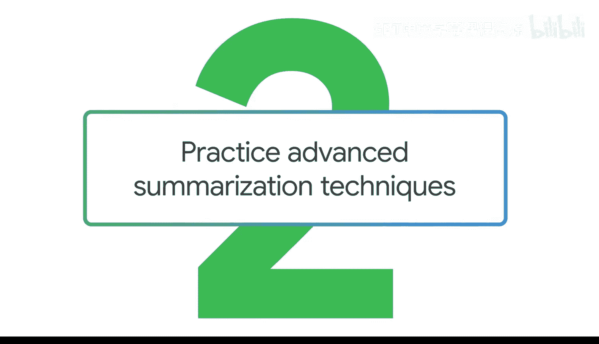
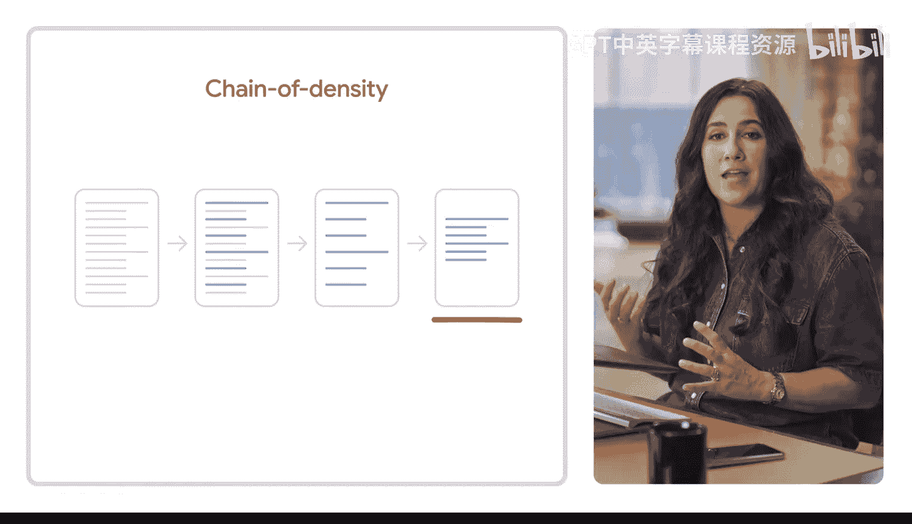
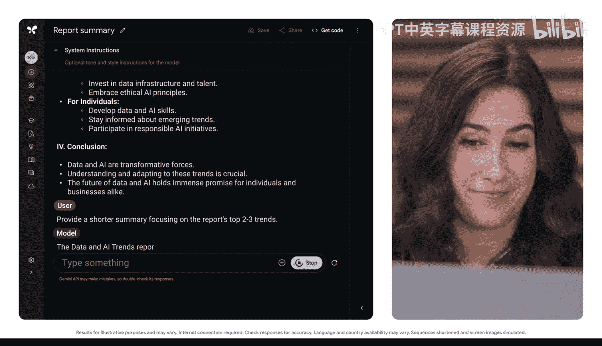

#  022：练习高级总结技巧 🧠



在本节课中，我们将学习一种名为“密度链提示法”的高级总结技巧。这种方法能帮助你引导生成式AI工具，从一份冗长的初始总结开始，逐步提炼出更简洁、更聚焦的版本，最终获得对你最有用的信息。

上一节我们介绍了几种基础的总结技巧，本节中我们来看看如何通过迭代提示来获得更精确的总结。

## 什么是密度链提示法？ 🔗

当你要求生成式AI工具提供总结时，初始输出有时可能过于宽泛，缺乏你所需的细节。**密度链提示法** 可以帮助解决这个问题。通过这种方法，你可以获得一系列逐步精炼、越来越简洁的总结输出。

可以这样理解：假设你正在为公司构思一段完美的电梯演讲。你的第一稿太长，包含太多细节。但当你不断修改提炼时，它会变得更短、更直接，同时又不丢失需要传达的重点。最终，你得到了那段完美的电梯演讲：快速、直接且有效。

## 实践密度链提示法 📝

我们将通过一个例子来演示这个过程。假设我们有一份关于市场趋势的报告需要总结。

### 第一步：请求更短的总结



首先，我们在上一个提示词的基础上进行迭代，更新任务和格式要求。

**提示词示例：**
```
提供一份更短的总结，聚焦于报告中最重要的2到3个趋势。
```



### 第二步：进一步缩短为单句

任务完成了，但你可能希望它更短。我们可以让提示词更具体，以确保输出不仅更简洁，而且完全针对你的需求。让我们要求一个单句总结。

**提示词示例：**
```
将总结浓缩成一句话，突出最主要的一个趋势。
```

很好，我们不断要求它进一步提炼，并且对期望的输出结果非常直接和具体。

### 第三步：持续迭代直至满意

我们可以重复这个过程，直到生成对任务最有用、最有帮助的输出。我们甚至可以提前规划这些额外的迭代步骤，在最初的提示词中就要求生成式AI工具提供多个长度递减的版本。

**核心方法公式：**
`输出结果 = 迭代提示(初始内容， 目标：{更短/更长}， 焦点：{具体方面})`

## 为何需要迭代？ 🤔

你可能会想，为什么不一开始就要求最短的输出呢？原因如下：

1.  **检查幻觉**：迭代过程帮助我们在从超级详细的版本过渡到更直接、更切中要点的版本时，检查AI是否产生了“幻觉”（即编造信息）。
2.  **跟踪信息取舍**：它帮助我们了解，随着输出变短，哪些信息被剔除了，确保关键点得以保留。

## 反向应用：增加细节 📈

密度链提示法也可以反向操作。如果输出太短，我们同样可以通过提示来增加长度和细节。

记住，当你想到一份没时间阅读的报告时，试试这些提示技巧，你会发现快速生成一份有用的总结是多么容易。

## 总结 ✨


本节课中我们一起学习了“密度链提示法”。我们了解到，通过一系列逐步精炼的提示，可以引导AI生成从详细到精炼的不同版本总结。这种方法不仅能帮助我们获得最符合需求的输出，还能在迭代过程中监控信息的准确性与完整性。无论是缩短还是扩展内容，明确的迭代指令都是获得高质量AI总结的关键。