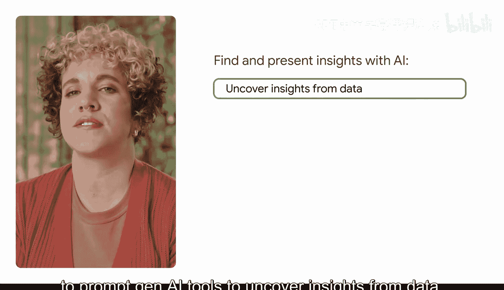
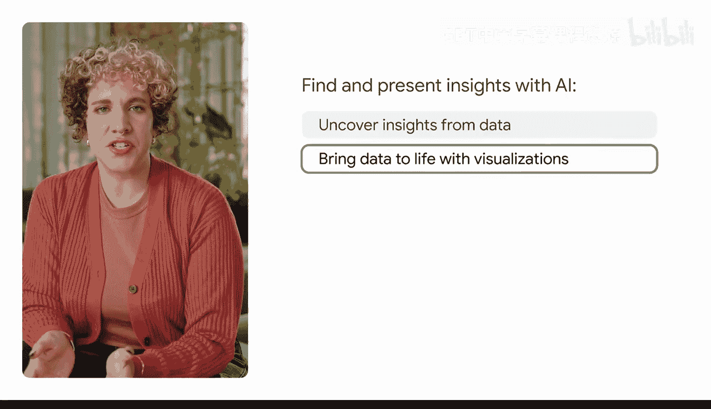
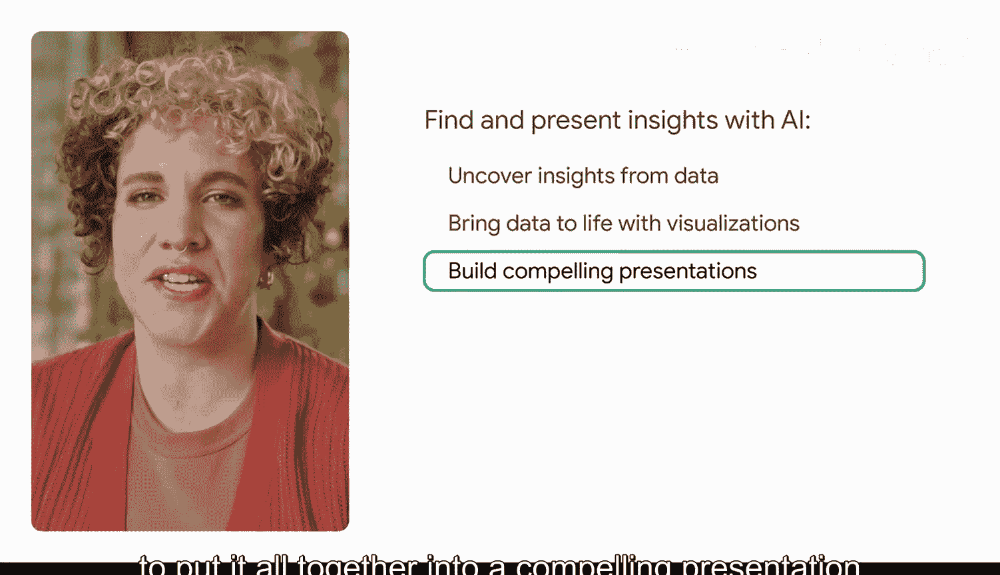

#  023：使用AI发现并呈现洞察


在本节课中，我们将学习如何利用生成式AI工具，从数据中发掘有价值的洞察，并将其转化为生动的可视化图表和引人入胜的演示文稿。


你是否还记得，当你的团队推出新产品后，某个特定区域的销售额随之上升？或者，一次简单的调查揭示了一个未被满足的客户需求？这些不仅仅是电子表格上的数字，它们是能够导向宝贵洞察的故事。然而，问题在于，你可能并不总是有时间去追踪这些故事。

生成式AI工具可以帮助你管理、分析、可视化并呈现数据。在本模块中，你将首先学习如何向生成式AI工具下达指令，以从数据中发掘洞察。接着，你将学习如何通过可视化让数据变得生动。最后，你将探索如何将所有内容整合成一个引人注目的演示文稿，帮助你展示并讲述你的故事。

---

上一节我们介绍了本课程的目标，本节中我们来看看如何具体使用AI来发现洞察。

以下是使用AI发现洞察的核心步骤：

1.  **准备数据**：确保你的数据是结构化的，例如CSV文件或清晰的表格。向AI提供数据的背景信息，例如数据来源、字段含义等。
2.  **提出具体问题**：不要问“分析一下这个数据”，而是提出具体、有针对性的问题。例如：“根据这份销售数据，找出过去一个季度增长最快的三个产品类别及其增长率。”
3.  **请求多角度分析**：引导AI从不同维度进行分析。例如：“请从地区、客户年龄层和产品类型三个维度，分析销售额下降的可能原因。”
4.  **验证与追问**：对AI给出的初步结果提出追问，以深化洞察。例如：“你提到A产品在X地区销量突出，请进一步分析该地区客户的购买行为有什么特征？”

---

上一节我们了解了发现洞察的步骤，本节中我们来看看如何将洞察可视化。

数据可视化能让复杂的洞察一目了然。你可以直接指示AI生成图表建议或代码。

以下是请求AI创建可视化的示例方法：

*   **描述性指令**：“将上述分析中‘各产品类别季度增长率’的结果，用一张**柱状图**来展示，并为图表添加清晰的标题和轴标签。”
*   **代码生成指令**（例如使用Python的Matplotlib库）：
    ```python
    # 请生成Python代码，使用Matplotlib绘制一个展示‘地区销售额占比’的饼图。
    import matplotlib.pyplot as plt

    # 假设数据
    regions = ['North', 'South', 'East', 'West']
    sales = [350, 290, 410, 320]

    plt.figure(figsize=(7,7))
    plt.pie(sales, labels=regions, autopct='%1.1f%%', startangle=140)
    plt.title('Sales Distribution by Region')
    plt.show()
    ```

---

上一节我们探讨了数据可视化，本节中我们将学习如何整合内容，形成演示文稿。

一个有力的演示文稿能将数据、洞察和故事流畅地结合起来。你可以指示AI帮助你构建叙述框架和内容。

以下是构建演示文稿大纲的提示词示例：



> “基于我们之前关于‘Q3区域销售分析’的发现，创建一个演示文稿大纲。大纲需包括：现状概述、关键发现（使用**项目符号列表**）、机遇与挑战、以及三项核心行动建议。请为每一部分建议一个简明的标题和1-2个核心要点。”



---



本节课中我们一起学习了利用生成式AI进行数据分析的完整流程：从**提出具体问题以发现数据洞察**，到**生成可视化图表**来生动呈现数据，最后**整合成结构清晰的演示文稿大纲**。掌握这些提示技巧，能帮助你更高效地将数据转化为有说服力的商业故事。