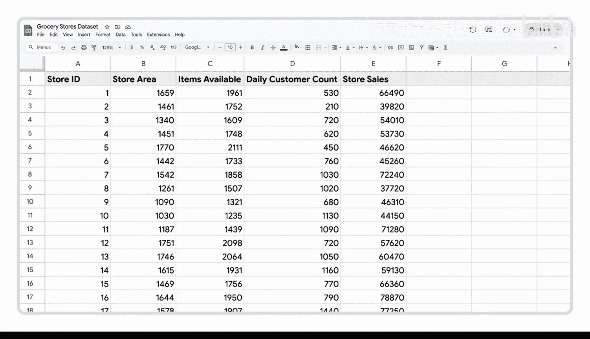
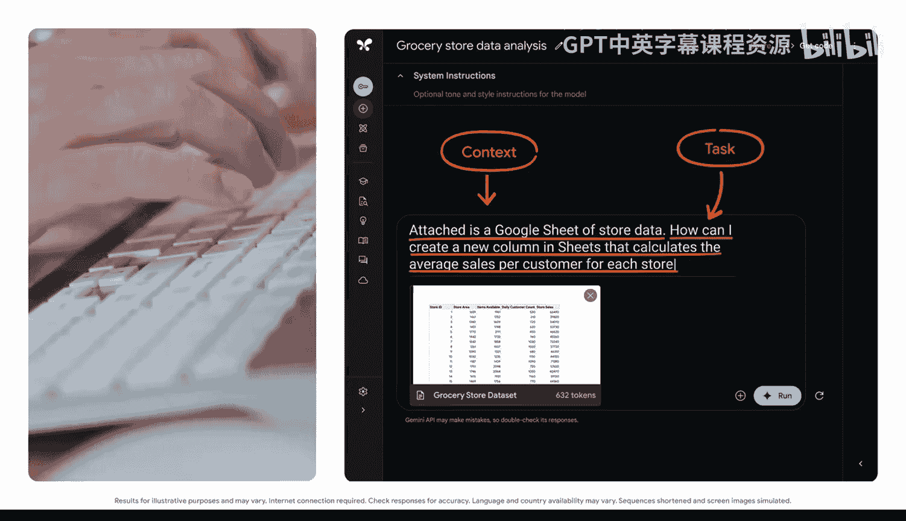

#  024：利用AI揭示数据中的隐藏模式 🕵️‍♂️


在本节课中，我们将学习如何运用提示词框架，通过生成式AI工具从数据中解锁洞察和模式。我们将以在Google AI Studio中使用Gemini模型为例，演示如何分析数据、组织数据并发现趋势。

数据能教会我们很多，但首先需要知道如何解读它。在开始之前，请记住并非所有生成式AI工具都能处理数据，使用前务必确认工具的功能。同时，请负责任地使用AI，在提示中包含敏感或机密数据前，务必审查组织的相关政策。本示例使用的是公开数据。


## 从组织数据开始

上一节我们介绍了提示词的基本框架，本节中我们来看看如何将其应用于数据分析。面对一个包含大量变量的数据集时，首先需要将其组织得易于处理。

这里我们有一个关于一家连锁杂货店的数据集。AI Studio可以帮助我们分析所有数据，以发现可能影响公司运营的趋势和模式。

首先，我们将请求逐步指导。我们可以直接从存储Google表格的Google云端硬盘上传数据。如果使用Microsoft Excel，则需从电脑上传。



上传电子表格后，就可以编写提示词了。

**提示词示例：**
```
已附上一份包含店铺数据的Google表格。我如何在表格中创建一个新列，用于计算每家店铺的每位客户平均销售额？
```

让我们回顾一下输出结果。模型为计算每家店铺的每位客户平均销售额提供了一些有用的建议，甚至解释了如何使用更具描述性的公式来标记电子表格中的新列。

这只是一个例子。如果这种组织方法不奏效，我们可以迭代优化提示词，以获得更接近需求的输出。



## 深入探索数据趋势

发现数据集中的趋势有助于我们做出明智的决策，我们可以提示生成式AI工具来帮助寻找这些趋势。

请思考一个你一直想要分析的电子表格。在我们进行以下示例时，请将其记在心中。

再次从明确任务开始：

**提示词示例：**
```
根据给定数据，为我提供关于每日客户数量、可用商品数量和销售额之间关系的见解。
```

这个提示词快速为我们提供了大量有趣的信息。一个引人注目的发现是：特定店铺的商品数量与其总销售额之间没有明显的相关性。一些小型店铺的销售额甚至超过了大型店铺。

输出结果还为我们提供了这一趋势背后的一些潜在原因，以便我们进一步调查并思考潜在的销售策略。

## 总结与展望

本节课中，我们一起学习了如何利用生成式AI工具分析数据。通过几个简单的提示，我们不再需要花费数小时手动处理数据，就能提取有意义的见解。


回到你一直想要分析的那个电子表格，现在你知道如何利用AI来节省时间并提取关键洞察了。借助这些工具，数据分析变得前所未有的高效。