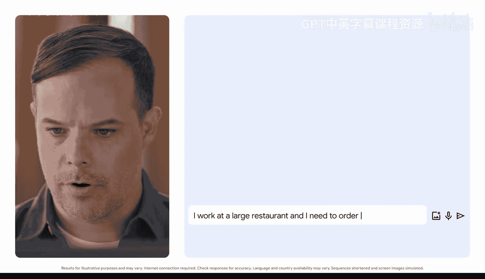
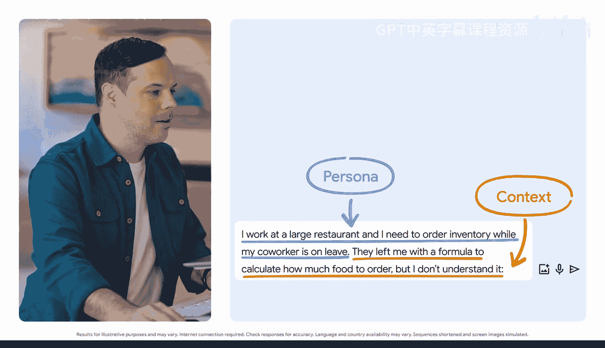
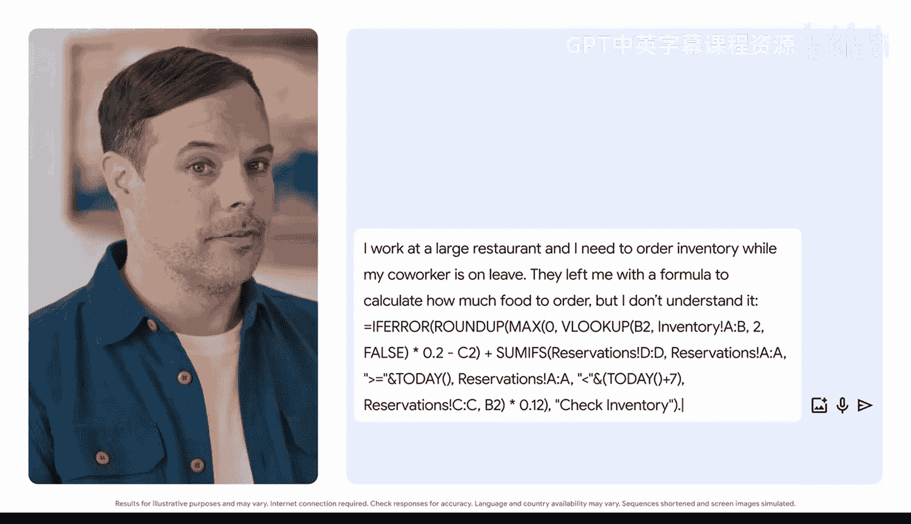
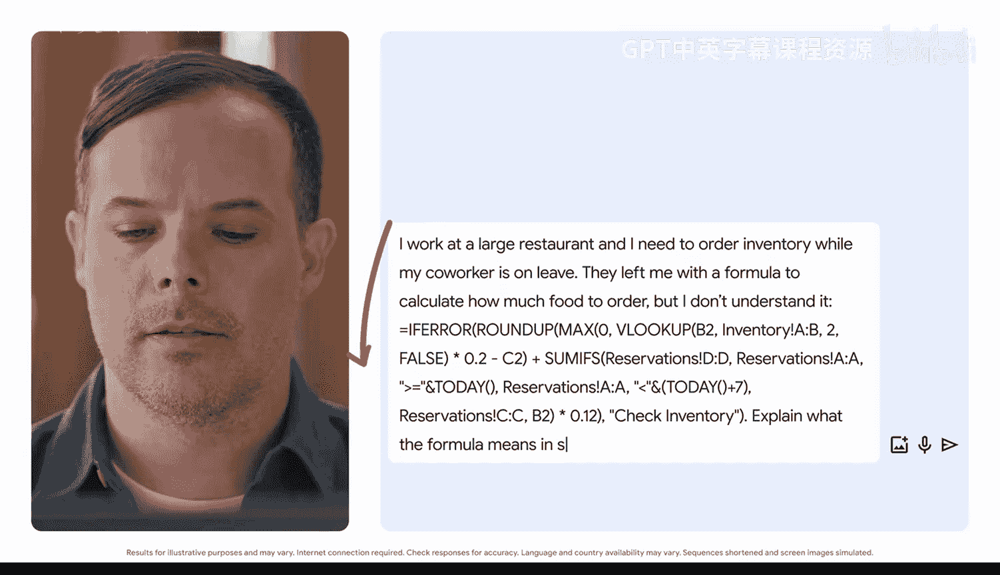
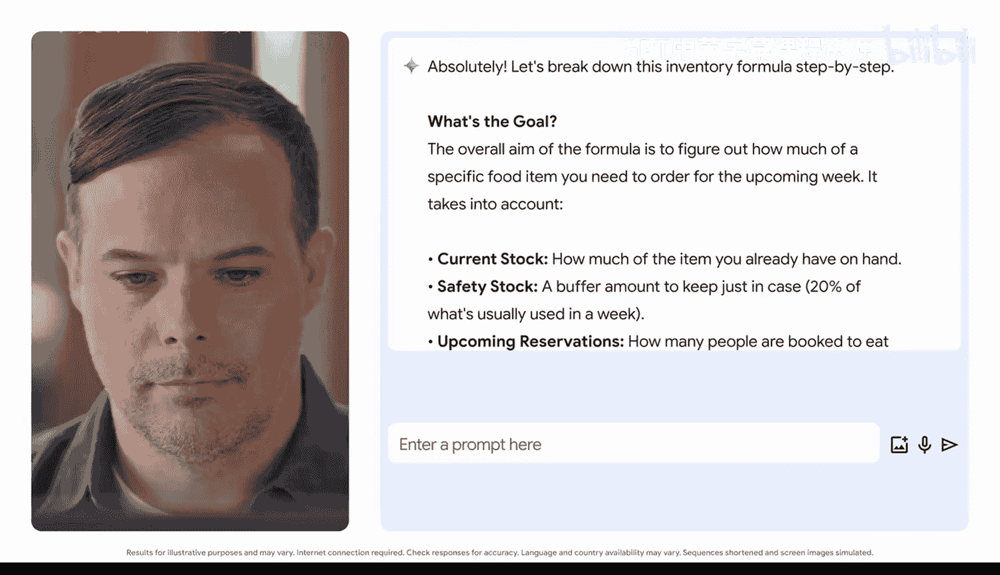
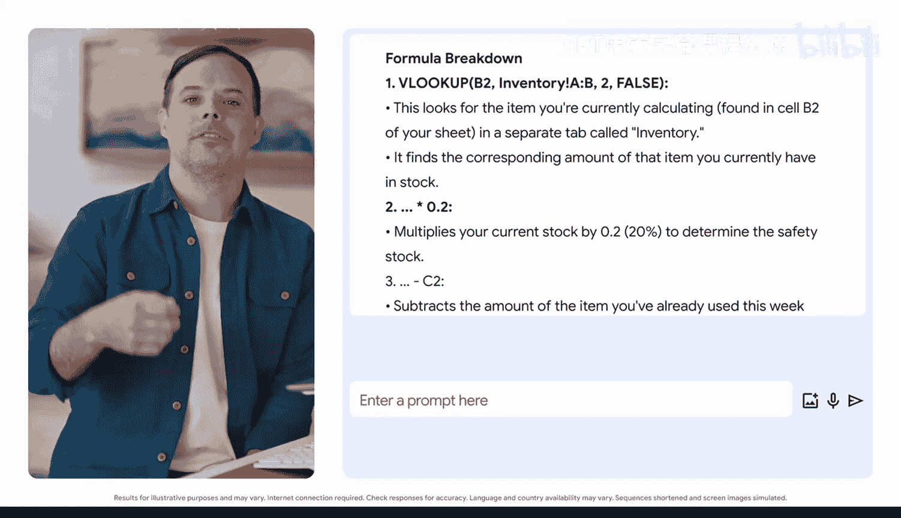
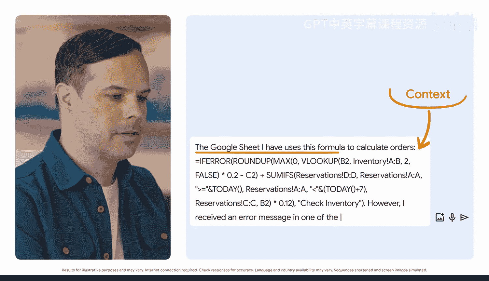
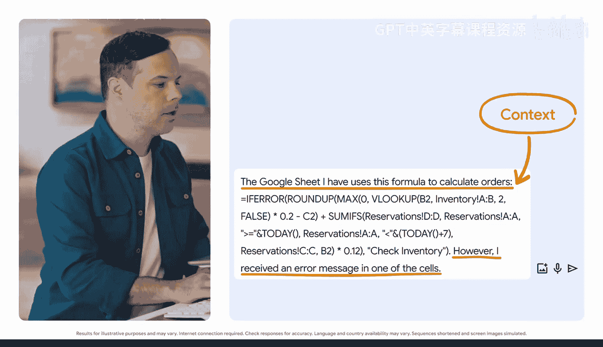

#  026：解读电子表格公式 📊

在本节课中，我们将学习如何利用生成式AI工具，通过自然语言提示词来理解和编写电子表格中的复杂公式。即使你对公式感到陌生，也能轻松掌握。

我是一名电子表格爱好者。但我也知道，并非所有人都像我一样对单元格和公式充满热情。

密集的电子表格和复杂的公式可能令人望而生畏，但无需担心。生成式AI可以帮助你理解和编写电子表格公式，你只需用自然语言向它提问即可。

你已经知道如何提示生成式AI工具来帮助你创建和理解文本、图像和数据点。它同样可以帮助你更好地理解电子表格公式。

让我们将提示框架付诸实践。想象一下，你在餐厅的同事去度假了，留给你一个充满数据和公式的电子表格。其中一些公式看起来很熟悉，但另一些则显得更为复杂。你今天需要订购库存，但又不想打扰你的同事。于是，你转向Gemini AI寻求指导。

## 第一步：理解复杂公式

我们将从设定角色和一些背景信息开始。

上一节我们介绍了使用AI的基本思路，本节中我们来看看如何具体应用。首先，你需要向AI清晰地描述你的处境。

以下是构建提示词的具体步骤：

1.  **设定角色与背景**：`我在一家大型餐厅工作，需要在同事休假期间订购库存。`
2.  **提供上下文**：`他留给我一个用于计算需要订购多少食物的公式，但我不理解它。`
3.  **粘贴公式**：`=IFERROR(SUM(FILTER(C2:C100, B2:B100="Lunch", A2:A100=TODAY()-7))*1.1, "Check Data")`
4.  **明确任务与格式**：`用简单的步骤解释这个公式的含义。`

这样，你就能更容易地理解公式了。你现在应该对公式试图实现的目标有了更清晰的认识，从而可以快速处理库存订单。

## 第二步：诊断并修复错误

既然你已经理解了公式，接下来我们看看如果你遇到问题该怎么办。

你是否曾在电子表格中收到错误提示却不知如何是好？让我们提示Gemini来学习如何找出这些错误的来源。

我的Google表格使用这个公式来计算订单。我将粘贴公式：`=VLOOKUP(A2, Inventory!A:B, 2, FALSE)`

然而，我在其中一个单元格中收到了错误信息：`#N/A`

是时候指定任务和我们想要的格式了。

以下是请求AI帮助诊断错误的步骤：

1.  **描述问题**：说明你使用的公式和遇到的错误信息。
2.  **提出具体请求**：`给我一个在Google表格中查找并修复此错误的逐步过程。`

这样，你就获得了解决那个烦人错误信息的清晰指导。解决了这些问题，你就可以顺利推进库存订单的工作了。

## 总结

本节课中我们一起学习了如何利用生成式AI解读电子表格公式。关键步骤包括：**设定背景**、**提供具体公式**、**明确解释或诊断的请求**。通过将复杂的公式或错误信息用自然语言描述给AI，你可以获得易于理解的逐步解释或解决方案，从而克服使用电子表格时的障碍。