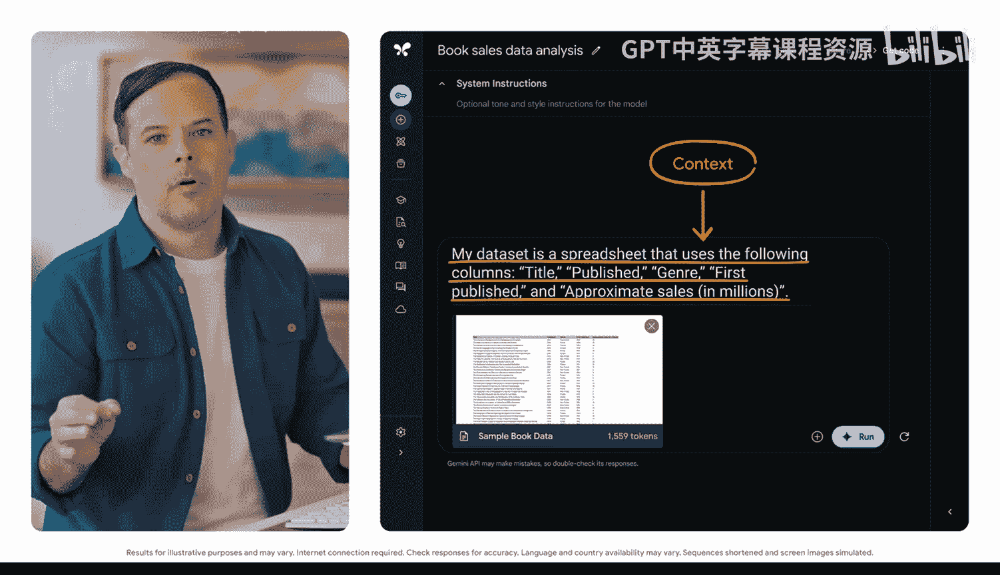
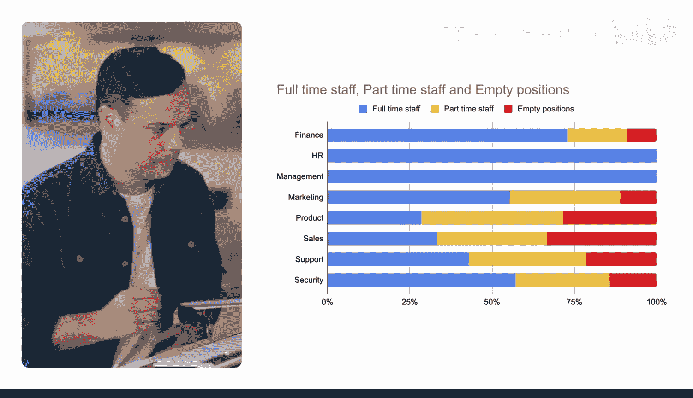

#  027：通过可视化让数据生动呈现 📊

在本节课中，我们将学习如何利用生成式AI工具，将枯燥的数据转化为清晰、生动的图表，从而更有效地展示信息。

你的工作是否涉及向不同的人展示信息？无论是向潜在客户进行推介，还是向同事或组织领导层传达信息，在呈现数据时，展示往往比单纯讲述更具说服力。幸运的是，生成式AI工具非常擅长帮助你确定数据可视化的最佳方式。你只需要知道如何提问。

## 使用提示框架获取图表建议

你可以提示生成式AI工具，获取关于用何种图表或图形来展示数据的最佳建议。提示框架依然是你的指导原则：添加你的**任务**、**上下文**，并在需要时提供**参考**，然后评估输出结果并进行迭代。

你对所需图表类型及其参数的描述越清晰，得到的输出就越有用。

## 实战案例：书店销售数据分析

假设我们共同经营一家书店。这里有一份畅销书清单，列出了它们自出版以来在全球的销量（以百万册计）。在决定采购哪些书之前，我们先来分析一下数据。

**请注意**：并非所有生成式AI工具都能分析数据，使用前请务必确认你的工具具备此功能。在本例中，我们将使用 Google AI Studio。

首先，思考如何用图表直观地呈现这些数据。如果你不确定使用哪种图表，可以随时提示AI工具获取建议。

### 步骤一：请求图表类型建议

我们将用通俗的语言向模型描述数据集，以找出最适合的图表类型。以下是我们的上下文描述：

> 我的数据集是一个电子表格，包含以下列：`书名`、`出版年份`、`体裁`、`首次出版年份`、`近似销量（百万册）`。

现在，我们请求以图表形式呈现，因此需要一些选择。以下是任务提示：

> 给我一些能展示体裁与销量之间相关性的图表选项。

为了更具体地了解图表将如何展示这种相关性，我们可以进一步提问：

> 解释体裁与销量是如何相关的。

根据返回的信息，我们得到了三个创建图表的绝佳建议，这些图表能清晰地可视化数据。更重要的是，每个建议都附有详细解释，让我们可以根据自己的数据集选择最合适的可视化方案。

### 步骤二：利用参考图表获取灵感

你并不总是清楚该使用哪种图表，这时在提示中添加参考就很有帮助。你可以使用与你想要的图表类似的示例，或你觉得有用的图表，并将其作为参考包含在提示中。然后，请求AI推荐如何使用你的数据创建类似的图表。

我们将找到一个图表作为参考，并提示模型使用我们书店场景的数据来模仿它。首先上传示例图表，然后提示模型获取关于该图表描绘内容的信息。

**记住**：有时从简单开始，再逐步增加复杂性会更好。

以下是分析参考图表的提示：

> 描述这个图表。图表中突出了哪些数据关系？

在提示重新创建图表之前，我们先请求描述它，以便循序渐进。

模型告诉我们，这是一个**堆叠条形图**，展示了一个组织内不同部门的人员构成情况。它分析了数据，指出财务部门全职员工比例很高，而产品部门的人员构成则更为均衡。

### 步骤三：基于参考创建新图表

现在，我们将输入一个关于我们已有数据的提示，并要求按照参考图表的方式对其进行可视化。以下是包含上下文和任务的完整提示：

> **上下文**：我的数据集是一个电子表格，包含以下列：`书名`、`出版年份`、`体裁`、`首次出版年份`、`近似销量（百万册）`。
>
> **任务**：我对展示体裁与销量之间的关系很感兴趣。请建议如何修改这个图表，以便在 Google Sheets 中更好地适配我的特定数据。

现在，我们获得了关于如何使用我们的数据创建新图表的详细指导。输出结果甚至解释了如何修改条形图，以更清晰地说明体裁与销量之间的关系。

**请记住**：如果输出结果不符合你的需求，你随时可以调整提示并进行迭代。

## 总结

本节课中，我们一起学习了如何利用生成式AI工具为数据可视化提供建议。我们掌握了通过描述**任务**和**上下文**来获取图表类型建议的方法，并学会了通过提供**参考图表**来引导AI生成更符合需求的定制化可视化方案。关键在于清晰的沟通和迭代优化，从而将复杂的数据转化为直观、有力的视觉故事。