#  028：快速开始演示文稿的演讲者备注

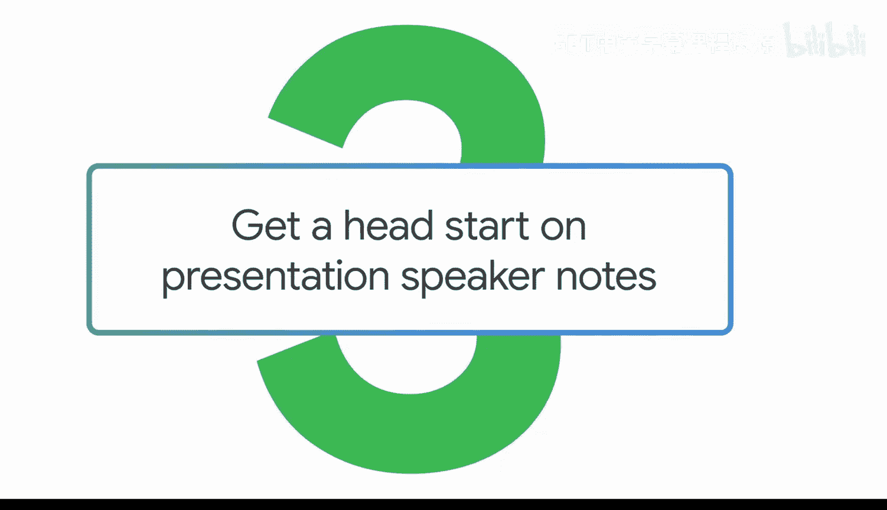

在本节课中，我们将学习如何利用生成式AI工具来构建一个引人入胜的演示文稿。我们将从组织故事结构开始，到生成演讲要点，最后创建辅助图像，让整个演示过程更具吸引力。

沟通不仅仅是分享信息，你需要讲述一个故事。故事是让信息在人们脑海中留下深刻印象的方式。生成式AI工具可以帮助你将演示文稿组织成引人入胜的故事，构建演讲要点，甚至创建图像以保持听众的参与度。我们将使用Gemini来整合这一切。

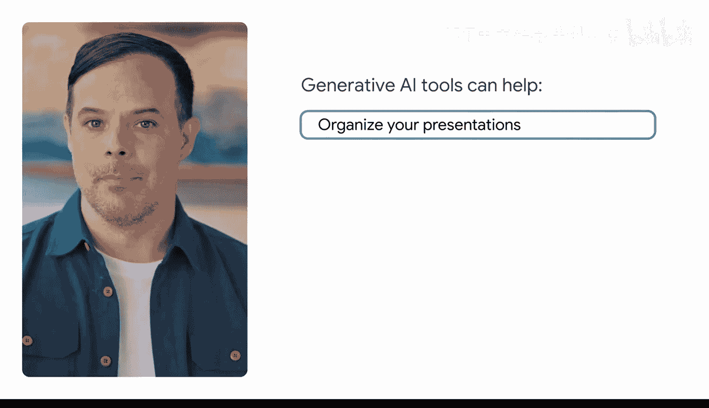

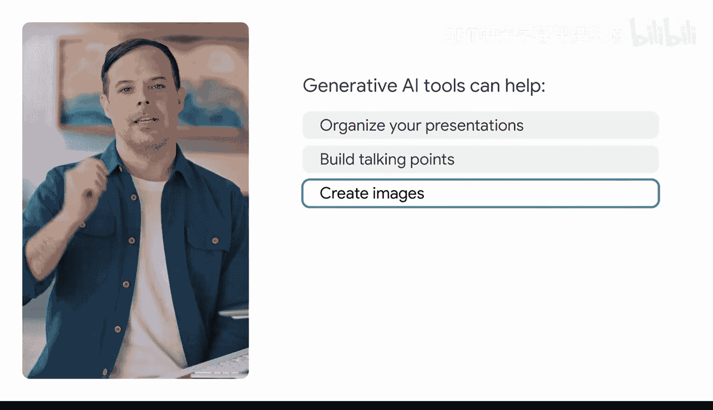

## 设定场景与目标

在以下场景中，你在一家设计、制造和销售耳机的公司工作。你正在准备向你的团队推介一些很酷的新功能。需要传达大量的信息和见解，因此你需要将所学内容提炼成一个清晰的演示文稿。

首先，让我们提示Gemini来帮助确定如何构建演示文稿结构并总结发现。

## 构建演示文稿结构

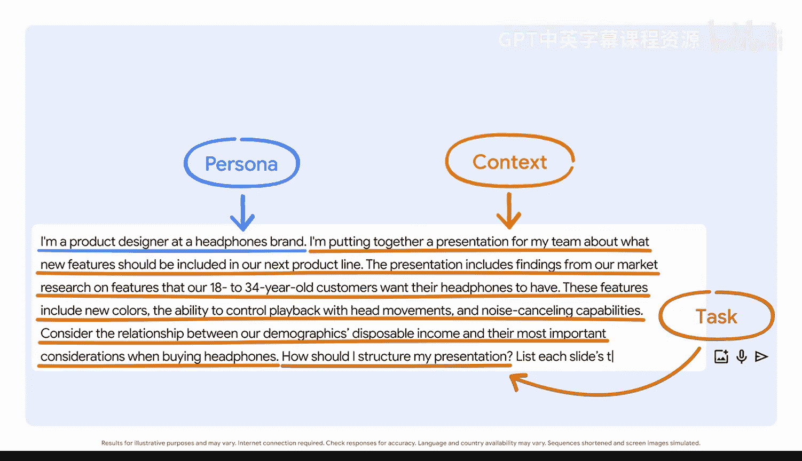

上一节我们设定了场景，本节中我们来看看如何向AI清晰地描述任务，以获得结构化的建议。

以下是构建提示词的具体步骤，包括设定身份、提供背景和明确任务：

1.  **设定身份**：`I‘m a product designer at a headphones brand.`
2.  **提供背景**：粘贴相关的市场研究、用户反馈或功能详情等上下文信息。
3.  **明确任务与格式**：`How should I structure my presentation? Don‘t forget to specify the format: list each slide‘s topic with its key points and visuals.`

Gemini为你的演示文稿提出了一个结构建议，其中包含了每张幻灯片的主题、关键点和视觉元素。这个结构包括标题页、设定背景的简介、听众感兴趣的三个功能的详细信息，甚至在演示文稿结尾建议了行动号召。这是一个很好的建议。

## 生成辅助图像

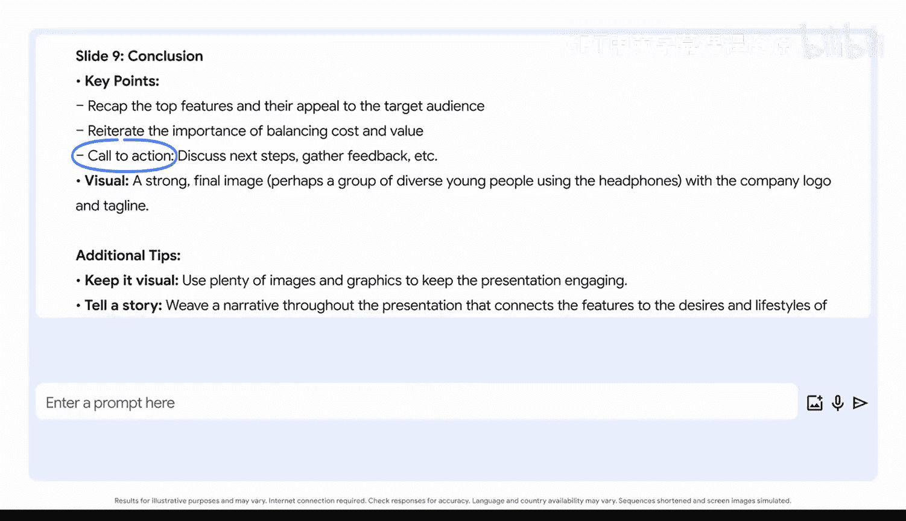

有了清晰的结构后，演示文稿还需要视觉元素来增强吸引力。本节我们将学习如何使用生成式AI创建符合主题的定制图像。

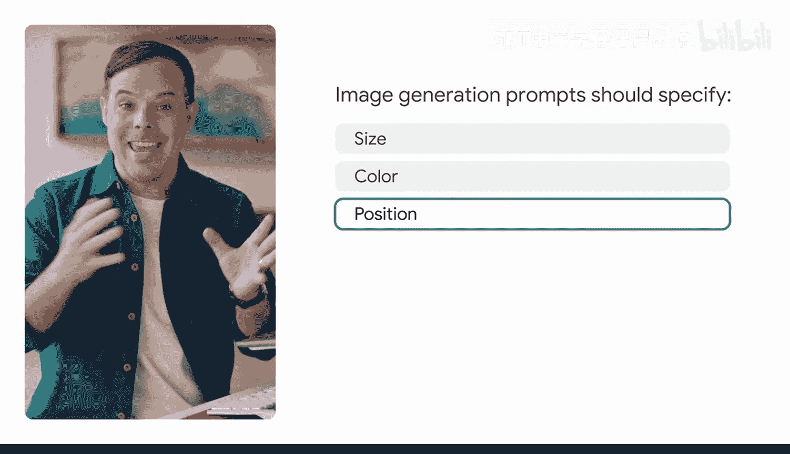

为了让生成式AI工具创造出你想要的图像类型，你的输入提示词需要尽可能生动和详细。这意味着需要指定图像中物体的大小、颜色、位置以及我们想要的整体美学风格。

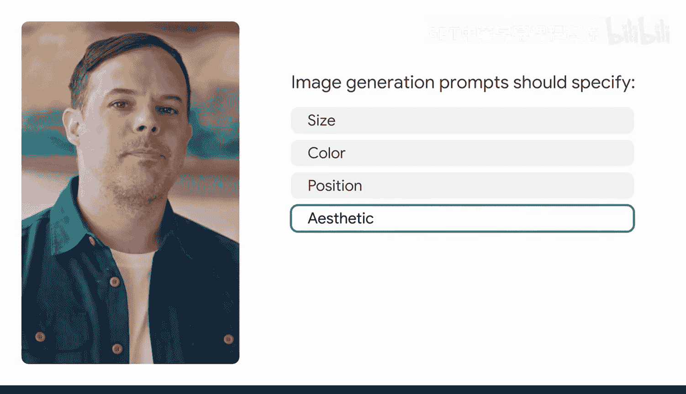

首先，我们将明确我们的任务和期望的图像格式。

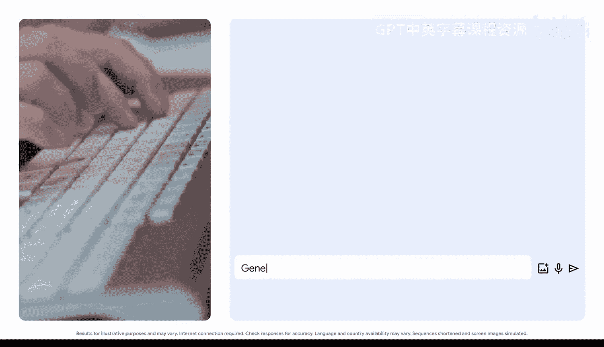

以下是创建图像提示词的要点：

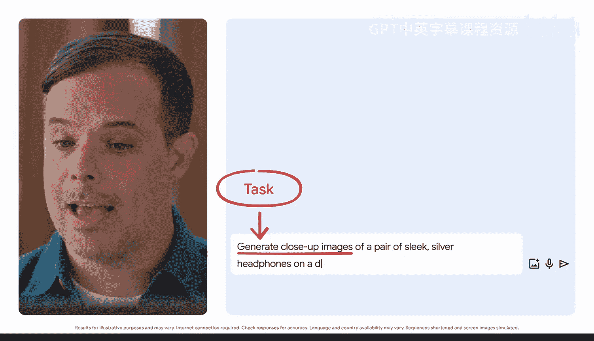

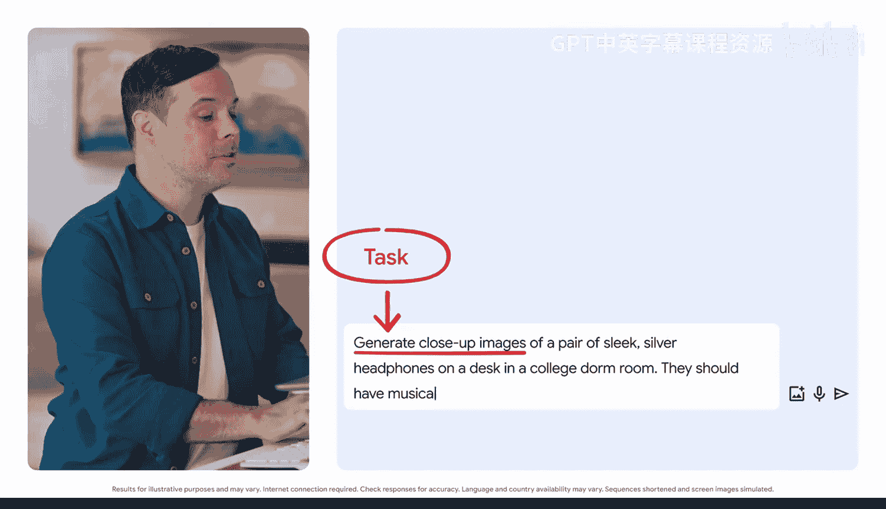

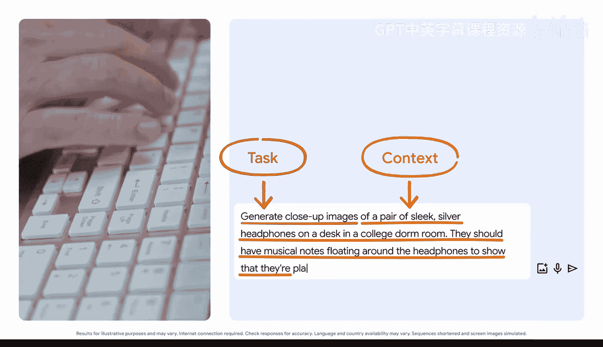

1.  **明确任务**：`Generate close-up images of a pair of sleek silver headphones.`
2.  **增添场景上下文**：`On a desk in a college dorm room.`
3.  **添加创意与风格描述**：`They should have musical notes floating around the headphones to show that they‘re playing music.`

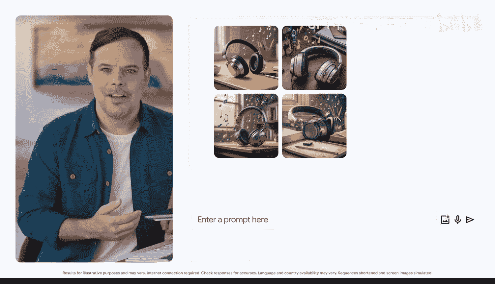

Gemini创建了多张图像供你选择。你甚至可以在摄影、矢量艺术、素描或水彩等风格中进行选择。你仍然需要像生成文本时一样评估输出结果。检查你的图像，确保它们符合你的要求，并且没有错误，比如耳机线没有插好或任何其他看起来不对劲的地方。

请记住，作为一名负责任的生成式AI使用者，披露你何时使用了这些工具是职责的一部分。因此，当你在工作中包含AI生成的图像时，请务必添加免责声明。

## 总结

本节课中，我们一起学习了如何利用生成式AI工具（以Gemini为例）来策划和丰富一个演示文稿。我们从**设定身份和背景**开始，通过清晰的提示词让AI帮助我们**构建演示文稿的大纲和要点**。接着，我们学习了如何通过提供**详细、生动的描述**来**生成定制的辅助图像**，以提升演示的视觉吸引力。最后，我们强调了**评估AI输出结果**和**负责任地披露AI使用情况**的重要性。掌握这些步骤，你将能更高效地准备出结构清晰、内容生动的演示文稿。