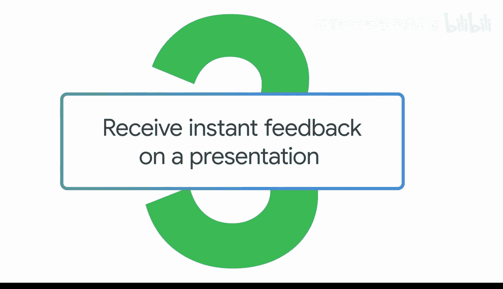
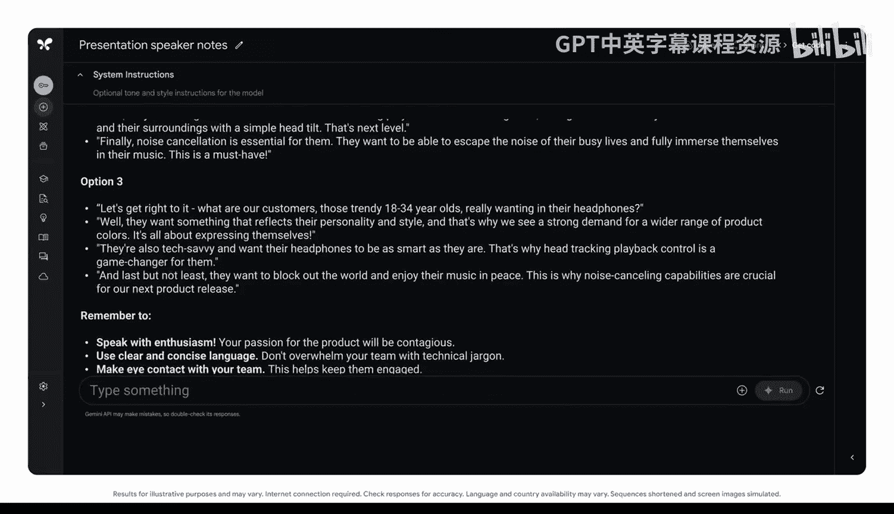
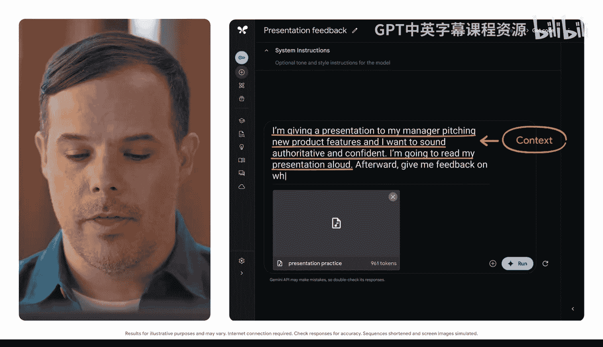

#  029：即时获取演示文稿的反馈

在本节课中，我们将学习如何利用生成式AI工具，为你的演示文稿快速生成讲稿要点，并根据不同听众调整内容，最后通过AI获取演讲练习的反馈。

你已经完成了演示文稿的制作，但还有一项任务需要完成：展示你的工作。你不想只是照本宣科地朗读幻灯片，而是希望在演示过程中为听众提供有用的背景信息和评论。你可以自己通读整个文稿并草拟一些讲稿要点，但从头开始会花费大量时间。相反，你可以提示生成式AI工具为你提供一个起点，自动生成讲稿要点。

## 生成初始讲稿要点

上一节我们提到了任务目标，本节中我们来看看如何具体操作。这个例子需要一个长上下文窗口。请注意，并非所有AI工具都提供长上下文窗口，不同工具的能力各不相同。在本例中，我们将切换到Google AI Studio。

首先，我们将上传幻灯片并输入提示词。我们需要添加角色和背景信息。

以下是构建提示词的具体步骤：

1.  **设定角色与背景**：`我是某耳机品牌的产品设计师。` 然后，我们将在此处粘贴演示文稿的上下文内容。
2.  **明确语气与格式**：`请为我在演示此幻灯片时使用的讲稿要点，提供多个简洁、亲切且引人入胜的选项。`

执行后，你得到了一些很棒的想法。建议的讲稿要点具有一定的个性和活力，这将有助于吸引你的听众。

## 为特定听众调整内容

但是，你可以提出更具体的要求。假设你得知公司的市场总监将出席这次演示。你可以提示模型调整讲稿要点，以更适合资深听众。

让我们尝试一下，这次为了节省时间，我们将使用语音输入提示：
`请为此幻灯片提供替代的讲稿要点，这些要点需要专门针对我耳机公司的市场总监。该总监重视精确性，其工作重点是紧跟行业趋势并培养一个忠诚的客户社群。`

就这样，你获得了更适合市场总监的新讲稿要点。

## 获取演讲练习反馈

现在，你有了演示文稿和讲稿要点，但希望在正式演示前进行一些练习。你可以上传自己的练习录音，以获得专门的反馈。

我们首先明确希望达到的语气和目标：
`我将向我的经理做一次演示，推介新产品功能。我希望听起来权威且自信。`

然后，说明你将做什么以及任务要求：
`我将朗读我的演示文稿。之后，请就我是否达成了这个目标给我反馈。`

这个反馈非常有帮助。你不仅得到了一份关于如何做好演示的要点清单，还获得了关于语速和语调方面需要改进的具体示例。由于你使用的是具有长上下文窗口或大记忆容量的生成式AI工具，你可以保存你的提示，并在之后从中断的地方继续练习，而无需全部重头开始。

## 总结

本节课中，我们一起学习了如何利用AI工具优化演示流程。我们首先通过设定角色和明确要求，让AI生成了富有吸引力的初始讲稿要点。接着，我们通过提供更具体的听众信息，让AI调整内容以精准匹配资深听众的偏好。最后，我们通过上传练习录音，从AI那里获得了关于演讲语气和表现的专业反馈，并利用长上下文窗口功能实现了连续练习。这些步骤能帮助你更高效地准备和交付一场出色的演示。