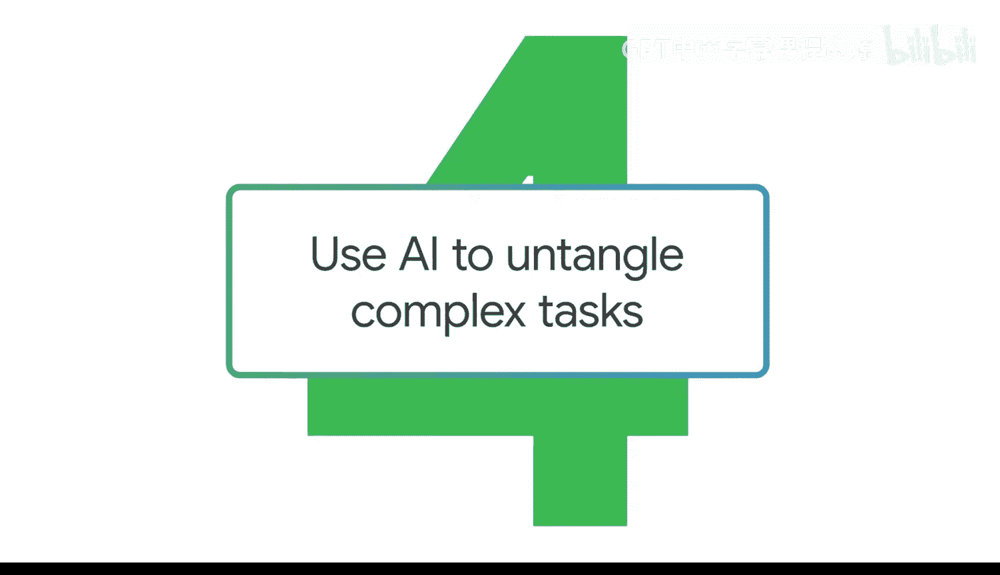
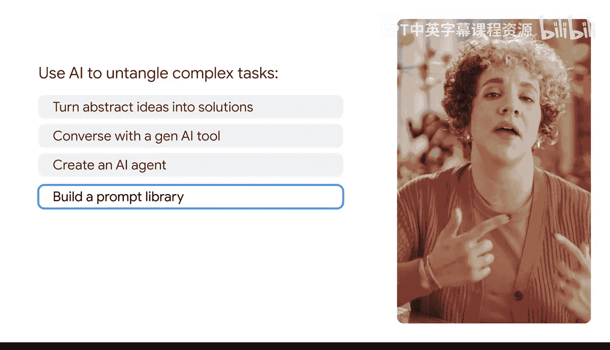

#  031：利用AI解构复杂任务

在本节课中，我们将学习如何向生成式AI工具发出提示，以处理更复杂的项目。你将学会如何将抽象的想法转化为一步步的解决方案。

我是一名研究员，这意味着我有时需要处理与我专业领域相关的、内容繁重的资助申请提案。

不仅如此，我还需要外出寻找可以申请的资助项目，这本身就是一个令人头疼的问题。

我一直在做的一件事是，将我的研究员个人资料上传到生成式AI工具中，并利用它来寻找潜在的资助机会。

我会添加我的简历、已发表的作品以及我的个人陈述，然后使用不同的提示技巧来搜索与我的背景相匹配的资助项目。

这尤其有帮助，因为许多地方对于资助对象都有特定的资格要求规定。

使用生成式AI为我消除了这个过程中的许多猜测工作。

上一节我们介绍了利用AI辅助研究工作的背景，本节中我们来看看与AI对话的具体方法。

我们将探索如何与生成式AI工具进行对话。

以下是实现有效对话的三个关键步骤：
1.  **明确任务**：首先清晰地定义你需要AI帮助解决的核心问题或任务。
2.  **提供上下文**：输入相关的背景信息，例如你的简历、专业领域或项目目标。
3.  **迭代优化**：根据AI的初始回复，进一步提出细化或修正的要求，引导对话走向理想结果。

接下来，我们将了解如何创建一个能持续执行特定任务的AI智能体。

你可以创建一个AI智能体来自动化处理重复性或多步骤的任务。

最后，我们将学习如何建立一个提示词库以提升效率。

构建一个提示词库可以帮助你节省时间并重复使用高效的提示词。

本节课中我们一起学习了如何利用生成式AI工具处理复杂任务。我们探讨了通过有效对话、创建AI智能体以及建立提示词库，将抽象问题分解为可执行步骤的方法。这些技巧能帮助你更高效地利用AI，减少工作中的猜测和重复劳动。

现在让我们开始吧。