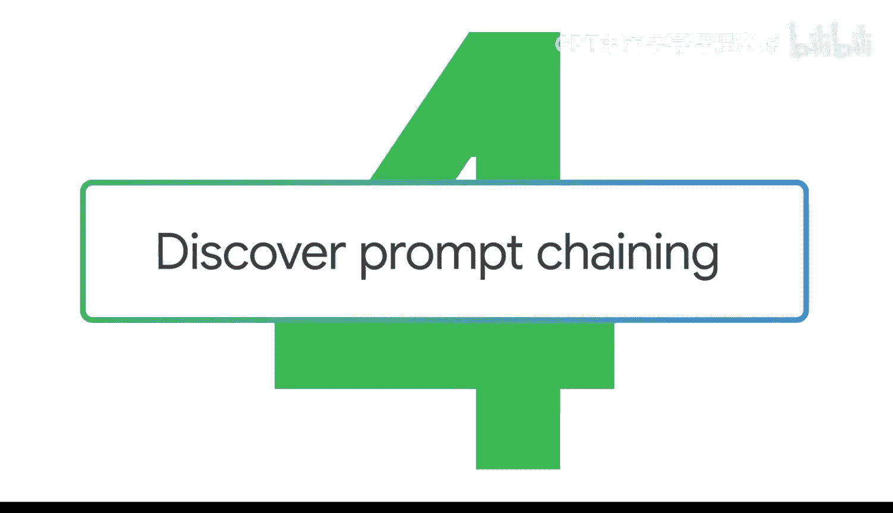
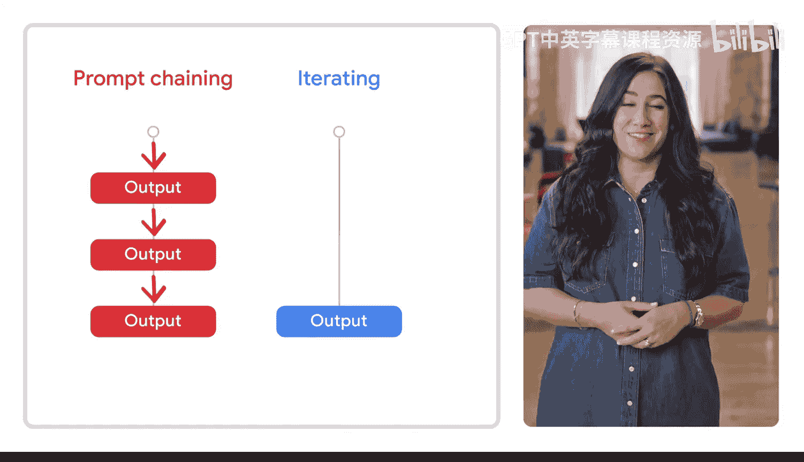
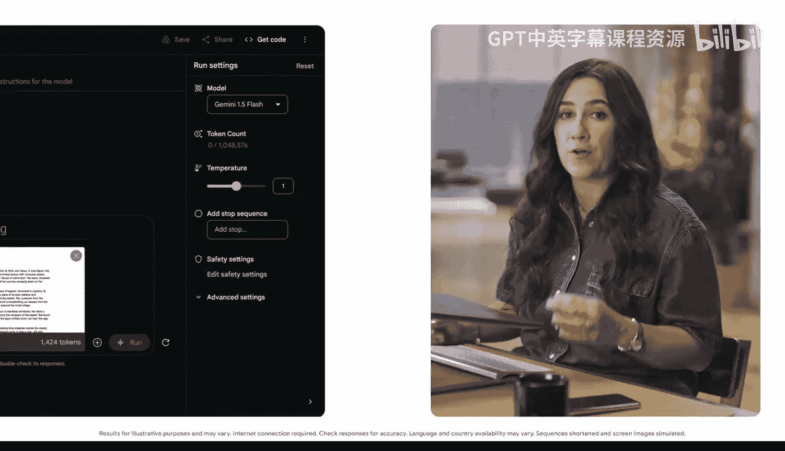
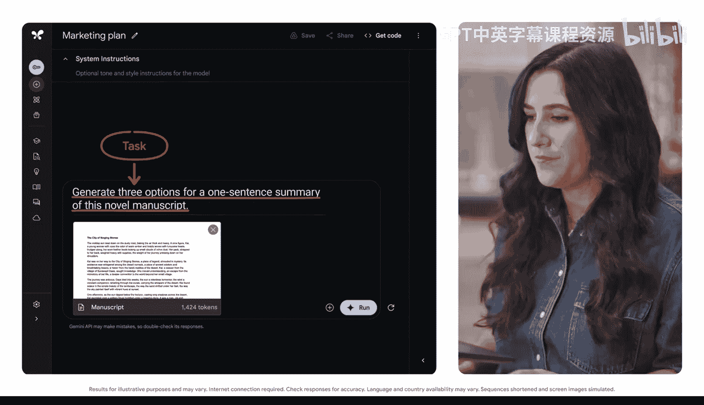
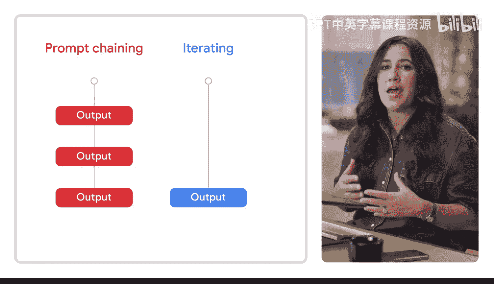

#  032：探索提示链技术



在本节课中，我们将要学习一种名为“提示链”的高级提示技术。它通过将复杂任务分解为一系列相互关联的步骤，引导生成式AI工具逐步解决问题，就像拼图一样。

## 什么是提示链？🧩

你是否尝试过拼拼图？你不会直接把所有碎片倒出来然后指望它们自动拼好。你会先制定一个计划：也许先找到角落的碎片，慢慢拼出边框，然后再处理中间部分。这是一个有意识、逐步构建的过程。

**提示链**正是如此。它引导生成式AI工具通过一系列相互关联的提示，每一步都增加新的上下文或任务层。最终，这些链接起来的提示帮助工具一步一步地解决复杂问题。

## 提示链的应用场景 📧

想象一下，你休假回来后需要处理堆积的工作。你可以运用提示链技术：
1.  首先，提示AI工具总结你不在时收到的所有邮件和文档。
2.  在审阅输出后，你可以再次提示它，专注于那些有时间限制的请求。
3.  如果新的输出揭示了紧急问题，你可以第三次提示工具，寻求处理方案。



通过这种技术，你并非简单重复，而是让每一个提示和回答都建立在之前的基础上，共同构成一个单一的、连续的提示链。

## 实战演示：图书营销计划 📚

上一节我们介绍了提示链的概念，本节中我们来看看一个具体的例子。我们将使用Google AI Studio来演示，因为它能让我们访问具有长上下文窗口的Gemini模型。

假设你刚刚写完一部小说，现在需要为它制定营销计划。



### 第一步：生成吸引人的标语



首先，你需要一句能抓住眼球的标语或口号。我们可以使用提示框架在AI Studio中生成一些选项。一如既往，我们需要明确任务。

**提示词示例：**
```
Generate three options for a one sentence summary of this novel manuscript.
The summary should be similar in voice and tone to the manuscript, but more catchy and engaging.
```

生成的选项可能不错，但你可能希望标语更侧重于书中的某个特定主题。这时，我们可以写一个后续提示来优化标语。

**后续提示词示例：**
```
Create a tagline that is a combination of the previous three options, with a special focus on the exciting plot twist and mystery of the book.
Find the catchiest and most impactful combination. The tagline should be concise and leave the reader hooked and wanting to read more.
```

这样就得到了一个强有力的标语，可以作为书籍营销的亮点。记住，提示链不仅仅是给提示增加更多上下文，更是对AI工具之前生成的内容进行扩展和深化。这与提示框架中的“迭代”略有不同，迭代侧重于调整给定提示以改进结果；而在这里，你是将它的输出作为构建更复杂请求的基石。

### 第二步：撰写书籍封底简介

有了标语，我们就可以进入提示链的下一环：为书籍封底生成内容简介。



**提示词示例：**
```
Create a five sentence summary of the entire manuscript below that expands on the one sentence summary.
```

### 第三步：制定图书巡回推广计划

现在，标语和简介都已设定，是时候考虑图书巡回签售会了。我们将继续构建提示链，基于我们已经告诉AI工具关于这本书的信息，生成一个推广计划。得益于长上下文窗口，模型已经分析过你的手稿并记得之前的对话，因此只需提供新任务即可。

**提示词示例：**
```
Generate a six week promotional plan for a book tour, including what locations I should visit and what channels I should utilize to promote each stop on the tour.
```

当然，如果对AI工具提供的选项不满意，你可以对其中任何一个提示进行迭代优化。

## 总结 ✨


本节课中我们一起学习了提示链技术。它的强大之处在于，仅通过一系列提示，我们就引导AI模型完成了从撰写标语、摘要到制定完整图书巡回计划的全部工作。这展示了如何将复杂任务分解为连贯的步骤，并利用AI的上下文记忆能力，高效地构建出详尽的解决方案。