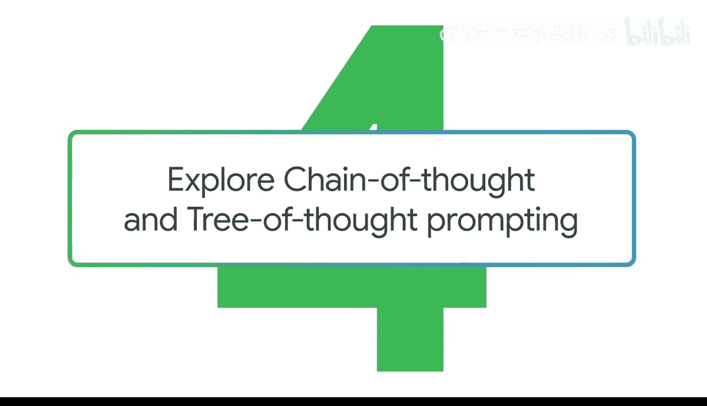
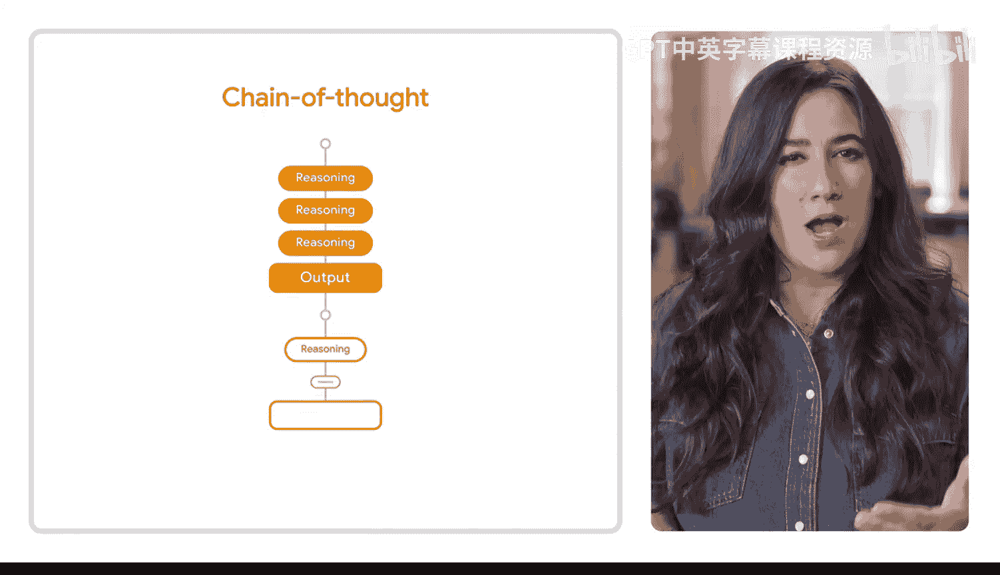

#  033：深入链式思维与树状思维提示法 🧠

在本节课中，我们将要学习两种高级的提示训练技巧：链式思维提示法和树状思维提示法。这些方法能帮助你引导生成式AI工具进行更深入、更结构化的思考，从而获得更优质、更具洞察力的输出结果。

## 链式思维提示法 (Chain of Thought, C.O.T.) 🔗

上一节我们介绍了基础提示方法，本节中我们来看看如何让AI展示其思考过程。链式思维提示法要求生成式AI工具解释其推理过程，或逐步描述它是如何得出特定结果的。这类似于数学老师要求学生解释他们是如何得出答案的。这种方法可以帮助你理解AI工具的推理方式，从而让你能基于其输出做出更好的决策。

例如，你可能需要在有限的预算或时间限制下，平衡如何访问所有六个图书巡演地点。你可以提示AI工具提供解决此问题的想法。但这一次，你在初始提示中包含了“请解释你的思考过程”这样的要求。这样一来，你就可以评估每个提议解决方案背后的逻辑。

**核心概念**：在提示中要求模型 `分步解释其推理过程`。

## 树状思维提示法 (Tree of Thought, T.O.T.) 🌳

了解了让AI线性思考的方法后，我们再来看看如何激发其发散性思维。树状思维提示法涉及要求工具同时探索多条推理路径，就像树枝一样。这种方法使工具能够探索给定问题的多种解决方案，并在过程中进行评估，从而帮助你获得最佳结果。

这就像走迷宫。你的目标是到达终点，但在到达之前，你可能需要尝试几条不同的路径。当解决抽象问题时，例如为小说续集开发包含新角色和复杂情节线的剧情，这种方法尤其有用。

**核心概念**：提示模型 `同时探索并评估多个解决方案路径`。

## 实际应用与优势 ✨

这些技巧对于在工作中创建大纲或起草较长文档的小节也非常有用。提示链为你提供了探索更复杂想法和生成有趣回应的机会。你甚至可能发现一些使用单一提示时可能会错过的见解。

以下是两种方法的核心优势对比：

*   **链式思维 (C.O.T.)**：提升**透明度和可理解性**，让你能追踪AI的思考步骤。
*   **树状思维 (T.O.T.)**：提升**解决方案的多样性和质量**，通过并行探索找到更优解。

## 总结 📝

本节课中我们一起学习了两种高级提示技巧：**链式思维提示法 (C.O.T.)** 和 **树状思维提示法 (T.O.T.)**。链式思维通过要求AI `分步解释其推理过程`，使思考过程透明化，有助于我们评估其逻辑。树状思维则通过要求AI `同时探索并评估多个解决方案路径`，像探索树枝一样寻找最优解，特别适合处理复杂、开放性问题。掌握这两种方法，你将能引导AI进行更深思熟虑的推理，从而获得更可靠、更具创造性的输出结果。