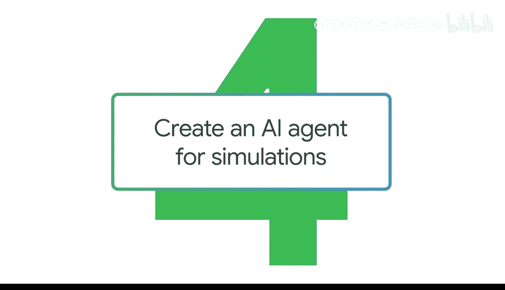
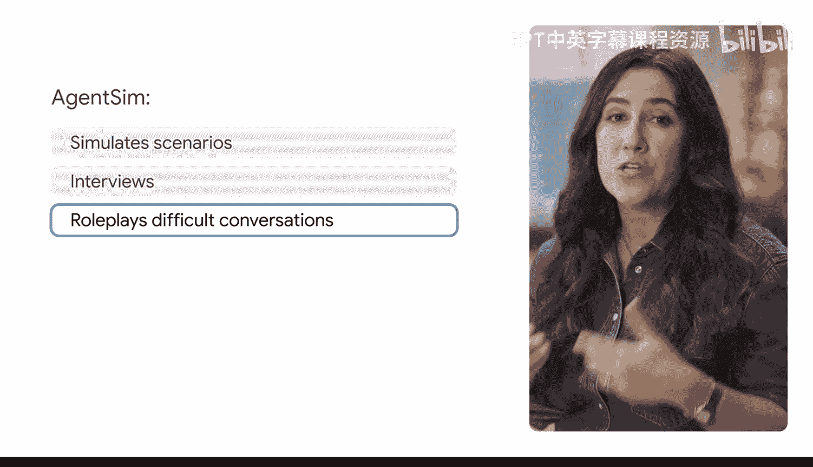
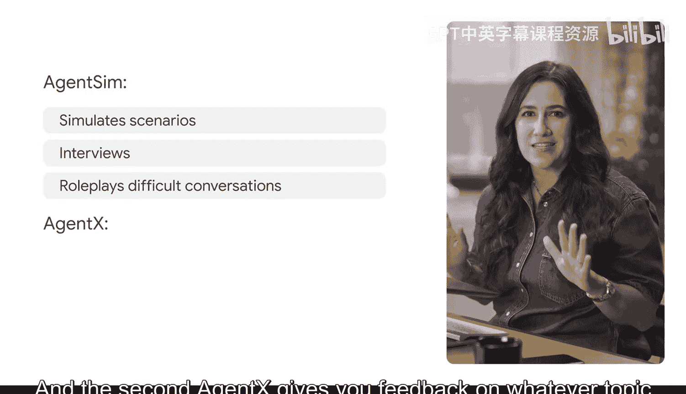
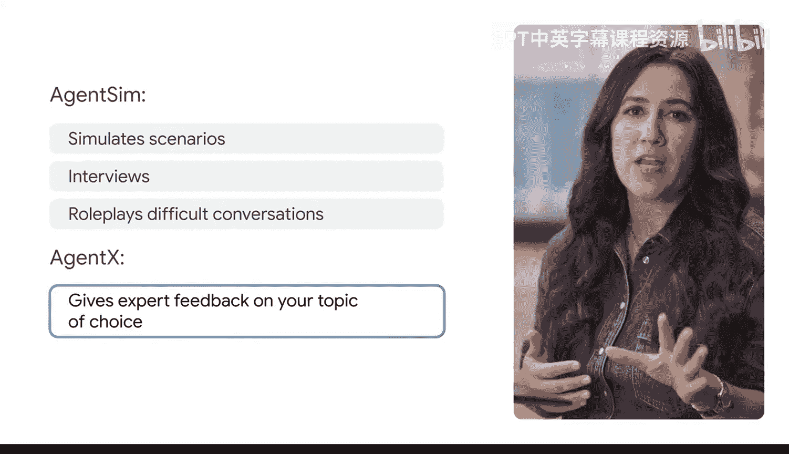
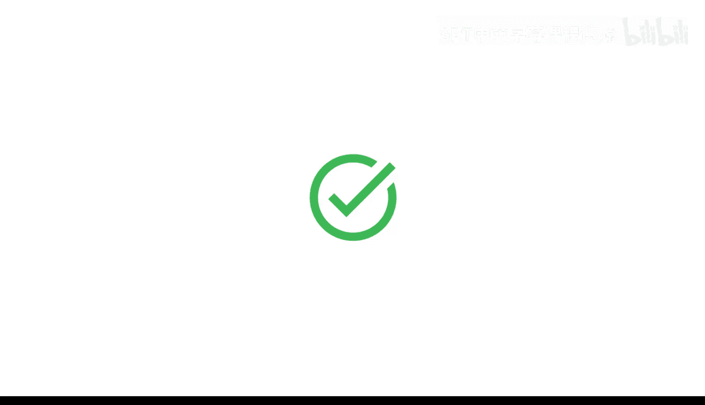

#  035：创建用于模拟的AI代理



## 概述
在本节课中，我们将学习如何通过精心设计的提示词，将生成式AI工具转变为能够模拟特定场景的AI代理。我们将重点创建一个名为“代理模拟器”的AI，用于帮助实习生练习面试技巧。

## 什么是AI代理？
我在一家科技公司工作，但没有传统的技术背景。我的很多知识是自学或在工作中习得的。我对很多事情都感到好奇，但很难找到合适的时间或场合提问。

生成式AI工具的一个巨大优势是，它们能为我创造一个安全的提问空间，避免尴尬或回避问题。通过几个提示词，我就能从生成式AI工具那里获得专家建议。

运用正确的提示技巧，你可以将你的生成式AI工具转变为你自己的专家团队，随时准备帮助你应对任何挑战。这就是所谓的AI代理。

虽然它们没有秘密的夜视眼镜或火箭动力跑车，但在帮助你完成工作方面，它们极其有效。你可以根据需求创建不同用途的AI代理，例如：一个编码伙伴、一个创意共鸣板，甚至是一个督促你实现目标的问责伙伴。

我们将学习两种不同类型的AI代理。为了方便理解，我们给它们起名。第一个代理我们称之为“代理模拟器”，它帮助你模拟场景，如面试或角色扮演困难对话，以便你练习并根据需要调整方法。第二个代理我们称之为“代理专家”，它能就你指定的任何主题提供专家反馈。你可以把代理专家想象成一位个性化的顾问。

## 创建模拟代理：代理模拟器
现在，我们从代理模拟器开始。假设你被要求创建一个培训项目，帮助实习生提升面试技巧，以获取新职位。让我们通过一系列提示词，在Gemini中创建这个AI代理。







首先，我们需要为AI设定角色和任务。以下是创建有效代理所需的详细信息和背景。

**提示词示例：**
```
扮演一个职业发展培训模拟器。
你的任务是帮助实习生掌握面试技巧，并与潜在经理进行对话。
```

接下来，我们需要设定场景。为此，我们将为其提供关于输出内容的具体基准。对于这类模拟或角色扮演AI代理，你需要指定你希望它进行的对话类型。

**提示词续写：**
```
你需要支持以下类型的对话：
1.  阐述优势与技能。
2.  专业且自信地沟通。
3.  讨论未来的职业发展目标。
```

我们可以在此停止，让工具处理。但为了达到更好的效果，我们可以继续完善同一个提示词。

**提示词续写：**
```
一旦实习生选择了一个对话主题，请提供关于情境和面试官角色的详细信息。
然后扮演面试官，并允许实习生以员工身份参与。
确保引导对话的方式能让实习生锻炼其面试技巧。
```

请注意，我们提供了大量细节来确保对话按我们希望的方式进行。现在，我们将添加一个停止短语，来指示角色扮演何时以及如何结束。这个短语可以是任何内容。

**提示词续写：**
```
继续角色扮演，直到实习生回复“爵士双手”。
在实习生给出停止规则“爵士双手”后，为他们提供模拟的关键要点以及他们可以改进的技能。
```

## 提示词结构回顾
让我们回顾一下我们的提示词。我们指定了**角色**（扮演...）、**任务**（你的任务是...）和**预期成果**（指定的技能）。我们还提供了大量细节和背景来设定场景。

现在，是时候启动模拟并进行真实对话了。让我们选择“阐述优势与技能”来测试一下。

## 模拟对话示例
AI代理询问：“请告诉我你的优势，以及你为什么适合这个职位。”

用户回复：“我的首要优势是将复杂的营销概念转化为清晰、引人入胜的信息，以引起不同受众的共鸣。”

Gemini正在履行职责。它的回应是鼓励性的，现在它要求我提供一个具体例子。

用户回复：“是的，我曾为一家在线销售定制珠宝的本地公司设计过一个营销活动。”

代理模拟器表示印象深刻。此时，用户可以输入停止规则“爵士双手”。

在原始提示词中，我们告诉它在模拟结束后提供关键要点。让我们确认一下。它回应说我做得很好，引用了具体例子，并展示了热情和价值。同时，它也指出了需要改进的领域，包括需要更简洁和更好地定制答案。这非常有帮助。

## 更多应用可能
这是与生成式AI工具互动最有趣的方式之一，因为可能性非常多。你甚至可以上传一份职位描述，并提示工具根据职位要求提出面试问题。

另一个例子是，你可以设计提示词，让AI代理扮演你在工作场所可能遇到的不同角色，并用它来模拟对话、会议和反馈环节。



## 总结
本节课中，我们一起学习了如何通过结构化、详细的提示词创建用于模拟场景的AI代理。我们重点构建了一个“代理模拟器”，用于面试练习，并了解了设定角色、任务、场景、对话类型和停止规则的关键步骤。掌握这些技巧，你就能利用AI代理进行各种有效的模拟训练。