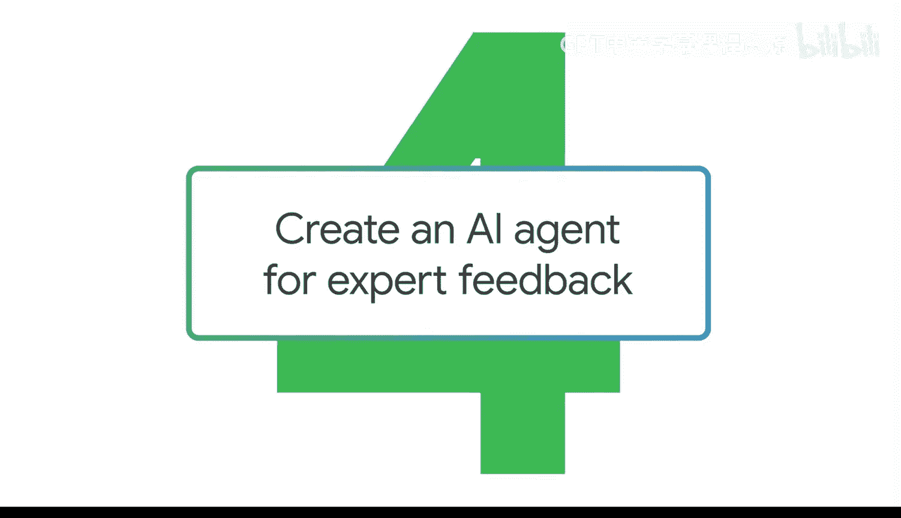
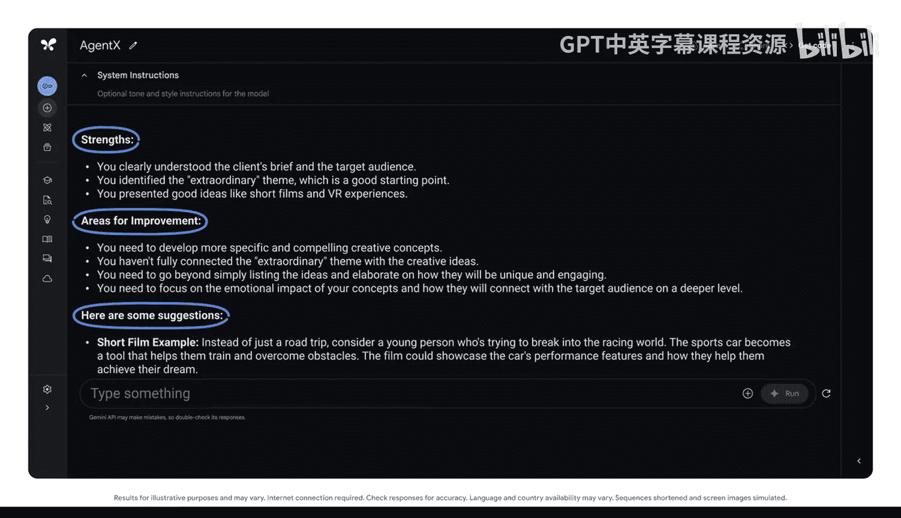
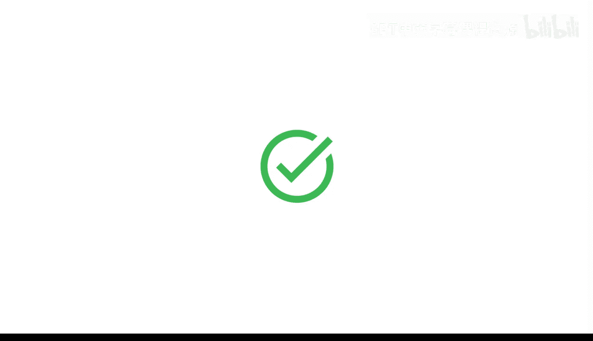

#  036：创建用于专家反馈的AI代理



在本节课中，我们将学习如何创建第二种类型的AI代理——代理X。我们将把它打造成一个能够提供专家反馈的个性化顾问，并以一个向潜在客户进行提案的场景为例进行实践。

上一节我们介绍了代理Sim，本节中我们来看看代理X。你可以将代理X视为你的个性化顾问。通过正确的提示词，你可以指示你的代理成为任何你需要的领域的专家。

## 设定代理角色与场景

在这个示例中，我们需要AI代理就一份面向潜在客户的提案提供专家反馈。由于这个提示词将包含大量关于潜在客户的背景信息，我们需要使用一个**长上下文窗口**。这允许生成式AI工具保留并利用更多信息，从而产生更好的回应。因此，我们将切换到Google AI Studio。

首先，我们需要为代理设定一个明确的角色和背景。
```
你是我潜在的客户，一家以创新、性能和卓越工程闻名世界的跑车公司的广告副总裁。
```

现在，代理具备了角色和背景，但我们需要设置交互对话的场景。
```
你正在考虑雇佣一家创意机构来开发一个新 campaign，以吸引更年轻的买家群体。你正在与我会面，我是一家创意机构的设计总监，正在为你的公司提案一个新 campaign。
```

## 构建核心指令与交互流程

我们可以将整个提案内容放入提示词中。以下是构建代理行为逻辑的核心指令。

```
扮演我的潜在客户。当我提供回答时，请进行评判。如果需要，请提出后续问题。持续对话，直到我给出停止指令。然后，给我整个对话的总结，重点指出我可以改进提案的方法。
```

为了确保反馈是从客户视角出发的，我们需要提供项目背景资料。
```
我们将在这里上传客户给我们的简报。这样，模型将通过客户的视角来评判提案。我已附上汽车公司提供的简报，其中包含本项目所有相关信息。请使用此简报中的信息来指导你的回答。
```

## 回顾提示词结构

这是一个较长且复杂的提示词。我们来回顾一下。请记住，我们仍然在使用我们的提示词框架。

我们首先设定了副总裁的角色，然后明确了我们希望生成式AI工具执行的任务——评判提案并提出后续问题。我们还指定了预期的结果，即重点指出改进提案的方法。

## 进行模拟对话与获取反馈

现在，是时候开始对话了。代理正在询问更多细节。让我们查看回应。提案中仍有一些需要解决的问题。这对于练习轮次非常有帮助。

现在，输入停止指令并评估反馈。
```
停止。
```

很好。AI代理已经给出了到目前为止的对话总结，指出了哪些部分有效、哪些需要改进，并提供了加强提案的建议。



## 持续优化与自定义代理

现在生成式AI工具正在扮演你的客户，你可以继续就提案征求反馈。请记得保存你的提示词，这样你可以在修改提案后回到这个对话，帮助你测试更多想法，以完善最终版本。

你甚至可以创建自定义版本的Gemini，称为Gems。只需描述你希望你的Gem做什么以及你希望它如何回应，Gemini将根据这些指令帮助你创建一个满足特定需求的Gem。

## 课程总结



本节课中，我们一起学习了如何创建用于专家反馈的AI代理（代理X）。我们通过设定具体角色、构建交互指令、提供背景资料，模拟了与客户进行提案反馈的完整流程。关键在于使用清晰的框架和长上下文窗口来引导AI提供深入、有针对性的建议。掌握此方法后，你可以将其应用于各种需要专业评审或模拟对话的场景。