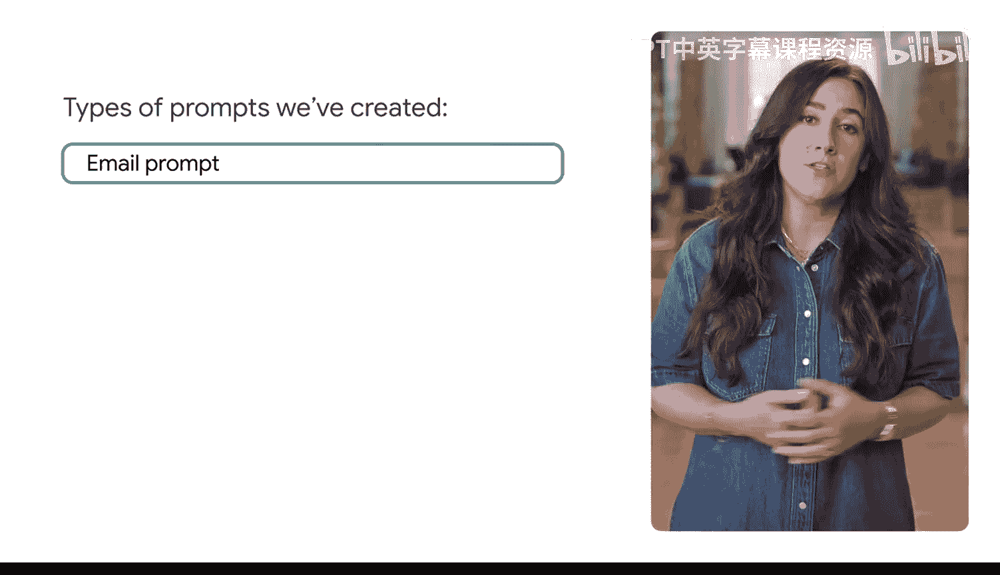
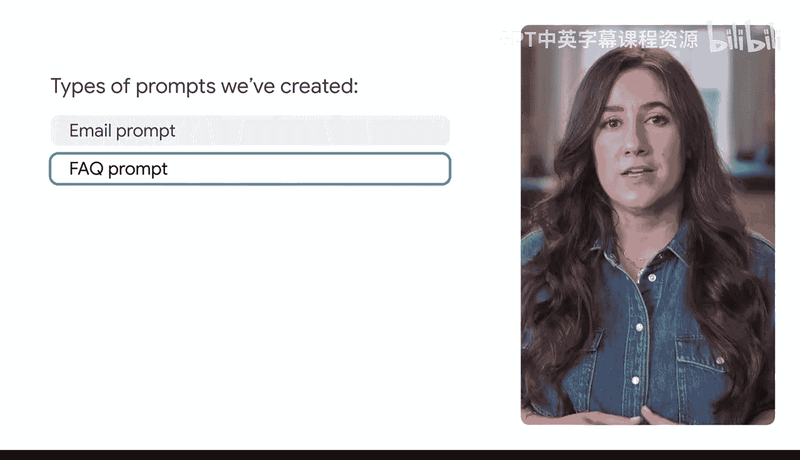
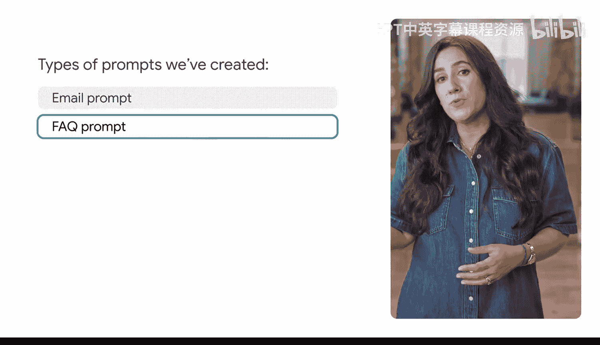
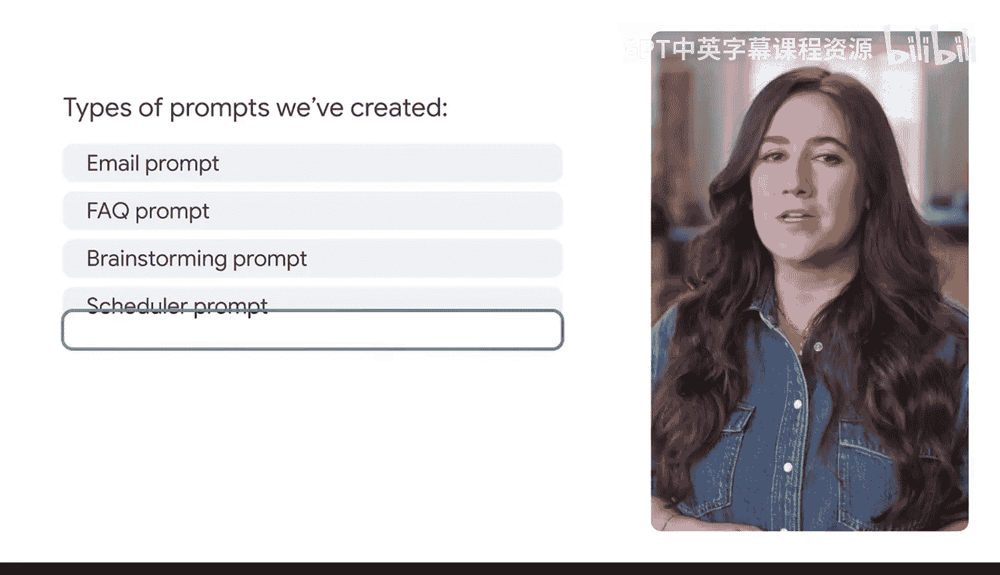

#  038：构建提示词库 📚

在本节课中，我们将学习如何通过版本管理和构建个人提示词库，来系统化地提升提示词技能。我们将探讨如何记录、迭代和复用有效的提示词，从而节省时间并提高工作效率。

---

## 概述

在本课程中，你已经学会了如何深思熟虑地创建优秀的提示词输入。与大多数技能一样，你的提示词能力将通过实验和实践得到提升。通过记录哪些提示词在何种用例下效果最佳，你可以节省大量时间。我们鼓励你持续追踪并回顾，以确定哪些方法有效，哪些无效。

## 提示词版本管理

上一节我们介绍了持续追踪提示词效果的重要性，本节中我们来看看如何通过版本管理来系统化这一过程。

提示词版本管理是一种随时间追踪你不同版本提示词的方法。这是一种强大的方式，可以捕捉你最有效的提示词，追踪你的进步，并发展你的生成式AI提示词技能。

这里有一个小技巧：你可以为你最有效的提示词命名，并将它们存储在你的个人提示词库中，以便将来轻松访问。事实上，一些生成式AI工具允许你在工具内直接命名和保存你的提示词。

想象一下你正在为家人准备一周的餐食。你找到了一套非常喜欢的食谱，但你想开始尝试新的菜系。你不会完全抛弃整个餐食计划并重新开始，对吗？你会利用你已经了解的关于偏好、份量和过敏原等信息，并以此为基础为家人创建一个新的每周菜单。

提示词版本管理也是如此。一旦你有了一个有效的提示词，你就不需要重新发明轮子。你可以根据需求，尝试不同的任务、上下文和参考信息来获得不同的结果。

以下是几个应用示例：

*   **邮件草拟**：你可以开发一个可复用的邮件提示词。生成式AI工具会为你起草邮件，但你可以根据沟通对象调整语气和格式。
*   **常见问题解答**：你可以使用单一信息来源，为访问你网站的不同类型客户创建不同的常见问题解答部分。你可以调整为个人消费者生成FAQ的提示词，通过改变角色设定来制作面向企业客户的FAQ。

回想一下我们在本课程中创建的所有提示词。你可以为你的需求创建哪些版本？

## 实验与社区

玩转和实验提示词是弄清楚如何获得你想要结果的最佳方式。而达到这一目标的唯一途径就是熟悉工具、积极探索并找到适合你的路径。

请记住，你并不孤单。有一个庞大的社区成员正在分享对他们有效的提示词，以便人们可以互相学习成功经验，寻找灵感和支持。参与社区是提升你提示词技能和建立人脉的好方法。

---

## 总结

本节课中我们一起学习了构建个人提示词库的重要性与方法。我们了解了**提示词版本管理**的概念，即通过追踪和迭代不同版本来捕捉有效策略。我们还探讨了如何通过实验来优化提示词，并认识到参与共享社区可以加速学习进程。记住，持续记录、复用有效模式并乐于尝试，是掌握提示词工程的关键。