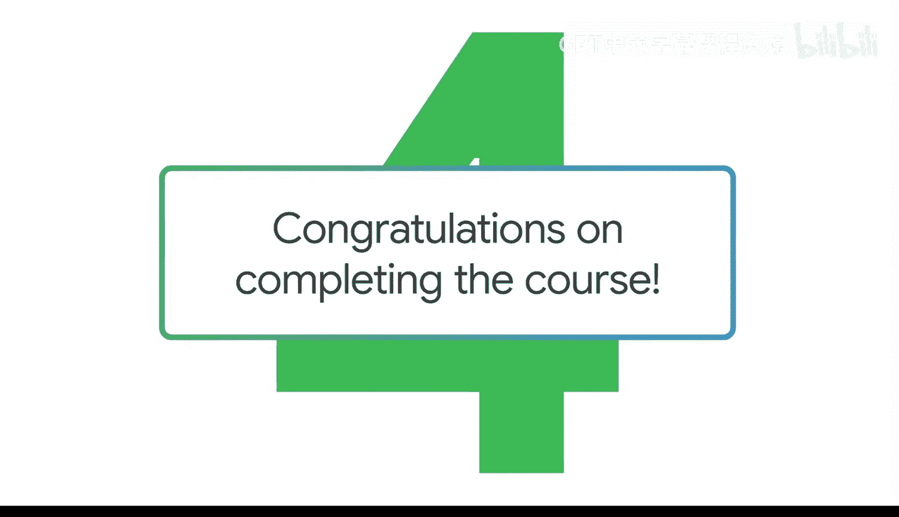

#  040：课程总结与展望 🎉

在本节课中，我们将回顾整个课程的核心要点，并对未来的学习与实践方向进行展望。

## 课程回顾

恭喜你完成了本课程的学习，你应该为自己投入的努力感到自豪。

提示词是解锁生成式人工智能强大能力的关键。你已学习如何从编写简单的文本提示词开始，逐步构建出属于自己的个人AI助手。

上一节我们介绍了如何将AI工具转化为创意伙伴，本节中我们来看看整个学习旅程的总结。

你掌握了如何逐步增加提示词的复杂度，以获得有用的输出。这些技能的应用范围广泛，以下是几个关键应用场景：
*   帮助你起草电子邮件。
*   总结文档内容。
*   创建引人入胜的演示文稿。

此外，你还学会了如何从数据中提取洞察、创建高级提示词，并将生成式AI工具转变为创意协作伙伴。

## 重要原则与未来方向

但请务必记住，负责任地使用这些工具至关重要。

我很高兴能陪伴你走过这段学习旅程。我鼓励你继续尝试生成式AI，以便探索如何让这些工具更好地为你服务。

实现这一目标的最佳方式就是立即行动起来，开始编写你自己的提示词。现在，就让我们开始实践吧。😊

## 总结

本节课中我们一起回顾了提示词的核心价值与应用技能，强调了负责任使用的原则，并鼓励通过持续实践来深化对生成式AI工具的掌握。