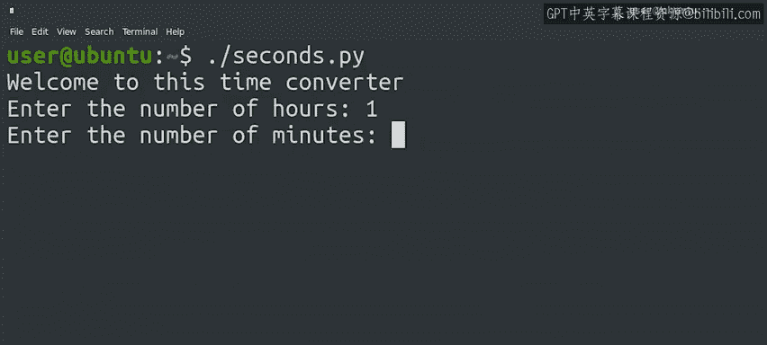
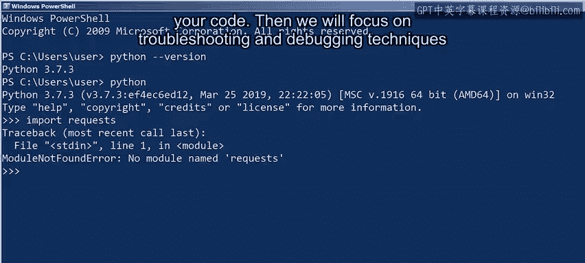
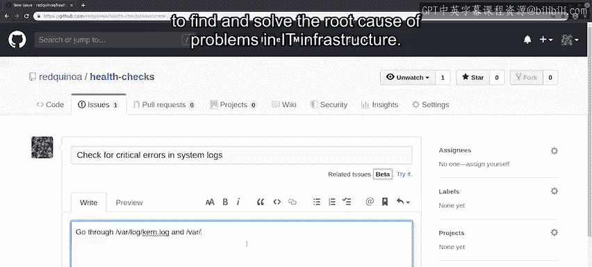
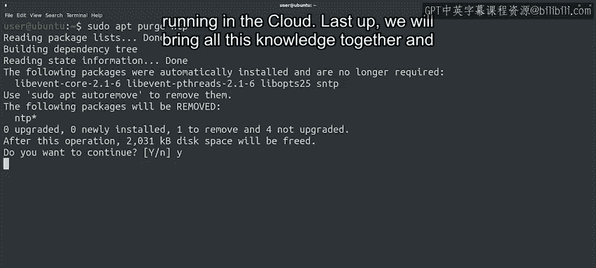

#  001：专业化介绍 🚀

在本节课中，我们将要学习IT职业发展的重要性，以及学习Python编程和自动化技能如何为你的职业生涯打开新的大门。我们还会概述整个课程的结构，并认识你的讲师团队。

## IT职业：不止是一份工作

从事IT工作不仅仅是一份职业。它是一条职业发展路径。

研究表明，IT支持领域是未来职业成长和获得更高薪酬的起点。事实上，哈佛商学院、埃森哲和Burning Glass最近联合进行了一项名为“跨越鸿沟”的研究。研究发现，在当今那些需要培训但不需要正式大学学位的中等技能工作中，IT支持提供了通往成功的清晰路径。

我们在谷歌的IT支持项目中亲眼目睹了这一现象。那些努力自学Python编程的人通常都看到了强劲的职业发展。他们培养了进入IT领域更高级职位的关键技能。通过努力工作和决心磨练这些技能后，他们晋升为更专业的技术支持专家、系统管理员、技术解决方案工程师，甚至是站点可靠性工程师。

所有这些角色的共同点在于，**知道如何编写代码来解决问题和实现自动化**。

## 扩展你的技能工具箱

通过将编程技能纳入你的工具箱，你打开了通往系统管理世界的一扇窗，这可以引导你走向更高级的技术岗位。

特别是Python，它正经历着巨大的发展。根据2019年Stack Overflow开发者调查，Python是大多数人最想学习的编程语言，在已掌握者中最受喜爱的语言中排名第二，总体受欢迎程度排名第四。

那么，为什么要通过这个项目来学习Python编程呢？

以下是几个关键原因：

*   **面向IT从业者**：该项目专为已经身处或渴望进入IT领域的人士设计。你可能正在思考如何提升当前的IT角色，希望朝着大规模管理运维的方向努力；或者你刚刚起步，希望进入IT行业。也许你已经完成了我们在Coursera上的IT支持专业证书课程，或者你已具备同等的IT支持知识，例如处理文件和目录、熟悉网络概念以及了解如何在计算机上安装软件等基本计算技能。无论如何，这个项目都是为你量身定制的。
*   **三种实践教学方法**：该项目提供了三种动手实践的教学方法来教授编程、Python和自动化：代码块、Jupyter笔记本和Qwiklabs。
*   **优秀的讲师团队**：我们汇集了一群出色的谷歌员工，他们将在每门课程中担任你的讲师。他们都从IT支持岗位开始职业生涯，然后学习了编程并转向了更技术性的角色，就像我一样。

## 认识你的讲师

我们迫不及待地想与你分享我们的故事，以及我们如何在日常工作中使用Python。

哦，对了，我可能应该自我介绍一下。我叫Christine Rahtila，是谷歌的一名系统管理员。我将担任本课程的讲师。这个项目完全由谷歌设计和开发，我们甚至在谷歌不同的酷炫空间里拍摄了每门课程。

它将向你介绍Python编程语言，特别关注这门语言如何应用于IT系统支持和行政管理中的任务自动化。

能在这里与你们一起学习，我感到非常兴奋。在我年轻的时候，我甚至不知道IT职业的存在。我参与这个证书项目有很多原因，但我最大的动机之一是希望看到更多女性在这个行业中得到代表。

我记得曾参加过一个系统管理员峰会，那里有数百名男性，而女性系统管理员大约只有三位。自那时以来，情况已经发生了很大变化，但我们仍然可以做很多事情，为IT领域带来新的想法和多样性。这就是为什么我想与尽可能多的人分享我的知识。

我热爱我的工作，也热爱与我共事的人，因为他们让我很容易寻求帮助并获得指导。这种支持网络让我们的团队，乃至整个行业，能够取得更大的成功。

根据我的经验，我理解学习一门编程语言可能会让人感到相当畏惧，甚至有点害怕。请记住，每个人都曾站在你现在的位置，从第一个命令、第一个脚本开始，当然，还有众多错误中的第一个。当我开始我的职业生涯时，我力求第一次尝试就把每件事都做得完美无缺，但这实际上减慢了我的进步速度。所以，不要害怕犯错。这会让你占据优势。

## 课程内容概览

那么，让我们开始吧。接下来会有什么内容？

以下是整个项目的课程路线图：

*   **Python速成课**：项目从Python速成课开始，你将学习编写简单程序，并理解它们在自动化中的作用。
*   **Python与操作系统交互**：接下来，我们将更深入地动手实践，重点学习Python如何与操作系统交互。
*   **使用Git和GitHub**：之后，我们将介绍如何使用Git和GitHub来管理你的代码版本。
*   **故障排除与调试**：然后，我们将重点学习故障排除和调试技术，以发现和解决IT基础设施问题的根本原因。
*   **大规模自动化**：下一门课程涵盖大规模自动化，你将学习在云中运行的一批物理或虚拟机上部署配置管理。
*   **期末项目**：最后，我们将把所有知识融会贯通，完成一个旨在解决现实IT环境中可能遇到的任务的期末项目。作为奖励，你可以将项目发布到GitHub上，向雇主、朋友或两者展示你炫酷的新技能。

哇，一口气说了这么多。你感到兴奋吗？

现在，我想快速向你介绍一路上将会遇到的讲师同事们。

*   **Roger Martinez**：嗨，我叫Roger Martinez。我是一名Linux系统管理员，我将在关于使用Python与操作系统交互的课程中担任你的讲师。
*   **Kenny Suleman**：嗨，我是Kenny Suleman。我将在关于使用Git和GitHub管理代码版本的课程中担任你的向导。
*   **Amanda Belllis**：大家好，我是Amanda Belllis，我将教你关于故障排除和调试的知识。
*   **Phlin Vandeville**：嘿，我是Phlin Vandeville，在我的课程中，我们将学习使用配置管理和云技术进行大规模自动化。

感谢大家。这个全明星团队聚集在一起，是为了指导你在编程世界中的冒险。你得到了非常好的指导。

好了，我想这就是全部了。让我们准备好学习一些新技能，或许还能在此过程中收获一些欢笑。我们下一个视频见。