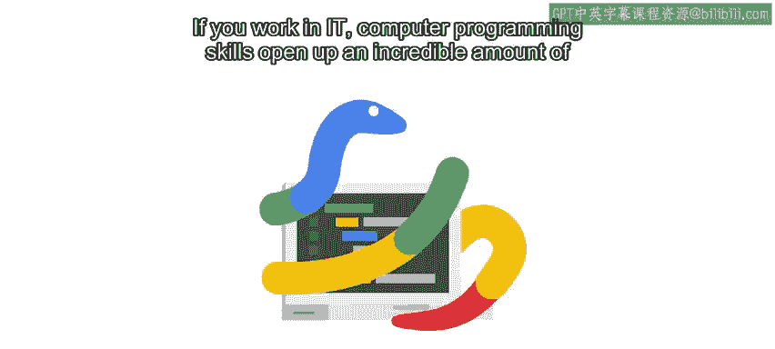
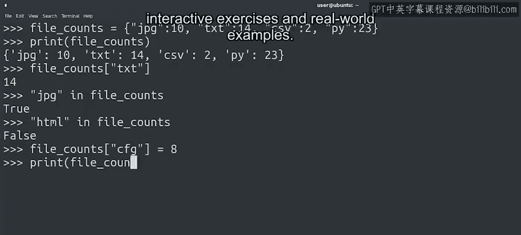
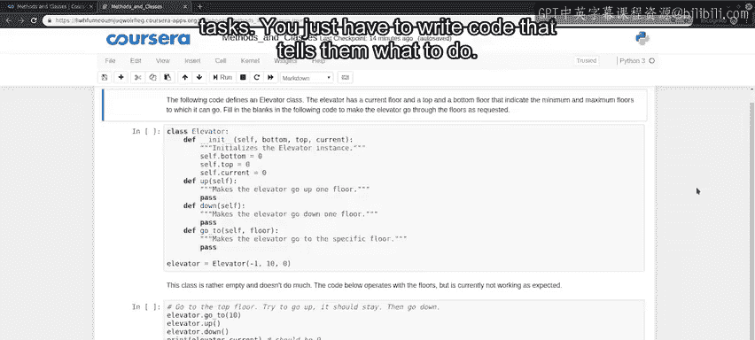
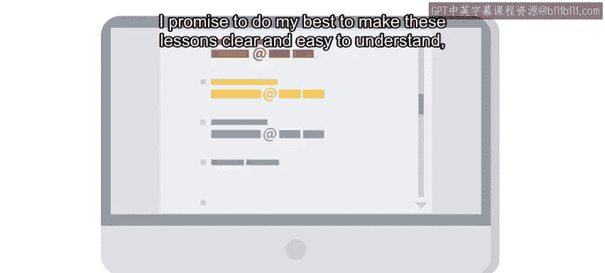

#  002：Python编程与IT自动化 🚀

在本节课中，我们将要学习Python编程的基础知识，以及如何利用编程技能实现IT自动化。通过掌握这些技能，你可以在IT领域获得更多机会，提升工作效率，并推动职业发展。

---

## 为什么学习编程？ 💡

如果你在IT领域工作，掌握计算机编程技能将为你打开大量机会。能够编写脚本和程序，让计算机执行任务，是一项极其宝贵的工具。这不仅使你的工作更轻松、更高效，还能帮助你在IT职业生涯中更快成长、更进一步。

但如何开始学习像Python这样的编程语言？如何识别何时需要让计算机执行任务？又如何编写程序，让计算机完成你想要它做的事情？学习用Python编写程序可能会让你产生各种情绪：兴奋、期待，以及想要立即投入学习的冲动，同时也可能伴随着恐惧。

你可能会问自己：我真的能学会编程吗？我有这个能力吗？我要告诉你：是的，你绝对可以做到。学习编程可能令人畏惧，但同时也非常有趣和令人兴奋。编程就像生活一样，最有回报的工作通常都带有一些挑战，但最终绝对值得付出努力。

---

## 讲师介绍 👩‍💻

我的名字是克里斯汀·拉菲尔，我是谷歌的一名系统管理员，我将担任本课程的讲师和向导。

系统管理员的角色在不同公司，甚至在同一公司的不同团队中，差异很大。我恰好就职于企业身份与访问管理运营团队，简单来说，我们的职责是确保每个人都能被正确识别，并且在需要时能够访问特定资源。

我最喜欢系统管理员这个角色的地方在于，它的职能非常多样化。我们需要处理大量独特的问题和边缘情况，从调整不同系统到与其他团队协作，我总是在学习新东西，所以很难感到无聊。

---

## 自动化的力量 ⚙️

这一切都始于知道如何实现自动化。如果你是一名IT支持专家、系统管理员，或者介于两者之间的角色，掌握如何让计算机为你完成繁重工作，将使你在类似的IT角色中脱颖而出，并让你的工作生活轻松得多。

想一想：你是愿意手动部署100台计算机，还是告诉你的计算机一次性为你完成所有工作？答案显而易见，对吧？拥有编码技能可以帮助你成长为更专业的角色，例如：

*   系统管理员
*   云解决方案工程师
*   DevOps专家
*   站点可靠性工程师
*   或者，谁知道呢，甚至可能是Web开发人员或数据分析师。

关键在于，能够编写程序是你IT工具箱中的一项基本工具，越来越多的雇主在招聘时都在寻找具备这些技能的人才。

---

## 学习新技能的旅程 🧗

如果你曾经学习过一项新技能，比如演奏乐器、说一门外语、编织或滑板，你就会知道，要精通新事物需要大量的练习。

对我而言，我喜欢学习新语言。我很自豪地说，我会说西班牙语、阿拉伯语、法语，我甚至还会10个俄语单词。我们的世界是由我们所说的词语和语言塑造的。虽然有些词语可能是某种语言所独有的，但你总能找到有助于学习和理解的相似之处。能够连接不同文化之间的点，让我能看到别人可能看不到的东西。

我想说的是，无论是学习法语还是Python，这从来都不容易。你必须从小处着手，学习基础知识，并不断练习直到掌握它们。只有这样，你才能转向更复杂、更令人印象深刻的内容。我将在这里帮助你走完这段旅程，你在后续课程中还会遇到我的同事们。

---

## 课程环境与目标 🎯

你可能会好奇，为什么我们在加拿大湖边的小木屋里录制这门课程？事实上，我们是在加利福尼亚州桑尼维尔市谷歌办公室的一个游戏室里。我们为这个项目的每门课程选择了不同主题的办公空间，只是为了增添变化。我觉得我这次选得不错。我应该提醒我的经理，课程结束后我也会经常待在这里，因为它超级舒适。

到本课程结束时，你将能够：

1.  **理解**编程在IT角色中的好处。
2.  **使用Python编写**简单的程序。
3.  **理解**编程的基本构建模块是如何组合在一起的。
4.  **综合运用**所有这些知识来解决一个复杂的编程问题。

没错，在本课程结束时，你将编写一个用Python设计的程序，用于解决一个现实世界的IT问题。这非常令人兴奋，对吧？

---

## 学习方法与承诺 📚

我们将从编写计算机程序的基础知识开始。你将通过互动练习和真实世界的例子，获得编程概念的实践经验。你将很快看到计算机如何执行多种任务——你只需要编写代码告诉它们该做什么。

在此过程中，我们将讨论**自动化**，即让计算机自动完成通常需要我们人类手动完成的任务的过程。

现在，有些内容可能会有点复杂和令人困惑。我承诺会尽我所能让这些课程清晰易懂。但是，如果你在任何时候遇到困难，请随时重新观看视频，尽情练习，并花时间真正理解这些主题。

本课程的目标不是教你关于软件工程的一切知识——天哪，那将是一门非常长的课程。相反，我们将向你介绍一些编程和脚本编写的关键概念，这些概念将使你能够在现实生活中发现自动化的机会。

---

## 总结 ✨

在本节课中，我们一起学习了学习Python编程和IT自动化的重要性。我们了解了编程如何为IT职业打开大门，认识了课程的讲师，探讨了自动化的价值，并预览了课程的学习路径和最终目标。

你即将学习一项可以帮助你将职业生涯提升到全新水平的技能。你感到兴奋吗？我很兴奋。那么，让我们开始吧！