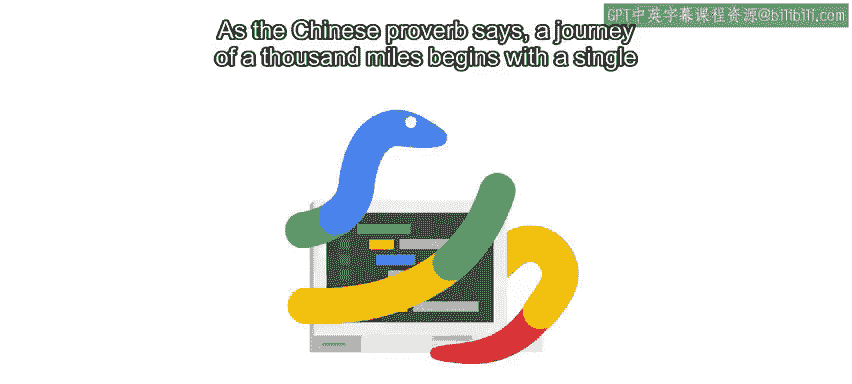

#  003：🚀 开始编程之旅

在本节课中，我们将要学习编程的基本概念，了解什么是编程语言和脚本，并动手编写你的第一个Python脚本。我们会循序渐进地介绍每个知识点，确保你能完全理解。

---

正如中国古语所说：“千里之行，始于足下。”

今天是一个重要的日子。你迈出了学习用Python编写脚本的第一步。

这个过程有时会有些挑战，但真的，它并不可怕。

我们会放慢节奏，在进入下一个视频之前，确保你充分掌握每一个概念。

---

## 什么是编程？

上一节我们开启了学习之旅，本节中我们来看看编程究竟是什么。

在接下来的几个视频中，我们将探索计算机编程的基本概念。

你将了解什么是编程语言，什么是脚本。

除了Python之外，还有哪些其他语言，以及这一切与Python有何关联。

我们还会在你不知不觉中让你开始编码，通过我们准备的一些小型编码练习，让你亲手实践Python。

这包括编写你的第一个Python脚本。

---

## 给初学者的建议

在深入学习之前，这里有一些重要的建议。

请始终记住，如果在学习过程中的任何时候感到困惑或迷失，不要惊慌。

你可以根据需要多次观看视频，让概念慢慢消化。此外，你可以在讨论区提问，这是获取额外信息并与其他学习者联系的最佳方式之一。

当我被邀请参与这个项目时，它让我想起了自己刚开始编码的时候。

如果我能给年轻时的自己一条建议，我会告诉她：

**代码第一次永远不会成功运行。**

说真的，作为一个新手，我曾期望一切都能像魔法一样运行。我以为第一次就遵循规则并做对，就能证明我作为程序员的价值。

但事实并非如此。即使是最顶尖的程序员也不例外。

如果你期望第一次就写出完美的代码，你将会感到失望。

听到了吗，年轻的自己。

**尽量不要被细节淹没。**

融会贯通只能通过经验获得。所以，最好的学习方法就是直接开始实践。

---

## 按自己的节奏学习

每个人都有自己的学习节奏。

如果你已经了解其中一些概念，可以自由跳过，直接进入你最感兴趣的部分。

如果你是从零开始，请为每个概念留出足够的时间。评估测试会在你完成后等着你。

如果在任何时候你开始怀疑自己，请记住，即使是最资深的程序员也曾经想过：“Python？Python是什么？”

好了，我们即将全面了解它，让我们开始吧。

---

## 本节总结

本节课中，我们一起学习了编程之旅的起点，了解了编程的基本概念，并获得了开始实践的重要心态建议。记住，实践和耐心是学习编程的关键。

接下来，我们将详细梳理编程到底是什么。