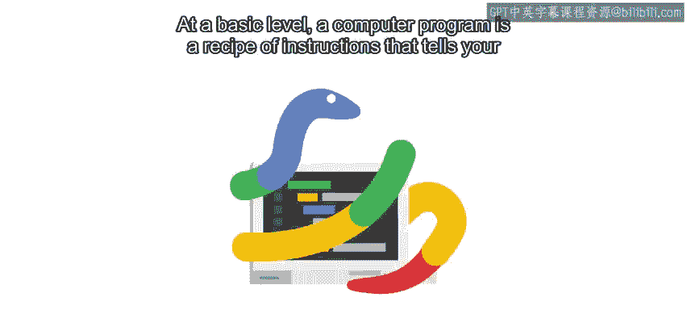
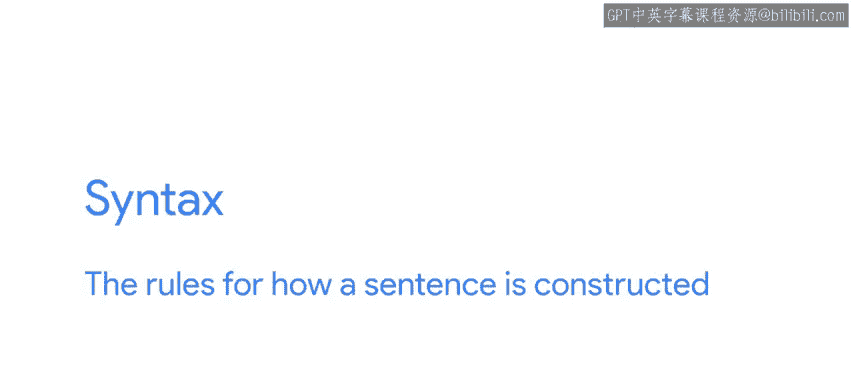
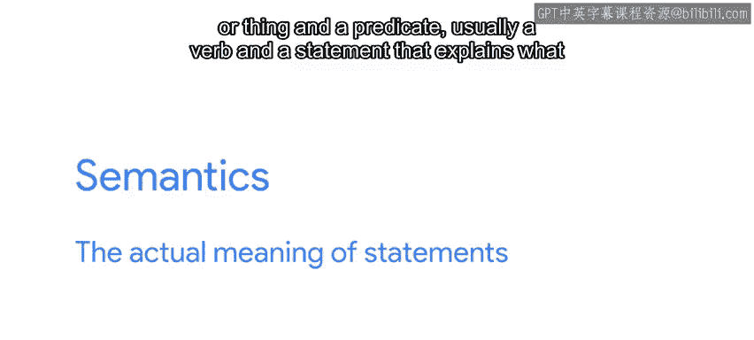
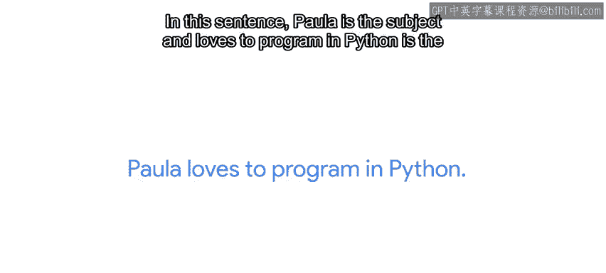
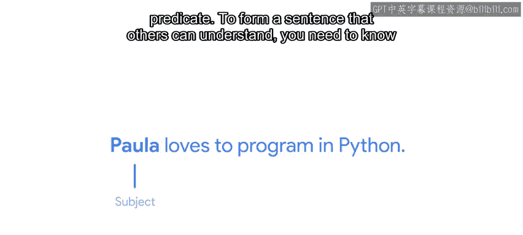
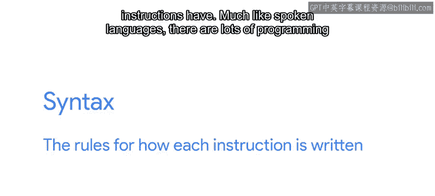
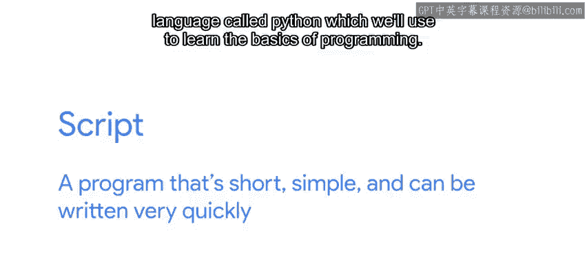

#  004：什么是编程？🧑‍💻

在本节课中，我们将要学习编程的基本概念。我们将了解什么是计算机程序，以及编程语言如何像人类语言一样工作。我们还会区分“程序”和“脚本”，并介绍我们将要使用的编程语言——Python。

---

## 概述

从根本上说，计算机程序是一份指令清单，它告诉你的计算机要做什么。当你编写程序时，你创建了一份需要逐步执行的“食谱”来完成一项任务。当你的计算机执行程序时，它会读取你写的内容并一字不差地遵循你的指令。

## 编程语言：语法与语义

上一节我们介绍了程序是指令的集合，本节中我们来看看这些指令是如何被书写的。这份“食谱”是用一种称为编程语言的代码编写的。编程语言实际上与人类口语相似，因为它们也有语法和语义。

如果你已经很久没有上过语法课了，这里快速回顾一下语法和语义的概念。

在人类语言中：
*   **语法**是句子构成的规则。
*   **语义**则指的是语句的实际含义。

在英语中，句子通常既有**主语**（一个人、地方或事物），也有**谓语**（通常是一个动词，用于说明主语在做什么）。

让我们以句子“Paula loves to program in Python”为例。
*   在这个句子中，“Paula”是主语。
*   “loves to program in Python”是谓语。

为了形成一个别人能理解的句子，你需要同时知道构建句子的**语法**和赋予其意义的**语义**。

这同样适用于编程语言。在像Python这样的编程语言中：
*   **语法**是每条指令的书写规则。
*   **语义**是这些指令产生的效果。

## 多种编程语言

与口语类似，可供选择的编程语言有很多。每种语言都有自己的历史、特点和应用场景，但它们都共享相同的基本理念。因此，一旦你理解了一种编程语言的基本概念，学习另一种就会容易得多。

最后，计算机总是完全按照被告知的内容执行。所以，当你编写程序时，**非常清晰**地表达你希望计算机做什么至关重要。学习你所选编程语言的语法和语义将使你能够做到这一点。

## 程序与脚本

在继续之前，让我们花点时间讨论一下术语。在接下来的视频中，你会多次听到“脚本”这个词。那么，脚本和程序有什么区别呢？

两者之间的界限可能有些模糊。在本课程中，我们将互换使用这两个术语。一般来说，你可以将脚本视为**开发周期短、可以快速创建和部署的程序**。换句话说，脚本是一种**简短、简单且可以非常快速编写**的程序。

## 本课程的重点：Python

在本课程中，我们将专注于一种特定的脚本语言——**Python**，我们将用它来学习编程的基础知识。我们将学习Python的语法（编写Python程序的规则）以及相关不同部分的语义（或含义）。

在我们开始学习如何编码并让你编写第一个Python脚本之前，让我们更多地谈谈什么是自动化以及它为什么有用。

---

## 总结

本节课中我们一起学习了：
*   计算机程序是指导计算机完成任务的指令集合。
*   编程语言像人类语言一样，拥有**语法**（书写规则）和**语义**（含义）。
*   存在多种编程语言，但核心概念相通。
*   “脚本”通常指简短、开发快速的小型程序。
*   本课程将使用**Python**语言来学习编程基础和自动化。