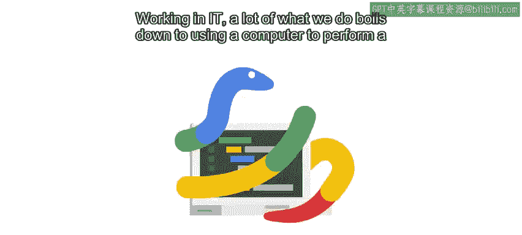
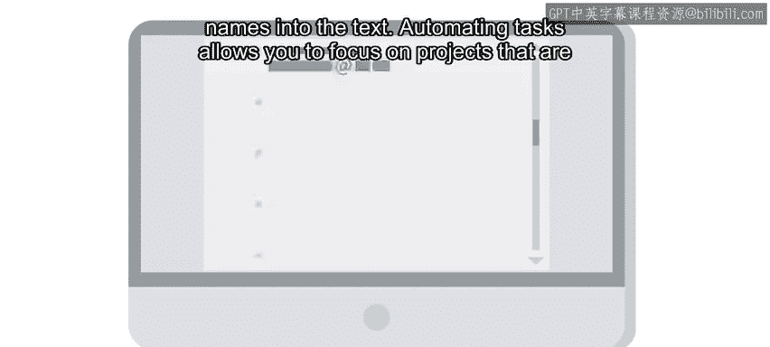
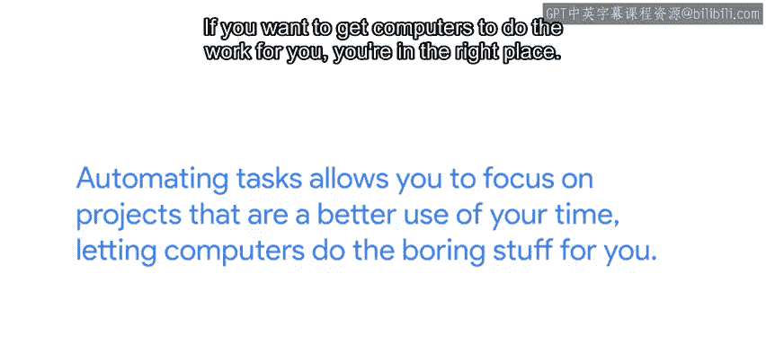

#  006：让计算机为您工作 🖥️

在本节课中，我们将要学习自动化在IT工作中的重要性，以及如何通过编程让计算机代替我们执行重复性任务。我们将探讨自动化的优势，并通过具体例子理解其实际应用。

---

在IT领域，我们的很多工作最终都归结为使用计算机执行特定任务。在工作中，您可能需要创建用户账户、配置网络、安装软件、备份现有数据，或者每天执行一系列其他基于计算机的任务。

在我第一份IT工作中，我意识到每天上班时，我都要输入相同的三条命令来验证系统身份。出于安全考虑，这些凭据每天都会按设计超时。因此，我创建了一个脚本，让它每天早上自动为我运行这些命令，从而避免了自己手动输入。

有趣的是，监控异常活动的团队发现了我的这个小发明，并联系我将其删除。

---

## 为什么需要自动化？🤔

由计算机执行、需要多次重复且变化不大的任务，非常适合进行自动化。因为当您自动化一项任务时，可以避免人为错误的可能性，并减少执行任务所需的时间。

想象以下场景：您的公司在最近的一次会议上设有一个展位，并收集了大量对了解产品感兴趣的人的电子邮件列表。

您希望向这些人发送每月的电子邮件通讯，但列表中有些人已经订阅了该通讯。那么，如何确保每个人都能收到您的通讯，而不会意外地两次发送给同一个人呢？

您可以手动逐一检查每个电子邮件地址，以确保只将新地址添加到列表中。这听起来既无聊又低效，对吧？确实如此。而且它也更容易出错。您可能会意外地遗漏新邮件，或添加已经存在的邮件，或者因为过程太无聊而在办公桌前睡着。

---

## 自动化的解决方案 💡

那么，您可以怎么做呢？您可以让计算机为您完成这项工作。

您可以编写一个程序来检查重复项，然后将每个新电子邮件添加到列表中。无论列表中有多少电子邮件，您的计算机都会严格按照指示执行。因此，它不会感到疲倦，也不会犯任何错误。

更好的是，一旦您编写了程序，将来在类似情况下就可以使用相同的代码，从而节省更多时间。这很酷，对吧？

---

## 自动化的进阶优势 🚀

事情还可以变得更好。想想您何时发送这些电子邮件。如果您手动发送，您必须向每个人发送相同的电子邮件。个性化电子邮件将需要大量的手动工作。

相反，如果您使用自动化来发送，您可以让每个人的姓名和公司自动添加到电子邮件中。结果是，电子邮件更有效，而您无需花费数小时在文本中插入姓名。

自动化任务可以让您专注于更能有效利用时间的项目，让计算机为您处理枯燥的工作。学习如何编程是实现这一目标的第一步。如果您想让计算机为您工作，那么您来对地方了。

---

## 一个自动化实例分享 📂

在本视频开头，我告诉您我自动化的第一个任务。现在，我想告诉您我自动化过的最酷的事情。

那是一个脚本，它更改了大量Google内部服务的访问权限。该脚本遍历了一个包含大量不同文件的大型目录树，检查文件内容，然后根据我在脚本中设定的条件更新服务的权限。

好吧，我承认，我是个书呆子，但我仍然认为这真的很酷。

---

## 分享您的想法 💬

接下来，是时候分享您的想法了。您希望使用编程自动化哪些事情？

虽然这些讨论提示是可选的，但它们真的很有趣。说真的，它们让您能稍微了解其他学习者，并在想法和见解上进行协作。请务必阅读其他人的发言，他们可能会给您带来您从未想过的点子。

在那之后，您就可以准备参加本课程的第一次测验了。别担心，这只是练习。

---

## 本节总结 📝

本节课中，我们一起学习了自动化在IT工作中的核心价值。我们了解到，自动化能够高效、准确地处理重复性任务，避免人为错误，并释放我们的时间以专注于更有价值的项目。通过编程，我们可以教会计算机执行这些任务，从简单的命令脚本到复杂的文件处理系统。现在，您已经准备好思考如何将自动化应用到自己的工作中了。