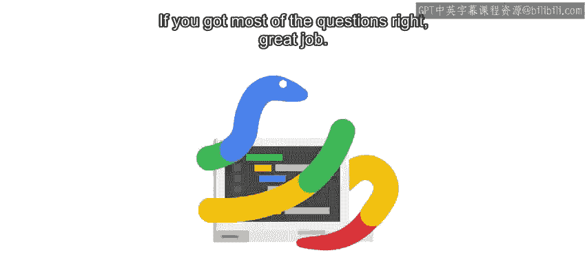
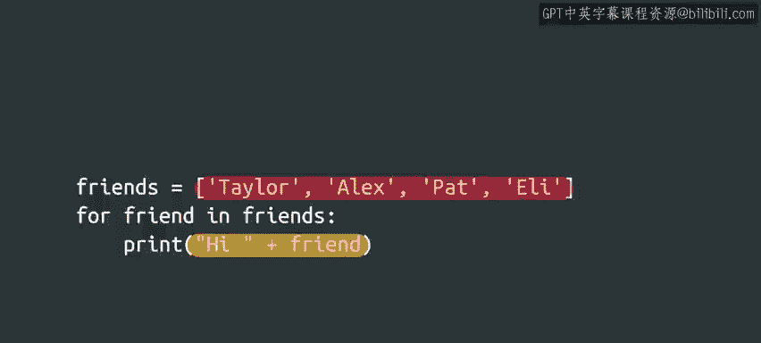
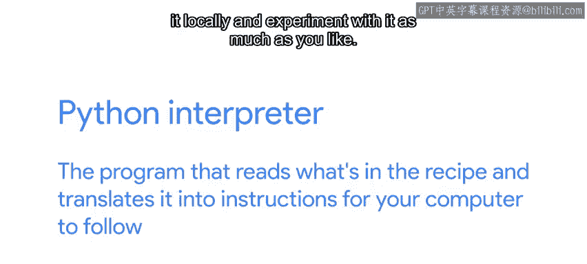

#  007：什么是Python？🐍



在本节课中，我们将要学习Python编程语言的基本概念，了解为什么选择它作为本课程的教学语言，并初步体验如何运行Python代码。

---

欢迎回来。你在第一次测验中表现如何？如果答对了大部分问题，做得很好。如果没有，不用担心。这是学习过程的一部分。我们会通过这类定期测验来帮助你真正理解这些概念。

如果你觉得某个问题棘手，可以返回复习视频，然后重新尝试测验。在进入下一课之前，你需要对所学内容感到非常熟悉。记住，慢慢来。当你准备好继续时，我随时在这里。

感觉不错？很好，让我们开始吧。

在本课程中，我们将使用Python编程语言来演示基本的编程概念，以及如何将它们应用于编写脚本。我们之前提到过，市面上有很多编程语言。那么为什么选择Python呢？

我们选择Python有几个原因。首先，用Python编程的感觉通常类似于使用人类语言。这是因为Python让我们能够用易于阅读和书写的语法，轻松地表达我们想做的事情。

请看这个例子：

```python
friends = ['Taylor', 'Alex', 'Pat', 'Eli']
for friend in friends:
    print("Hi " + friend)
```

这里有很多内容需要理解。所以，如果你不能立刻明白，请不要担心。我们将在课程后面深入细节。但即使你以前从未见过一行代码，你或许也能猜出这段代码的作用。它定义了一个包含朋友名字的列表，然后为列表中的每个名字创建一句问候。



现在，轮到你与Python交朋友了。尝试运行它，看看会发生什么。

---

在整个课程中，你将使用网页浏览器来执行Python代码。我们将从使用代码块进行一些小型的编码练习开始，就像你刚才实验的那个一样。之后，随着你技能的发展，你将使用其他工具来处理更大、更复杂的编码练习。

精通某事需要大量的练习，编程和Python也不例外。我们建议你亲自练习本课程中分享的每一个例子。

如果你的电脑上没有安装Python，不用担心。你仍然可以使用在线的Python解释器进行练习。请查看下一份阅读材料，获取最流行的在线Python解释器的链接。

现在，我确信你很好奇，到底什么是Python解释器？在编程中，解释器是读取和执行代码的程序。还记得我们把计算机程序比作包含分步说明的食谱吗？那么，如果你的食谱是用Python写的，Python解释器就是那个读取食谱内容并将其翻译成你的计算机可以遵循的指令的程序。

---



最终，你会希望在电脑上安装Python，以便在本地运行它并随心所欲地进行实验。我们将在接下来的课程中指导你如何安装Python，但你不必为了初次体验Python而安装它。

你可以通过我们提供的测验以及下一份阅读材料中给出的在线解释器和代码编辑器链接进行练习。我们会为你提供大量练习，但也欢迎你提出自己的想法，并在讨论论坛中分享。尽情发挥创意吧，这是你展示新技能的机会。

---

**总结**

本节课中，我们一起学习了选择Python作为学习语言的原因，包括其语法接近人类语言、易于读写。我们初步接触了Python代码的结构，并了解了**解释器**（如`python`命令）是执行代码的关键程序。我们还明确了本课程将通过浏览器和在线工具提供实践机会，鼓励大家积极练习和创造。