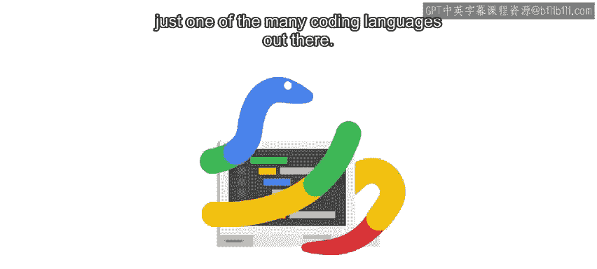
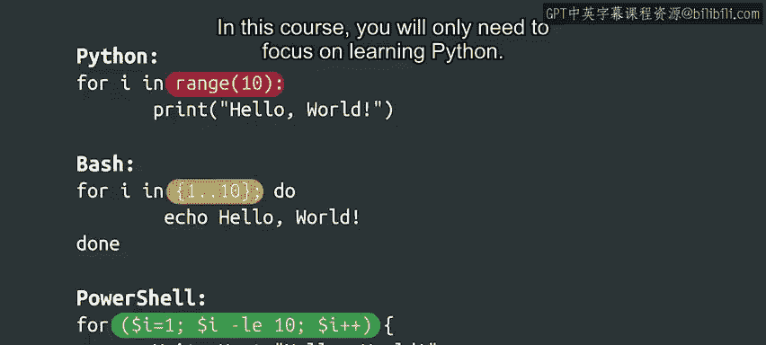

#  009：编程语言概览 🌐



在本节课中，我们将要学习编程语言的基本概念，了解Python在众多语言中的位置，并初步探索不同语言之间的异同。

---

虽然我们为本课程选择了Python，但必须指出，它只是众多编程语言中的一种。

你可以将一门特定的编程语言视为你IT工具箱中众多强大工具之一。

每种语言都有其独特的优缺点。有些语言运行速度更快。有些语言更适合企业级应用。另一些则在处理数字计算方面特别出色。

以下是几种不同类型的编程语言：

*   **平台特定脚本语言**：例如在Windows上使用的**PowerShell**和在Linux上使用的**Bash**。这两种语言在各自平台上被系统管理员广泛使用。
*   **通用脚本语言**：与Python类似的语言，例如**Perl**或**Ruby**。它们也广泛用于脚本编写和自动化。
*   **JavaScript**：最初是作为一种Web客户端脚本语言开发的，现在越来越多地被用作服务器端语言，以完成更广泛的任务。
*   **传统语言**：除此之外，还有大量传统的编程语言可供探索，如**C**、**C++**、**Java**或**Go**。

随着你在IT领域的职业发展，你可能会遇到许多不同的语言，并学会在何时使用它们。但让我们不要操之过急。首先，我们需要掌握Python。

---

上一节我们介绍了编程语言的多样性，本节中我们来看看学习一门语言带来的好处。

学习一门语言编程基础的一个优点是，你通常可以将学到的相同概念应用到其他语言中。这意味着一旦你熟悉了Python，你会发现学习新的编程语言会更容易，因为你将能识别和理解它们之间的相似性与差异性。

毕竟，每种语言都需要做一些共同的事情，例如创建变量、控制程序流程、读取输入和显示输出。即使它们使用不同的方法来完成这些任务。

正如我们之前提到的，学习编程语言有点类似于学习一门外语。你需要掌握该语言的语法。幸运的是，一旦你掌握了编程的基础知识，学习另一门语言比学习第二门外语要容易得多。编程语言之间的相似性远多于差异性。

---

为了探索各种脚本语言之间的一些相似性和差异性，让我们来看一个简单的程序，它用三种不同的语言（Python、Bash和PowerShell）打印“hello world”十次。

```python
# Python 示例
for i in range(10):
    print("hello world")
```

```bash
# Bash 示例
for i in {1..10}; do
    echo "hello world"
done
```

```powershell
# PowerShell 示例
for ($i=1; $i -le 10; $i++) {
    Write-Host "hello world"
}
```

如你所见，每种语言都使用不同的方法来打印“hello world”。但仔细观察，你也会发现相似之处。

每种语言都必须以某种方式将文本输出到屏幕。Python的命令是`print`，Bash是`echo`，而PowerShell是`Write-Host`。

同时注意，每种语言都必须以某种方式计数到10。Python通过指定`range(10)`来实现，Bash使用序列符号从1计数到10。PowerShell在这个例子中语法最复杂，但它本质上也是从1开始计数到10。



---

所以，正如我们刚刚看到的，世界上有非常多的编程语言，但不要被此吓倒。在本课程中，你只需要专注于学习Python。一旦你掌握了Python，你就可以继续学习任何其他你想学的语言。

本节课中我们一起学习了编程语言的多样性、学习第一门语言的价值，以及通过一个简单的“hello world”示例对比了不同脚本语言的异同。接下来，我们将通过一个小测验来帮助你巩固刚刚学到的知识。