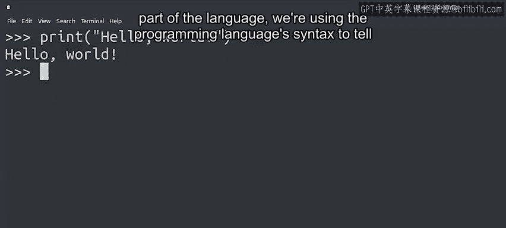
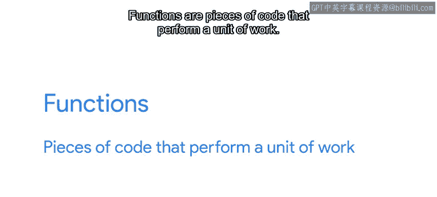
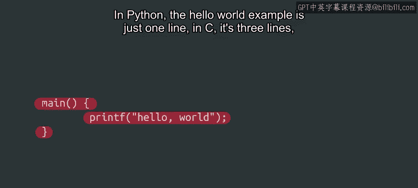

#  010：你好，世界！👋


在本节课中，我们将学习如何编写并运行你的第一行Python代码，并理解其背后的基本概念。

现在你已经对Python代码有了初步印象，让我们来查看一个最基础的例子，并深入探究其背后的原理。我们将使用Python解释器，让我们的计算机向世界问好。

## 打印“Hello World” ✨

当我们运行以下代码时，无论是在本地计算机上还是在网页解释器中，屏幕上都会出现“Hello World”的字样。

```python
print("Hello World")
```

这看似神奇，实则不然。这是因为 `print` 是一个Python函数，它的作用是将我们告诉它的内容输出到屏幕上。例如，语句“Hello World”。`print` 函数是Python基础语言的一部分。



## 理解语法：函数与关键字 🔑



每当我们使用属于该语言的关键字或函数时，我们就是在使用编程语言的语法来告诉计算机该做什么。

那么，什么是函数和关键字呢？

以下是关于它们的基本解释：

*   **函数**：是执行一个单元工作的代码片段。我们将在后续课程中详细讨论函数，你甚至会学习如何编写自己的函数。
*   **关键字**：是用于构建指令的保留字。这些词是语言的核心部分，只能以特定的方式使用。一些例子包括 `if`、`while` 和 `for`。我们将在课程后面解释这些以及更多关键字。

正如我们提到的，Python中使用的关键字和函数构成了该语言的语法。一旦我们理解了它们的工作原理，就可以用它们来构建更复杂的表达式，让计算机执行我们想要的操作。

## 字符串的概念 📝

最后，请注意“Hello World”是如何写在双引号之间的。用引号包裹文本表示该文本被视为一个**字符串**，这意味着它是将被我们脚本处理的文本。在编程中，任何不在引号内的文本都被视为代码的一部分。

## 历史趣闻与总结 📚

现在，分享一个有趣的小知识。你知道为什么在我们的例子中要向整个世界问好吗？打印“Hello World”自20世纪70年代以来一直是学习编程语言的传统起点，当时它被用作著名编程书籍《C程序设计语言》的第一个例子。那个例子看起来像这样：

```c
#include <stdio.h>
main() {
    printf("hello, world\n");
}
```

在Python中，“Hello World”示例只有一行。在C语言中，它是三行。在其他语言中，可能更多。虽然学习编写“Hello World”不会教会你整个语言，但它能让你对函数的使用方式以及用该语言编写的程序的外观有一个初步印象。

好了，既然我们已经编写了第一段Python代码，我认为你已经准备好迎接比“Hello World”更具挑战性的内容了。让我们继续前进吧！😊

---



**本节课总结**：我们一起学习了如何用 `print` 函数输出“Hello World”，理解了**函数**和**关键字**是构成Python语法的基本元素，并认识了用引号定义的**字符串**。这是你Python编程之旅的第一步。