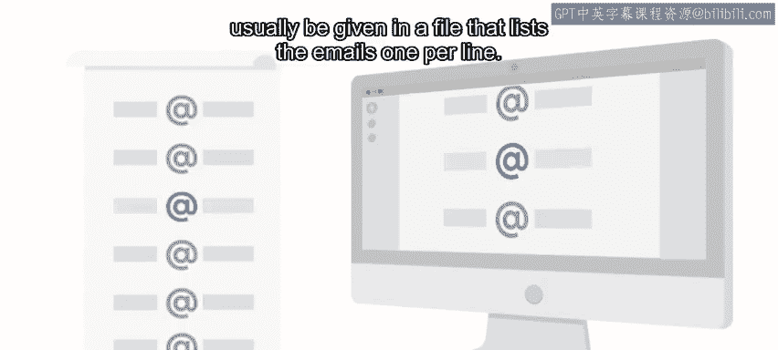
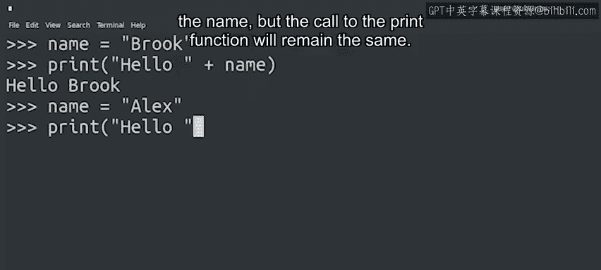

#  011：从用户获取信息 📥


在本节课中，我们将要学习如何让Python程序从用户那里获取信息，从而使程序能够执行更具体、更有用的操作，而不仅仅是输出固定的内容。

## 概述

一个有用的程序通常需要从用户那里获取至少一些信息。利用这些数据，程序可以执行与用户相关的操作，而不是像打印“Hello world”这样的通用操作。数据可以通过多种方式提供给计算机。

上一节我们介绍了程序的基本结构，本节中我们来看看如何让程序接收外部输入。

## 数据输入的方式

数据可以通过多种不同的平台和方式输入。

以下是几种常见的数据输入方式：
*   在网站上，您可以通过在文本字段中输入文本或点击链接来输入数据。
*   如果您使用移动应用程序，可能会点击按钮或从下拉菜单中选择偏好设置。
*   在命令行程序中，您可以通过将字符串作为参数传递给程序来提供额外数据，或者让程序以交互方式向您请求数据。

所有这些不同的平台、程序和应用程序处理数据的方式各不相同。有些程序可能将文件内容作为要处理的数据，而另一些程序则从其他来源收集数据并在后台进行处理。

## 课程中的数据处理方式

在本课程最初的示例中，我们将直接在代码块中把数据写成单独的一行。这种方式虽然有限，但简单直接。在本课程后期以及后续课程中，我们将向您介绍更好的方法将数据输入到代码中。



现在，让我们通过一个非常简单的例子来看看这个想法是如何实现的。

## 一个简单的示例

假设我们想向一个名叫“小明”的人问好。我们可以这样写代码：

```python
name = "小明"
print("你好，" + name)
```

通过将姓名与调用`print`函数的代码分开，我们使得调用`print`函数的那行代码变得通用，同时仍然能个性化问候语。如果我们想向不同的人问好，只需要更改`name`变量的值，而调用`print`函数的代码保持不变。

这很简单，对吧？

## 总结



本节课中我们一起学习了程序获取用户信息的重要性，并了解了数据输入的多种方式。我们通过一个简单的Python示例，看到了如何通过变量将数据与程序逻辑分离，从而使代码更加灵活和可重用。

接下来，我们将学习其他一些可以让Python为您完成的简单任务。