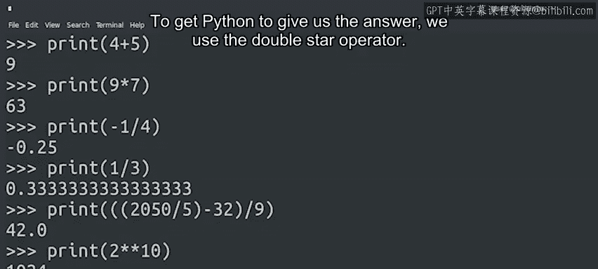

#  012：用Python作为计算器 🧮

在本节课中，我们将学习如何使用Python执行基础数学运算。Python不仅可以处理复杂任务，还能作为一个强大的计算器，帮助我们快速准确地进行各种计算。

## 概述

Python具备强大的数学运算能力。在深入学习复杂主题前，我们先通过一个简单任务来熟悉它：将Python当作计算器使用。这有助于我们理解Python处理数字和运算的基本方式。

## 基础运算

让我们从简单的数学运算开始。Python可以执行加、减、乘、除等基础运算。

以下是几个基础运算示例：

*   `4 + 5` 的结果是 `9`。
*   `9 * 7` 的结果是 `63`。
*   `-1 / 4` 的结果是 `-0.25`。

## 处理小数和循环小数

在进行除法时，Python会精确地显示结果，包括小数。对于无限循环小数，Python会以包含多位小数的格式进行表示。

例如，计算 `1 / 3`：
在数学中，1除以3的结果是小数点后3无限循环。Python无法显示无限长的数字，因此它会展示一个包含许多小数位的近似值。

## 复杂表达式与运算顺序

上一节我们介绍了基础运算，本节中我们来看看如何计算更复杂的表达式。要计算复合算式，我们需要像在普通数学中一样使用括号 `()` 来明确运算顺序。

例如，计算 `(2050 / 5 - 32) / 9`：
我们需要先用括号确保先进行除法和减法，再进行第二次除法。

## 乘方运算

除了四则运算，Python还能轻松计算乘方（幂运算），例如平方、立方或任意次方。

要计算一个数的乘方，我们使用双星号 `**` 运算符。

以下是乘方运算示例：

*   计算2的10次方，代码为 `2 ** 10`。

## 为何使用Python计算？

如果你开始疑惑，为何要用Python而不是普通计算器？这是一个合理的问题。通过这种方式进行实验，你能熟悉语言的数学能力。在IT工作中，许多任务都需要数学计算。

你可能需要统计某个词在文本中出现的次数、计算操作完成的平均时间，或者计算需要将图像压缩多少才能符合特定大小限制。无论你需要计算什么，编写脚本都能帮助你更快、更准确地完成。因此，你需要了解有哪些数学运算可供使用。

## 进阶能力简介

Python实际上拥有更多用于数据分析、统计学、机器学习和其他科学应用的高级数值计算能力。本课程不会深入这些内容，但如果你想自行了解更多，网上有丰富的资源可供查阅。

## 总结

本节课中我们一起学习了如何将Python用作计算器。我们涵盖了基础运算、处理小数、使用括号控制复杂表达式的运算顺序，以及使用 `**` 运算符进行乘方计算。掌握这些基础数学运算是利用Python自动化处理任务的重要第一步。

接下来，将有一份速查表来帮助你回顾刚学到的编程概念。之后，是另一个小测验，这次包含一些简单的编码练习。记住，如果有任何不清楚的地方，你可以根据需要多次回看视频。

准备好了吗？你可以的。