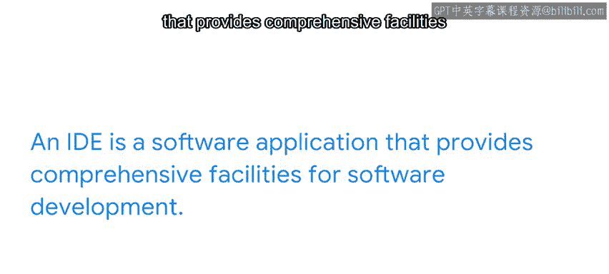

#  013：代码编辑器与IDE概览 🛠️

在本节课中，我们将要学习代码编辑器和集成开发环境（IDE）的基础知识。它们是帮助您更高效地编写、调试和运行Python代码的重要工具。

上一节我们介绍了一些Python编码基础，本节中我们来看看能辅助您进行开发的编码工具。

## 什么是代码编辑器？

代码编辑器是用于编写代码的工具。使用代码编辑器，您可以编写、调试和执行Python程序。

代码编辑器提供多种功能，包括：
*   **语法高亮**：用不同颜色显示代码的不同部分，使其更易读。
*   **自动缩进**：自动调整代码的缩进，这对Python这类依赖缩进的语言至关重要。
*   **错误检查**：实时提示代码中的潜在错误。
*   **自动补全**：在您输入时，智能地建议和补全代码。

总体而言，代码编辑器帮助定义代码的结构和功能，让您能更高效地编写代码。它们也使理解变量、命令、函数和循环变得更加容易。

以下是几个我们将在后续视频中介绍的代码编辑器示例：
*   VS Code
*   Jupyter Notebook
*   Colab

## 什么是集成开发环境（IDE）？

IDE的功能比代码编辑器更丰富。代码编辑器与IDE的区别在于，代码编辑器更像一个文本编辑器，而IDE则能指导您编写代码，并允许您查看代码的执行过程。

您可以这样理解：代码编辑器就像一部固定电话，您可以拨号、打电话。而IDE更像一部智能手机，您仍然可以打电话，但它还拥有额外的功能，允许您进行视频通话、发送短信、浏览互联网和使用许多其他应用程序。

IDE是一个软件工具，它简化了创建新软件应用程序的过程。它是一个提供软件开发综合设施的软件应用程序。

## 代码编辑器与IDE的关系

IDE始终包含一个代码编辑器。IDE通过将多种工具集成到一个环境中，让您能更高效地开发代码。您将能够在一个应用程序中完成编辑、构建、测试和打包所有工作。它们还允许您更快地编程应用程序，而无需进行手动集成和配置。

接下来，我们将介绍IDLE。IDLE是一个随Python自动安装的IDE。它是一个优秀的初学者级IDE，因为它非常易于使用。对于大型项目它可能不太理想，但对于了解如何使用IDE来说，它非常出色。

现在，让我们深入了解一些您可以在Python学习之旅中使用的代码编辑器和IDE。

---

本节课中我们一起学习了代码编辑器和集成开发环境（IDE）的基本概念。我们了解到，代码编辑器是专注于编写和调试代码的工具，而IDE则是一个功能更全面的开发环境，集成了编码、测试、调试等多种功能。选择合适的工具将极大地提升您的编程效率和体验。