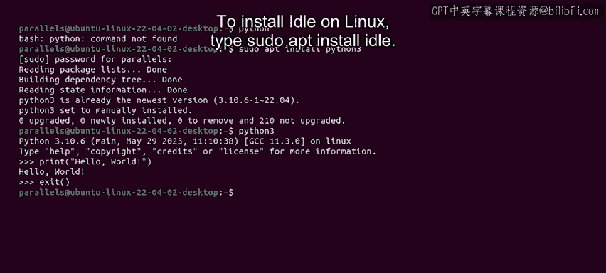
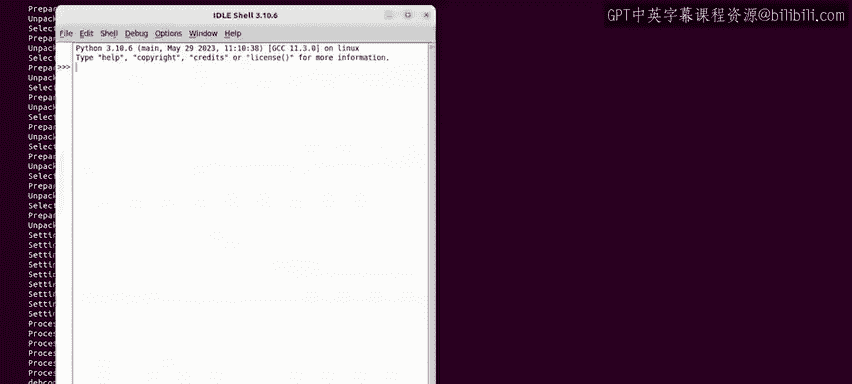
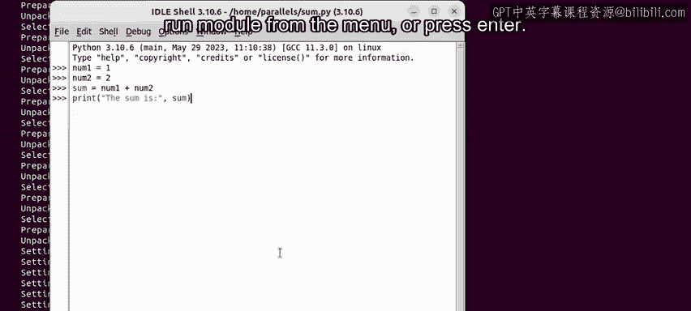

#  014：🚀 使用命令行与IDLE编写Python脚本


在本节课中，我们将学习如何通过命令行和Python自带的IDLE工具来编写和运行Python脚本。这是开始Python编程的第一步。

## 概述

命令行是直接与计算机操作系统交互的强大工具。通过它，我们可以执行各种任务，例如访问服务器、移动文件、切换目录，以及运行脚本。本节将重点介绍如何在Linux操作系统上使用命令行和IDLE来编写Python代码。如果你使用其他操作系统，原理是相似的，可以参考相关文档进行调整。

## 使用命令行

上一节我们介绍了命令行的重要性，本节中我们来看看如何在Linux上实际操作。

首先，你需要打开Linux终端。可以通过点击应用程序图标或使用快捷键 `Ctrl + Alt + T` 来实现。

打开终端后，你可以检查系统是否已安装Python。在终端中输入以下命令：

```bash
python3 --version
```

大多数Linux系统都预装了Python。如果系统提示命令未找到，则表示需要安装。你可以使用以下命令进行安装：

```bash
sudo apt install python3
```

系统会提示你输入密码。输入密码并按回车后，Python 3将开始安装。

安装完成后，你就可以在终端中直接进入Python的交互模式了。只需输入：

```bash
python3
```

以下是交互模式的一个简单示例。输入以下代码并按回车：

```python
print("Hello, world!")
```

你将看到终端输出：`Hello, world!`。

要退出Python交互模式，请输入：

```python
exit()
```

## 使用IDLE编写脚本

除了命令行交互模式，我们还可以使用IDLE来编写更复杂的Python脚本文件。IDLE是Python官方提供的集成开发与学习环境，特别适合初学者。

IDLE提供了语法高亮、代码自动补全和自动缩进等功能，能帮助你更轻松地编写代码。

在Linux上，如果尚未安装IDLE，可以使用以下命令安装：



```bash
sudo apt install idle3
```

安装完成后，在终端中输入 `idle3` 即可启动IDLE。



启动IDLE后，你会看到一个交互式解释器窗口。要创建新的脚本文件，请点击菜单栏的 `File` -> `New File`。

在新打开的编辑器窗口中，你可以编写Python代码。例如，编写一个简单的加法程序：

```python
# 这是一个简单的加法脚本
num1 = 5
num2 = 3
sum = num1 + num2
print(f"两数之和为: {sum}")
```

代码编写完成后，需要保存文件。点击 `File` -> `Save As...`，为文件命名，例如 `sum.py`，然后点击保存。



要运行这个脚本，你有两种选择：
1.  在编辑器窗口中，点击 `Run` -> `Run Module`。
2.  或者直接按键盘上的 `F5` 键。

运行后，你将在IDLE的交互式窗口或终端中看到脚本的输出结果。

## 总结

本节课中我们一起学习了Python编程的起点工具。我们掌握了如何在Linux命令行中检查、安装Python，并使用 `python3` 命令进入交互模式执行简单的代码。接着，我们介绍了功能更强大的IDLE工具，学习了如何安装、启动IDLE，并完成了一个从编写、保存到运行完整Python脚本的流程。

记住，无论你使用哪种操作系统，都可以通过命令行来运行Python。对于执行和调试单个脚本或 `.py` 文件，使用IDLE这类文本编辑器并从命令行运行是非常有效的方法。

接下来，让我们探索一些其他代码编辑器和集成开发环境（IDE）。我们下个视频再见。