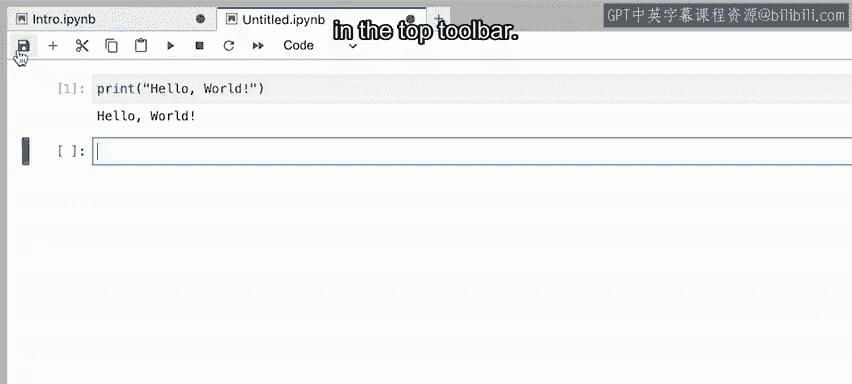
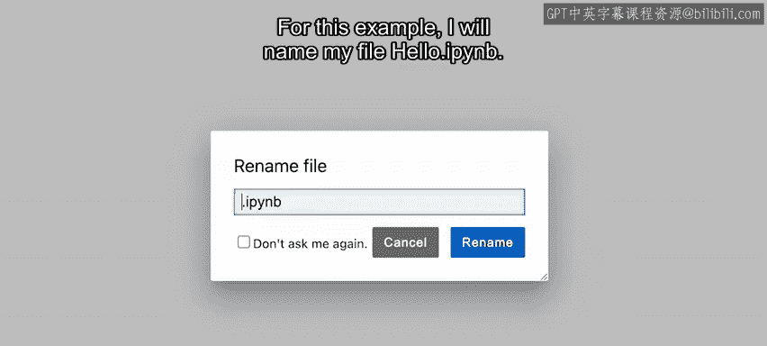
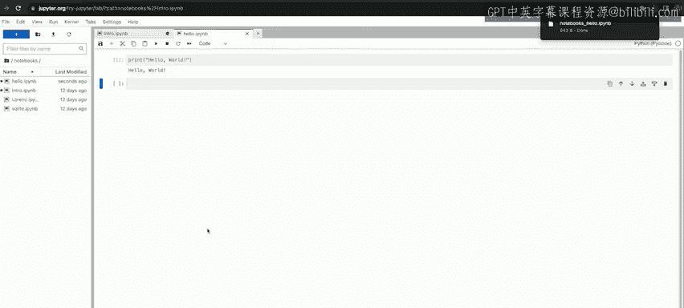
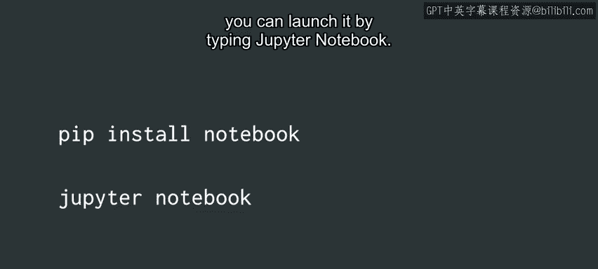

#  015：使用 JupyterLab 与 Jupyter Notebooks 📓


在本节课中，我们将学习如何使用 JupyterLab 和 Jupyter Notebooks 来编写、运行和调试 Python 代码。这是一种非常流行的交互式编程环境，尤其适合数据分析和学习。

## 概述：什么是 JupyterLab 与 Jupyter Notebooks？

JupyterLab 和 Jupyter Notebooks 是一个名为 **Project Jupyter** 的开源项目的一部分，可以免费使用。你可以在 [jupyter.org](https://jupyter.org) 了解更多信息。

JupyterLab 是一个基于网页的界面，允许你使用 Jupyter Notebooks 来编写、运行和调试 Python 代码。它提供了一个在线环境，让你可以在云端运行代码。

Jupyter Notebook 则是一种可以创建包含**实时代码块**的文本文档的工具。你可以在一个地方编写 Python 程序并查看其执行结果，这对于理解和创建代码非常有帮助。

## 如何使用基于云的 JupyterLab 环境？

最流行的使用方式之一是通过基于云的环境。以下是具体步骤：

1.  访问 [jupyter.org](https://jupyter.org)。
2.  点击 “Try” 按钮。
3.  在弹出的选项中选择 “JupyterLab”。

进入 JupyterLab 环境后，你可以创建一个新的 Notebook：

1.  点击 “+” 号添加新标签页。
2.  在 “Notebook” 分类下选择 “Python”。
3.  一个新的 Notebook 就会打开，你可以开始编写和运行 Python 代码了。

## 在 Notebook 中编写并运行代码

你将在带有蓝色边框的 **单元格** 中编写代码。让我们尝试一个简单的例子。

以下是一个打印语句的示例：
```python
print("Hello world")
```

要运行单元格中的代码，请使用工具栏顶部的 “运行” 按钮。点击后，你的单元格就会执行，输出结果会显示在单元格下方。对于上面的代码，输出应该是：
```
Hello world
```

## 保存与下载你的 Notebook

你可以使用工具栏顶部的 “保存” 按钮来保存你的 Jupyter Notebook。点击保存并为你的文件命名，例如 `hello.ipynb`。



如果你想下载你的 Notebook 文件，可以使用左上角的 “文件” 菜单，然后选择 “下载” 选项。





## 在本地机器上安装和使用 Jupyter

你也可以在自己的电脑上安装和使用 JupyterLab 和 Jupyter Notebooks。这需要通过命令行使用 `pip` 命令。

以下是安装和启动 JupyterLab 的步骤：
1.  在命令行中输入：`pip install jupyterlab`
2.  安装完成后，输入：`jupyter-lab` 来启动它。

以下是安装和启动 Jupyter Notebook 的步骤：
1.  在命令行中输入：`pip install notebook`
2.  安装完成后，输入：`jupyter notebook` 来启动它。



## 总结与更多资源

本节课中，我们一起学习了 JupyterLab 和 Jupyter Notebooks 的基本用法。它们是编写 Python 代码的强大工具。Notebook 文件可以轻松地通过电子邮件、GitHub 或 Jupyter Notebook Viewer 进行分享和保存。

网络上还有大量关于 Jupyter Notebooks 的资源。如果你需要更多支持，Jupyter 官方网站是一个深入学习的绝佳资源。

在下一个视频中，我们将介绍 Colab，这是一个与 Jupyter Notebooks 非常相似的编码工具。请继续观看以了解更多。