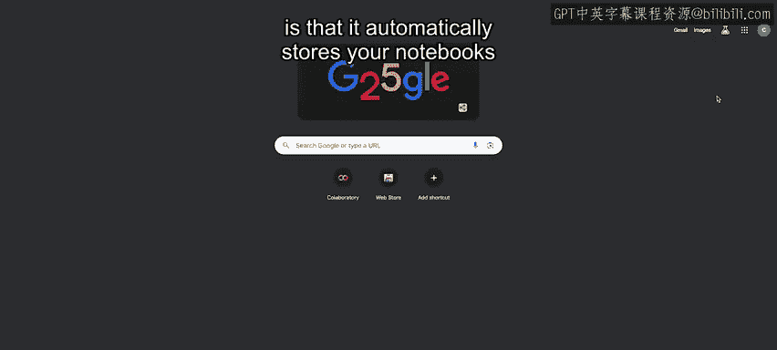
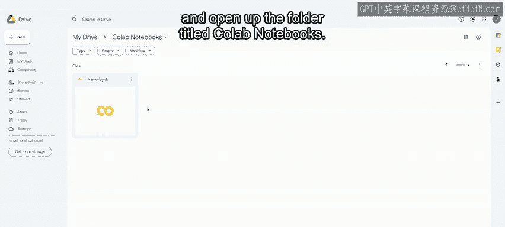

#  016：使用Google Colab 📓


在本节课中，我们将学习如何使用Google Colab。Colab是一个基于网页的平台，允许你在Google Drive中快速编写和运行Python代码。我们将介绍如何开始使用Colab、其核心功能以及如何管理你的项目。

---

## 概述

上一节我们介绍了Jupyter Notebooks。本节中，我们来看看Google Colab Notebooks。Colab Notebooks是由Google的Collaboratory托管的Jupyter Notebooks。在Colab中，你可以编写和运行Python代码。本视频将详细介绍如何使用Colab及其功能。

Colab是一个基于网页的平台，允许你在Google Drive中快速编写和运行Python代码。它是免费的，无需任何配置即可使用。你可以直接访问 `collab.sandbox.google.com` 或搜索“Google Colab”来开始使用。

Colab提供了Python的所有功能。Colab中的单元格可以包含代码、文本和图像。代码单元格包含可执行代码和富文本，这使得编写和运行代码变得非常容易。

Colab还使得在Notebook中包含Markdown变得简单。这是一个分享Notebook的绝佳功能，因为你可以添加标题、段落、列表、数学公式等。

你可以在代码单元格中使用 `pip` 命令安装Python包。Colab Notebooks也可以轻松地与其他协作者共享。

---

## 如何使用Colab

现在，让我们来看看如何使用Colab。

首先，再次打开Google Colab。你可以通过访问 `colab.sandbox.google.com` 来完成此操作。

转到“文件”菜单，点击“新建笔记本”。现在，你可以开始编写Python代码了。

在代码单元格中，让我们编写一个输出你名字的打印语句。

```python
print("你的名字")
```

要运行你的代码并查看其执行结果，请使用代码单元格左侧的“运行”按钮。

你也可以给你的编码项目起一个名字。在顶部，你可以将 `untitled.ipynb` 更改为类似 `name.ipynb` 的名称。这将使你将来更容易找到你的代码。



Colab的一个优点是它会自动将你的Notebook存储在Google Drive中。

要找到你的Notebook，你可以直接访问你的Google Drive，在搜索栏中输入“Colab notebooks”，然后打开名为“Colab Notebooks”的文件夹。在这里，你将看到你创建的所有Notebook。



---

## 总结

本节课中，我们一起学习了如何使用Google Colab。我们了解到Colab是一个便捷的在线Python编程环境，能够自动保存项目到Google Drive，并支持代码执行、Markdown文档编写以及包安装。现在你已经掌握了使用这些代码编辑器的窍门。接下来，让我们进入最后一个编辑器——VS Code的学习。我们下个视频见。