#  017：使用 VS Code 进行 Python 开发 🛠️


在本节课中，我们将学习如何安装和配置 Visual Studio Code（简称 VS Code），这是一个功能强大的开源代码编辑器，并利用它来编写和运行 Python 代码。

---

## 认识 VS Code

上一节我们介绍了几种不同的编码工具，本节中我们来看看 VS Code。

VS Code 是一个包含开发者工具的开源代码编辑器。它类似于 Jupyter Notebooks 和 Colab，但提供了更多功能。VS Code 提供了内置支持，包括智能代码补全、交互式调试器以及其他构建和脚本工具。

VS Code 的布局简洁，易于学习和使用。其直观的特性使其成为 Python 编码的绝佳选择。

---

## 安装准备：Python 3

要使用 VS Code 进行 Python 开发，你需要安装 Python 3、VS Code 以及 VS Code 的 Python 扩展。本视频将展示如何完成这些步骤。

VS Code 可以在 Windows、Mac 和 Linux 操作系统上使用。本视频将以 Linux 操作系统为例。如果你使用其他操作系统，我们提供了相关阅读材料供你后续参考。

现在，让我们开始吧。

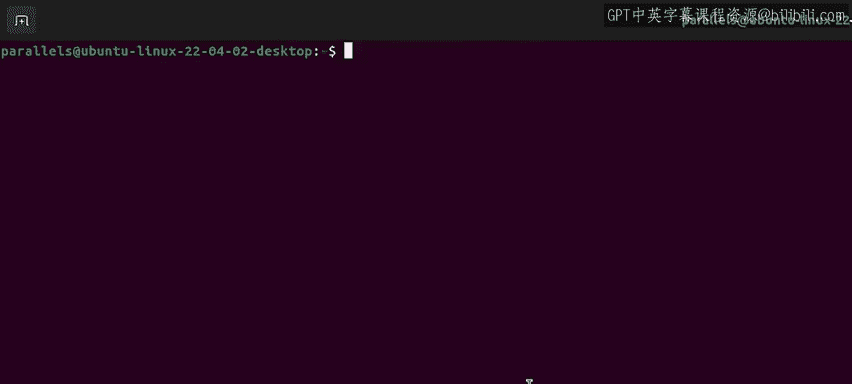

首先，打开一个终端窗口，输入以下命令来检查 Python 3 是否已安装：

```bash
python3 --version
```

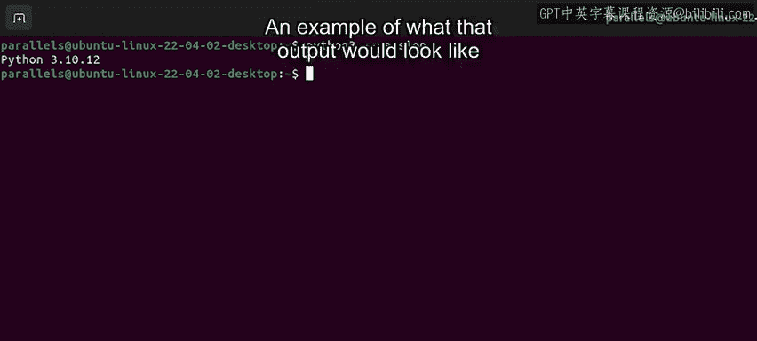

如果 Python 3 已安装，输出将显示你计算机上安装的 Python 版本，例如：

```
Python 3.10.12
```

如果未安装，输出将返回 `command not found`。这意味着你需要先安装 Python 3。

以下是安装步骤：

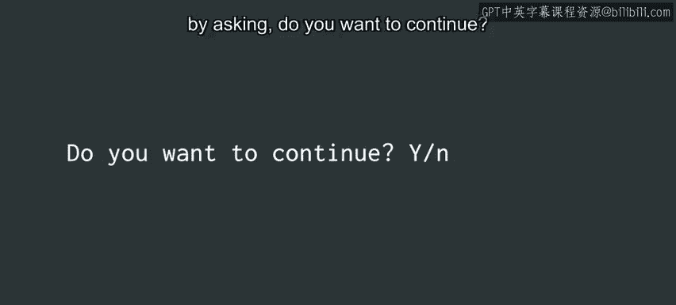

1.  在终端命令行中，输入 `sudo apt install python3` 并按回车。
2.  系统会提示你输入密码。输入密码后，安装将开始。
3.  在安装过程中，系统可能会询问 `Do you want to continue? [Y/n]`。选择 `Y` 并按回车。

现在，Python 3 已安装完毕并准备就绪。

---

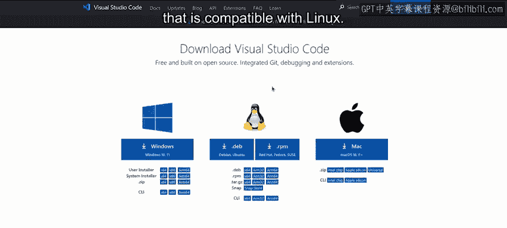

## 下载并安装 VS Code

接下来，我们安装 VS Code。

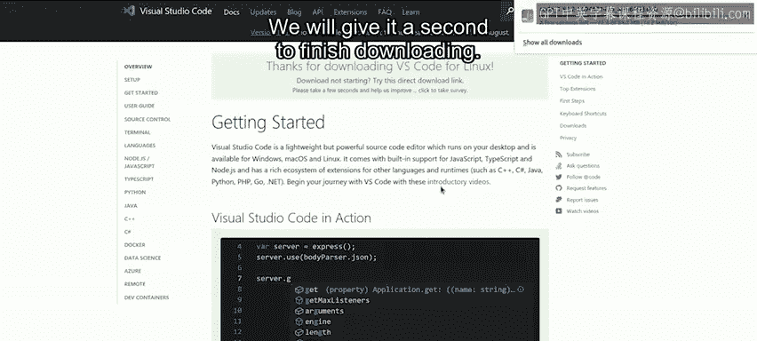

你可以访问 `code.visualstudio.com/download` 下载 VS Code。我们将下载与 Linux 兼容的版本。

选择 `.deb` 版本的 VS Code 进行下载。等待下载完成。

然后，回到终端。我们需要导航到下载文件夹并安装软件包。

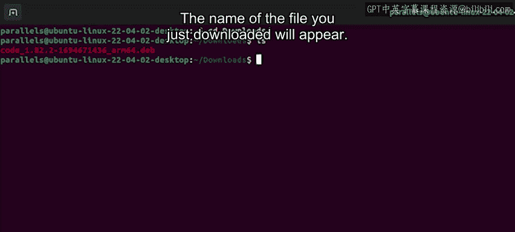

以下是具体步骤：

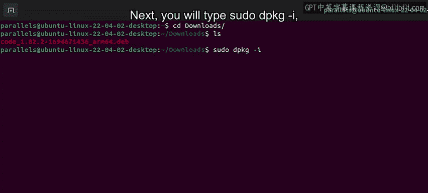

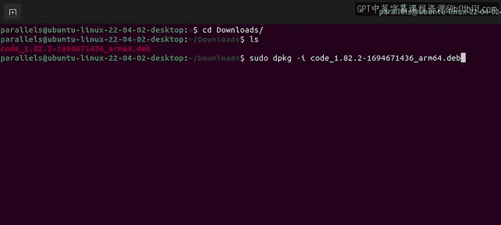

1.  输入 `cd Downloads/` 进入下载目录。
2.  使用 `ls` 命令，这会列出我们刚刚下载的 Debian 文件。你将看到已下载文件的名称。
3.  输入 `sudo dpkg -i` 加上列出的文件名，然后按回车执行安装命令。

一旦该命令执行完毕，Visual Studio Code 就安装成功了。

要打开 Visual Studio Code，在命令行输入 `code`。VS Code 就会为我们打开。

---

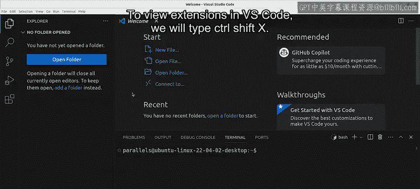

## 配置 Python 扩展

最后一步是在 VS Code 中设置 Python 环境。

我们需要浏览并安装扩展。在 VS Code 中，按 `Ctrl+Shift+X` 可以查看扩展。

这会显示 VS Code 市场上最流行的扩展列表。你可以使用搜索栏搜索 “Python”，然后点击 “安装”。

安装完成后，它会提供开始 Python 开发的选项。我们直接选择 “创建 Python 文件”，这将打开代码编辑器。

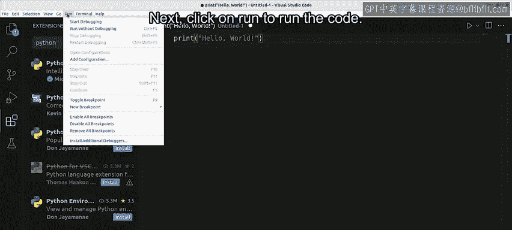

让我们用一个简单的语句来测试一下。在新的工作区中输入：

```python
print("Hello world")
```

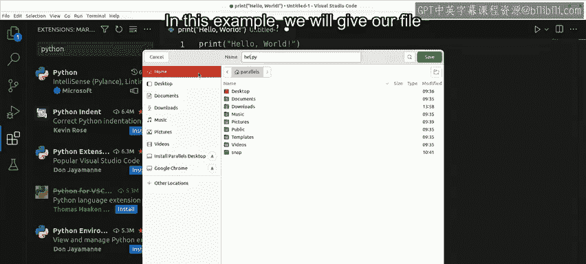

接下来，点击 “运行” 来执行代码。系统会提示你命名并保存文件。为你的 Python 文件取一个名字，然后点击 “保存”。在这个例子中，我们将文件命名为 `helloworld.py`。

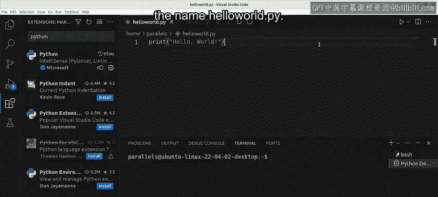

你的代码将运行，并在此处看到它的输出。

---

## 总结与回顾

干得漂亮！现在来总结一下。

VS Code 是一个极其强大的源代码编辑器。它使用智能感知技术，为编码提供语法高亮和自动补全。VS Code 允许你通过其交互式控制台直接在编辑器中进行调试。

总的来说，VS Code 极具交互性和可定制性。它还有一个庞大的扩展库，可以轻松集成。

本节课我们共同学习了如何安装 Python 3、下载并安装 VS Code，以及如何配置 Python 扩展来运行你的第一个程序。内容很多，你可以根据需要多次复习这些视频。


请记住，找出最适合你的工具的最佳方法之一，就是探索它们提供的所有功能并多加练习使用。