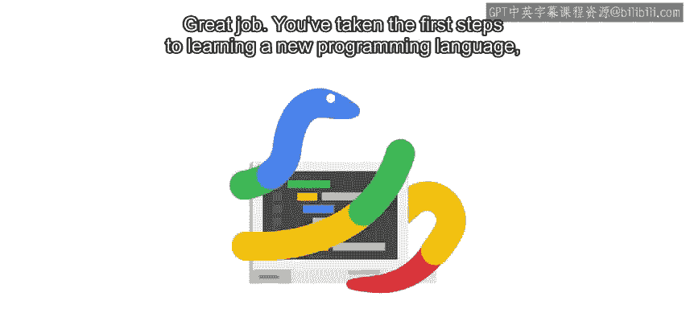
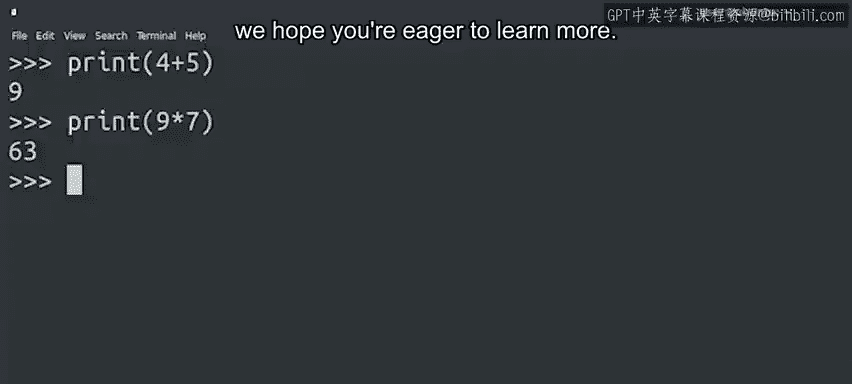

#  018：Python入门与自动化基础 - 初步总结 🎉

在本节课中，我们将回顾并总结第一模块所学的核心概念，涵盖Python编程基础、脚本编写、语法语义以及自动化入门知识。

---

恭喜你完成了第一模块的学习。你已迈出了学习新编程语言、提升IT技能的第一步。这展现了你的决心与学习意愿。

我们涵盖了许多主题，如果你之前从未接触过编程，其中很多内容可能是全新的。你了解了什么是脚本、编程语言的语法和语义，以及它们如何与自动化相关联。

上一节我们介绍了Python的基础代码块，本节中我们来看看本模块的核心收获总结。

以下是本模块涵盖的主要内容：

*   **脚本的概念**：理解了脚本作为一系列可执行指令的本质。
*   **编程语言的语法与语义**：学习了代码的结构规则（语法）和代码的含义（语义）。
*   **Python与自动化的关联**：探讨了Python为何是IT自动化的强大工具。
*   **其他编程语言**：简要了解了除Python外还有哪些可用的编程语言。
*   **数据输入与脚本编写**：初次尝试了如何接收输入数据并编写利用这些数据的脚本。
*   **数学计算**：学习了如何使用Python执行典型的数学运算。

对于Python入门的第一步而言，这些内容相当丰富。这只是学习编程这一激动人心旅程的开始，希望你渴望学习更多知识。

---

接下来，请准备好迎接你的第一次分级评估。这些评估有助于你检查是否理解了所有概念，并确认已准备好进入下一阶段。

现在，请不要担心。如果在任何时刻你对问题不确定，你随时可以回顾视频和阅读材料来回忆答案。

记住，每个人的学习速度不同。请按照自己的节奏，真正熟悉这些概念。一旦你感觉准备就绪，评估就在那里等着你。等你完成评估后，我们再见。

---

本节课中我们一起学习了Python编程与自动化的基础，包括脚本、语法语义、数据操作和基础计算。这是你自动化之旅的坚实起点。